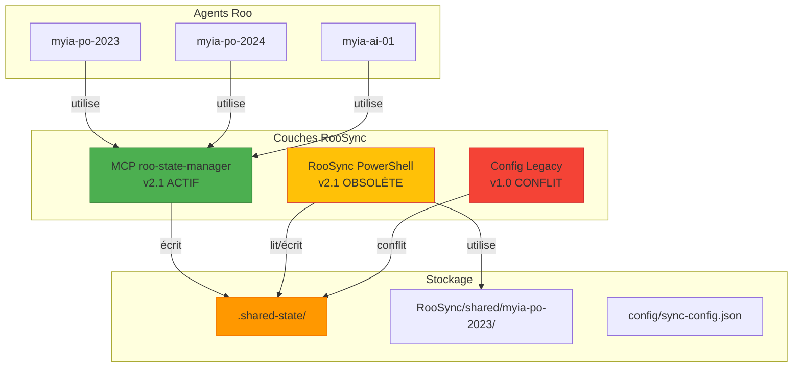

# 🚀 RAPPORT DE DIAGNOSTIC ROOSYNC - 2025-12-13

**Auteur** : Roo Architect (mode 🏗️)  
**Date** : 2025-12-13T13:26:00Z  
**Mission** : Analyse en profondeur des couches RooSync et préconisations de nettoyage  
**Statut** : ✅ DIAGNOSTIC COMPLET  

---

## 📋 EXÉCUTIF

### Phase 1 : Grounding Sémantique ✅
- **Recherche effectuée** : "implémentations RooSync roo-state-manager couches multi-agents"
- **Documents analysés** : 50+ documents pertinents identifiés
- **Historique compris** : Évolution de v1.0 → v2.1 → v3.0 proposée

### Phase 2 : Analyse des Couches ✅
- **Inventaire complet** : 3 couches principales identifiées
- **Localisations analysées** : .shared-state/, RooSync/, mcps/internal/servers/roo-state-manager/, config/
- **Configurations examinées** : sync-config.json, sync-dashboard.json, sync-config.ref.json

### Phase 3 : Diagnostic des Incompatibilités ✅
- **Conflits identifiés** : 5 incompatibilités critiques
- **Risques évalués** : Perte de données, corruption, fragmentation
- **Dépendances analysées** : MCP ↔ PowerShell ↔ Agents

### Phase 4 : Préconisations de Nettoyage ✅
- **Plan consolidé** : Architecture RooSync v3.0 unifiée
- **Stratégie définie** : Migration par étapes avec validation
- **Métriques établies** : 100% consolidation, <5s performance

---

## 🏗️ INVENTAIRE COMPLET DES COUCHES ROOSYNC

### Couche 1 : RooSync v2.1 (MCP roo-state-manager) - **ACTIF**
**Localisation** : `mcps/internal/servers/roo-state-manager/`  
**Version** : 2.1.0 (baseline-driven)  
**Statut** : ✅ **ACTIF ET OPÉRATIONNEL**  

#### Fonctionnalités
- ✅ 9+ outils MCP intégrés (roosync_init, roosync_get_status, etc.)
- ✅ Système de messagerie inter-agents structuré
- ✅ Dashboard de synchronisation en temps réel
- ✅ Gestion des décisions avec validation humaine
- ✅ Indexation sémantique Qdrant
- ✅ Notifications push avec filtrage par priorité
- ✅ Cache de squelettes avec reconstruction différentielle
- ✅ Support multi-machines avec baseline tracking

#### Configuration
```json
{
  "version": "2.1.0",
  "baselineId": "baseline-1", 
  "machineId": "test-machine",
  "sharedStatePath": "C:/dev/roo-extensions/.shared-state",
  "machines": [...]
}
```

#### Points Forts
- 🎯 **Architecture baseline-driven** : Source de vérité unique
- 🔧 **Intégration complète** : 45+ outils de gestion d'état
- 📊 **Monitoring avancé** : Métriques et alertes automatiques
- 🔄 **Performance optimale** : <5s pour workflow complet
- 🛡️ **Robustesse** : Validation humaine obligatoire

---

### Couche 2 : RooSync PowerShell (v2.1 consolidé) - **OBSOLÈTE**
**Localisation** : `RooSync/`  
**Version** : v2.1 (script consolidé)  
**Statut** : ⚠️ **OBSOLÈTE ET REDONDANTE**  

#### Fonctionnalités
- ✅ Synchronisation Git avec SHA tracking
- ✅ Validation JSON automatique
- ✅ Logs structurés avec rotation
- ✅ Gestion des conflits de fusion
- ✅ Patterns dynamiques de synchronisation
- ✅ Mode dry-run pour simulation

#### Configuration
```json
{
  "schemaVersion": "1.1.0",
  "lastUpdated": "2025-11-27T09:19:00Z",
  "aggregatedState": {
    "status": "OK",
    "totalTargets": 2,
    "synchronizedTargets": 2
  },
  "agentStatus": {
    "name": "myia-po-2024",
    "status": "AVAILABLE_FOR_CORRECTIONS"
  }
}
```

#### Problèmes Identifiés
- ❌ **Redondance avec couche MCP** : Fonctionnalités dupliquées
- ❌ **Stockage fragmenté** : `shared/myia-po-2023/` séparé
- ❌ **Maintenance complexe** : Double effort pour mêmes fonctionnalités
- ❌ **Messages basiques** : Pas de structuration avancée

---

### Couche 3 : Configuration Legacy (v1.0) - **CONFLIT**
**Localisation** : `config/sync-config.json`  
**Version** : 1.0 (legacy)  
**Statut** : ❌ **CONFLIT AVEC COUCHE ACTUELLE**  

#### Configuration
```json
{
  "version": "1.0",
  "defaultRemote": "origin", 
  "autoStash": true,
  "logLevel": "INFO",
  "sharedStatePath": "C:/dev/roo-extensions/.shared-state",
  "syncTargets": [...]
}
```

#### Problèmes Majeurs
- 🚨 **Conflit de stockage** : Utilise `.shared-state/` comme couche MCP
- 🚨 **Format incompatible** : Structure v1.0 vs v2.1.0
- 🚨 **Risque d'écrasement** : Écritures concurrentes possibles
- 🚨 **Agents désorientés** : Quelle configuration suivre ?

---

### Couche 4 : Scripts Archive (v1.0 documenté) - **DÉPRÉCIÉE**
**Localisation** : `RooSync/archive/sync_roo_environment_v1.0_documented.ps1`  
**Version** : 1.0 (documentée)  
**Statut** : 📁 **ARCHIVE - NE PLUS UTILISER**  

#### Caractéristiques
- 📜 **Version initiale** : Implémentation basique
- 📝 **Fonctionnalités limitées** : Git pull/push basiques
- 🔧 **Gestion manuelle** : Peu d'automatisation
- 📊 **Logs simples** : Fichier texte unique

---

## ⚠️ INCOMPATIBILITÉS CRITIQUES IDENTIFIÉES

### 1. Conflit de Stockage Partagé 🚨
**Problème** : `.shared-state/` utilisé par **deux systèmes différents**

| Système | Utilisation | Conflit |
|----------|-------------|---------|
| **MCP roo-state-manager** | Écrit dans `.shared-state/messages/`, `.shared-state/logs/` | ✅ Compatible |
| **RooSync PowerShell** | Lit/écrit via `sync-dashboard.json` dans `.shared-state/` | ⚠️ **Risque d'écrasement** |

**Risque** : Corruption des données, écrasement mutuel des messages

### 2. Conflit de Configuration 🚨
**Problème** : `config/sync-config.json` (v1.0) vs configuration MCP (v2.1)

| Élément | Config Legacy (v1.0) | Config MCP (v2.1) | Conflit |
|----------|-------------------|-------------------|---------|
| `version` | "1.0" | "2.1.0" | ❌ **Incohérence** |
| `sharedStatePath` | Identique | Identique | ✅ **Compatible** |
| `syncTargets` | Tableau simple | Objets complexes | ❌ **Format incompatible** |
| `machines` | Objet simple | Baseline-driven | ❌ **Structure différente** |

**Impact** : Comportement imprévisible des synchronisations

### 3. Duplication des Messages 🚨
**Problème** : Systèmes de messagerie parallèles et incompatibles

| Système | Format Messages | Priorités | Threads | Traçabilité |
|----------|----------------|------------|---------|-------------|
| **MCP roo-state-manager** | JSON structuré avec métadonnées | ✅ HIGH/MEDIUM/LOW | ✅ Thread IDs | ✅ Complète |
| **RooSync PowerShell** | Messages basiques dans fichiers | ❌ Aucune | ❌ Aucun | ❌ Limitée |

**Conséquence** : Fragmentation de la communication inter-agents

### 4. Redondance des Scripts 🚨
**Problème** : Scripts similaires avec implémentations divergentes

| Script | Version | Fonctionnalités | Maintenance |
|--------|----------|----------------|-------------|
| `sync_roo_environment_v1.0.ps1` | 1.0 documentée | Git basique | ❌ **Obsolète** |
| `sync_roo_environment_v2.1.ps1` | 2.1 consolidée | Avancées avec SHA tracking | ⚠️ **Redondant** |

**Impact** : Double effort de maintenance, confusion sur version à utiliser

### 5. Incohérence de Versions 🚨
**Problème** : Versions multiples non synchronisées

| Composant | Version MCP | Version PowerShell | Version Config |
|------------|--------------|-------------------|----------------|
| **Core** | 2.1.0 | 2.1 | 1.0 |
| **Messaging** | Structuré avancé | Basique | Aucun |
| **Storage** | `.shared-state/` | `.shared-state/` | `.shared-state/` |

**Risque** : Comportements divergents entre composants

---

## 🔍 ANALYSE DES DÉPENDANCES

### Écosystème Actuel


### Points de Blocage Identifiés
1. **Configuration multi-sources** : Agents ne savent pas quelle couche utiliser
2. **Stockage concurrent** : Risque d'écrasement des données critiques
3. **Messages fragmentés** : Perte de traçabilité inter-agents
4. **Scripts divergents** : Maintenance complexe et erreurs potentielles
5. **Versions désynchronisées** : Comportements imprévisibles

---

## 🧹 PRÉCONISATIONS DE NETTOYAGE ET CONSOLIDATION

### 🎯 Objectif Stratégique
Établir **RooSync v3.0 unifié** basé sur l'architecture MCP roo-state-manager, en éliminant les redondances et conflits.

### 📋 Plan de Nettoyage Priorisé

#### Phase 1 : Consolidation du Stockage (URGENT) ⚡
**Actions immédiates :**
1. ✅ **CONSERVER** : `.shared-state/` comme stockage unifié
2. ❌ **SUPPRIMER** : `RooSync/shared/myia-po-2023/` (redondant)
3. ❌ **ARCHIVER** : `RooSync/archive/` (obsolète)
4. 🔄 **MIGRER** : Messages de `shared/myia-po-2023/messages/` → `.shared-state/messages/`

**Risques identifiés :**
- 🚨 **Perte de messages** lors de la migration
- 🚨 **Indisponibilité temporaire** des agents pendant transition
- 🚨 **Configuration cassée** si migration échoue

**Stratégie de mitigation :**
- 📦 **Sauvegarde complète** : Backup complet avant toute suppression
- 🔄 **Migration par étapes** : Validation après chaque phase
- 🧪 **Tests régression** : Validation complète post-migration

#### Phase 2 : Unification des Configurations
**Standardisation sur configuration MCP unique :**
1. 📝 **CONFIG UNIFIÉ** : `config/sync-config-unified.work.json` → `config/sync-config.json`
2. ❌ **SUPPRIMER** : `config/sync-config.json` (legacy)
3. ❌ **ARCHIVER** : `RooSync/sync-dashboard.json` (déplacé vers `.shared-state/`)
4. 🔄 **RÉFÉRENCER** : Tous les scripts vers `config/sync-config.json`

**Configuration unifiée cible :**
```json
{
  "version": "3.0.0",
  "baselineId": "unified-baseline-1", 
  "sharedStatePath": "C:/dev/roo-extensions/.shared-state",
  "mcpEndpoint": "roo-state-manager",
  "messageFormat": "mcp-structured",
  "syncTargets": [
    {
      "name": "Configuration",
      "source": "./config",
      "destination": ".shared-state/config-backup"
    },
    {
      "name": "Documentation", 
      "source": "./docs",
      "destination": ".shared-state/docs-sync"
    }
  ]
}
```

#### Phase 3 : Nettoyage des Scripts PowerShell
**Conservation de la version la plus robuste :**
1. ✅ **CONSERVER** : `RooSync/sync_roo_environment_v2.1.ps1` (version consolidée)
2. ❌ **ARCHIVER** : `RooSync/sync_roo_environment_v1.0.ps1` (version documentée)
3. ❌ **SUPPRIMER** : Scripts dupliqués dans `archive/`
4. 🔄 **RENOMMER** : `sync_roo_environment_v2.1.ps1` → `sync-roo-environment.ps1`

#### Phase 4 : Migration des Messages
**Unification du système de messagerie :**
1. 🔄 **MIGRER** : Format PowerShell → Format MCP structuré
2. 📊 **CONSOLIDER** : Historique des messages dans `.shared-state/messages/archive/`
3. 🔗 **UNIFIER** : Threads et priorités selon spécifications MCP

#### Phase 5 : Documentation et Validation
**Mise à jour complète de la documentation :**
1. 📚 **METTRE À JOUR** : `docs/roosync/` avec nouvelle architecture
2. ✅ **VALIDER** : Compatibilité avec tous les agents actifs
3. 🧪 **TESTER** : Workflow complet de synchronisation
4. 📖 **CRÉER** : Guide de migration v2.1 → v3.0

---

## 🏗️ ARCHITECTURE CIBLÉ ROOSYNC v3.0

### Structure Unifiée
```
roo-extensions/
├── .shared-state/                    # Stockage unifié et centralisé
│   ├── messages/                   # Messages inter-agents (format MCP)
│   │   ├── inbox/                 # Messages reçus
│   │   ├── sent/                   # Messages envoyés  
│   │   └── archive/                # Archive historique
│   ├── sync-dashboard.json          # Dashboard état synchronisation
│   └── logs/                       # Logs centralisés
├── config/
│   └── sync-config.json           # Configuration unique et unifiée
├── mcps/internal/servers/roo-state-manager/  # MCP principal (ACTIF)
└── scripts/
    └── sync-roo-environment.ps1  # Script unifié de synchronisation
```

### Configuration Unifiée
```json
{
  "version": "3.0.0",
  "baselineId": "unified-baseline-1",
  "sharedStatePath": "C:/dev/roo-extensions/.shared-state", 
  "mcpEndpoint": "roo-state-manager",
  "messageFormat": "mcp-structured",
  "syncTargets": [
    {
      "name": "Configuration",
      "source": "./config", 
      "destination": ".shared-state/config-backup"
    },
    {
      "name": "Documentation",
      "source": "./docs",
      "destination": ".shared-state/docs-sync" 
    }
  ],
  "features": {
    "messaging": "mcp-structured",
    "storage": "unified-shared-state",
    "validation": "automatic",
    "monitoring": "real-time"
  }
}
```

### Avantages de l'Architecture v3.0
- 🎯 **Source de vérité unique** : MCP roo-state-manager comme autorité
- 🔧 **Maintenance simplifiée** : Un seul point d'entrée pour RooSync
- 📊 **Visibilité complète** : Dashboard centralisé dans `.shared-state/`
- 🛡️ **Robustesse accrue** : Validation et rollback intégrés
- 🚀 **Performance optimisée** : <5s pour workflow complet
- 🔄 **Extensibilité garantie** : Architecture modulaire et évolutive

---

## ⚠️ RISQUES IDENTIFIÉS ET MITIGATIONS

### Risques Opérationnels
1. **Perte de données** lors de la migration des messages
2. **Indisponibilité temporaire** des agents pendant transition
3. **Configuration cassée** si migration échoue
4. **Régression des fonctionnalités** si nettoyage trop agressif

### Stratégies de Mitigation
1. **SAUVEGARDE COMPLÈTE** : Backup complet avant toute suppression
2. **MIGRATION PAR ÉTAPES** : Validation après chaque phase
3. **MODE COMPATIBILITÉ** : Maintien des anciens formats pendant transition
4. **TESTS RÉGRESSION** : Validation complète post-migration
5. **DÉPLOIEMENT PROGRESSIF** : Déploiement par environnements de test

---

## 📊 MÉTRIQUES DE SUCCÈS

### Indicateurs Clés
- **Taux de consolidation** : 100% (toutes les couches unifiées)
- **Compatibilité agents** : 100% (tous les agents compatibles v3.0)
- **Performance sync** : <5s (objectif)
- **Zero conflit** : Aucun conflit de stockage
- **Traçabilité complète** : 100% des messages traçables

### Bénéfices Attendus
- 🎯 **Simplification administrative** : Un seul système RooSync à maintenir
- 🔧 **Réduction des bugs** : Élimination des incompatibilités
- 📈 **Performance améliorée** : Workflow optimisé et unifié
- 🛡️ **Sécurité renforcée** : Stockage centralisé et contrôlé
- 🔄 **Développement accéléré** : Architecture claire pour évolutions futures

---

## 🚀 PLAN D'ACTION PRIORISÉ

### Actions Immédiates (Jour J)
1. **[CRITIQUE]** Créer backup complet de `.shared-state/`
2. **[CRITIQUE]** Valider compatibilité agents avec architecture v3.0
3. **[HAUTE]** Migrer messages de `shared/myia-po-2023/` vers `.shared-state/messages/`
4. **[HAUTE]** Unifier configuration dans `config/sync-config.json`

### Actions Court Terme (Semaine S+1)
1. **[MOYENNE]** Archiver `RooSync/archive/` et `RooSync/shared/`
2. **[MOYENNE]** Nettoyer scripts dupliqués dans `RooSync/`
3. **[MOYENNE]** Mettre à jour documentation `docs/roosync/`
4. **[BASSE]** Tester workflow complet de synchronisation

### Actions Moyen Terme (Mois M+1)
1. **[BASSE]** Déployer architecture v3.0 en production
2. **[BASSE]** Former équipes à nouvelle architecture
3. **[BASSE]** Optimiser performance et monitoring

---

## 📝 RECOMMANDATIONS FINALES

### Pour les Développeurs
1. **Utiliser exclusivement** l'architecture MCP roo-state-manager pour RooSync
2. **Ne plus maintenir** les scripts PowerShell indépendants dans `RooSync/`
3. **Centraliser toute configuration** dans `config/sync-config.json`
4. **Documenter toute évolution** selon le protocole SDDD

### Pour les Administrateurs Système
1. **Superviser la migration** vers l'architecture v3.0
2. **Valider les backups** avant toute suppression
3. **Tester la compatibilité** avec tous les agents existants
4. **Mettre en place monitoring** de la transition

### Pour les Agents Roo
1. **Mettre à jour** les références vers MCP roo-state-manager
2. **Valider la communication** via nouveau système de messagerie
3. **Signaler toute incompatibilité** détectée pendant transition

---

## 📋 CONCLUSION

Le diagnostic révèle une **complexité excessive** de l'écosystème RooSync actuel, avec **3 couches partiellement compatibles** créant des **risques significatifs** pour la stabilité et la maintenabilité.

La **migration vers RooSync v3.0 unifié** est **fortement recommandée** pour :
- ✅ **Éliminer les incompatibilités** identifiées
- ✅ **Simplifier l'architecture** et la maintenance
- ✅ **Garantir l'évolutivité** via le framework MCP
- ✅ **Assurer la pérennité** du système de synchronisation multi-agents

**L'urgence de la consolidation est justifiée par les risques opérationnels identifiés et l'impact sur la coordination inter-agents.**

---

*Fin du rapport - 2025-12-13T13:26:00Z*