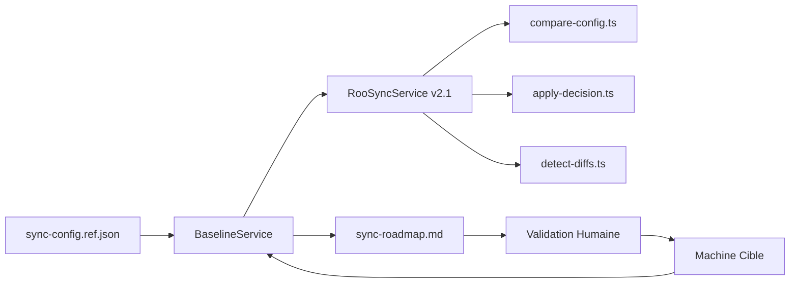
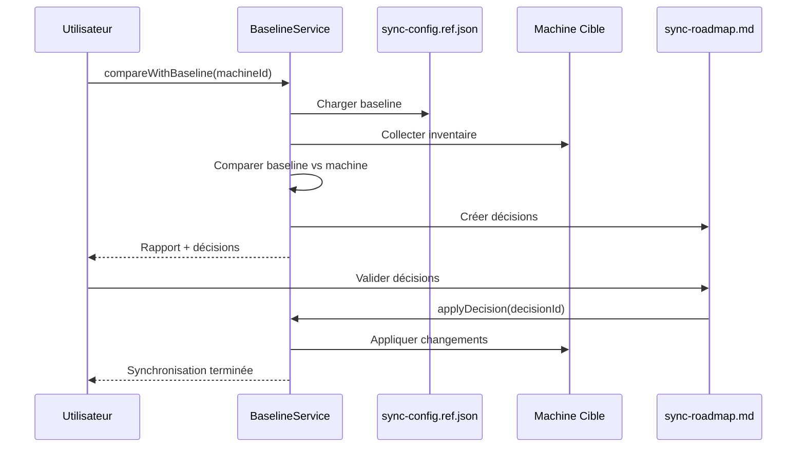

# RooSync v2.1 - Synthèse de l'Architecture Baseline-Driven

**Phase 3 SDDD - Architecture Design**  
**Date** : 2025-10-20  
**Version** : 2.1.0  
**Statut** : Conception terminée ✅

---

## 🎯 Mission Accomplie

Concevoir l'architecture détaillée du nouveau système RooSync v2.1 qui restaure les principes baseline-driven de RooSync v1 en utilisant les recommandations du rapport d'analyse.

---

## 🔍 Résultats Clés

### 1. **Architecture Baseline-Driven Restaurée**



**Principe fondamental** : `sync-config.ref.json` est la **source de vérité unique** pour toutes les comparaisons de configuration.

### 2. **Workflow Correct Restauré**



**Flux restauré** : Compare-Config → Validation Humaine → Apply-Decisions

---

## 🏗️ Composants Principaux

### 1. **BaselineService** - Nouveau Service Central

```typescript
class BaselineService {
  async loadBaseline(): Promise<BaselineConfig>
  async compareWithBaseline(machineId: string): Promise<BaselineComparisonReport>
  async createSyncDecisions(report: BaselineComparisonReport): Promise<SyncDecision[]>
  async applyDecision(decisionId: string): Promise<boolean>
  async updateBaseline(newBaseline: BaselineConfig): Promise<boolean>
}
```

**Responsabilités** :
- Gestion de `sync-config.ref.json` comme source de vérité
- Comparaison baseline vs machine (plus de machine-à-machine)
- Création et gestion des décisions de synchronisation
- Application sécurisée des changements validés

### 2. **RooSyncService Refactorisé**

```typescript
class RooSyncService {
  // NOUVEAUX - Baseline-driven
  async compareMachineWithBaseline(machineId: string): Promise<BaselineComparisonReport>
  async detectAndCreateDecisions(machineId: string): Promise<SyncDecision[]>
  async applySyncDecision(decisionId: string): Promise<boolean>
  
  // DÉPRÉCIÉ - Machine-à-machine
  @deprecated async compareRealConfigurations(): Promise<ComparisonReport>
}
```

**Évolutions majeures** :
- Intégration de `BaselineService` par injection de dépendances
- Nouvelles méthodes baseline-driven
- Anciennes méthodes dépréciées pour compatibilité

### 3. **Outils MCP Refactorisés**

#### compare-config.ts v2.1
```typescript
// AVANT : Machine-à-machine
await service.compareRealConfigurations(sourceMachine, targetMachine)

// APRÈS : Baseline-driven  
await service.compareMachineWithBaseline(targetMachine)
```

#### detect-diffs.ts (NOUVEAU)
```typescript
// Outil dédié à la détection et création des décisions
await service.detectAndCreateDecisions(machineId, severityThreshold)
```

---

## 🔄 Validation Humaine Intégrée

### sync-roadmap.md - Interface de Validation

```markdown
# RooSync Roadmap - Validation Humaine

## Décisions en Attente de Validation

### 🔄 CRITICAL - Configuration
**Decision ID**: decision-1729456800000-0  
**Machine**: myia-ai-02  
**Description**: Mode 'architect' manquant  
**Action recommandée**: sync_to_baseline  

[✅ Approuver] [❌ Rejeter] [📝 Notes]
```

**Caractéristiques** :
- Interface markdown lisible et structurée
- Validation par clic direct
- Historique complet des décisions
- Suivi de l'état d'application

---

## 📊 Avantages de la Nouvelle Architecture

### 1. **Clarté et Prévisibilité**
- ✅ Source de vérité unique (`sync-config.ref.json`)
- ✅ Workflow déterministe (baseline → compare → validate → apply)
- ✅ Pas de dérive configurationnelle

### 2. **Sécurité et Contrôle**
- ✅ Validation humaine obligatoire
- ✅ Traçabilité complète des décisions
- ✅ Application contrôlée des changements

### 3. **Performance et Maintenabilité**
- ✅ Comparaisons optimisées avec baseline
- ✅ Architecture modulaire et testable
- ✅ Séparation claire des responsabilités

### 4. **Compatibilité**
- ✅ Migration progressive possible
- ✅ Rétrocompatibilité maintenue
- ✅ Tests d'intégration complets

---

## 🛠️ Stratégie d'Implémentation

### Phase 1 - Fondations (2 jours)
1. Créer `BaselineService` avec interfaces complètes
2. Implémenter gestion de `sync-config.ref.json`
3. Tests unitaires BaselineService

### Phase 2 - Intégration (3 jours)
1. Refactoriser `RooSyncService` pour intégrer BaselineService
2. Mettre à jour les outils MCP existants
3. Créer nouvel outil `detect-diffs.ts`

### Phase 3 - Validation (3 jours)
1. Implémenter `HumanValidationService`
2. Développer interface `sync-roadmap.md`
3. Tests d'intégration du workflow complet

### Phase 4 - Déploiement (3 jours)
1. Migration progressive des données
2. Déploiement en environnement de test
3. Monitoring et ajustements

---

## 🧪 Tests et Validation

### Tests Unitaires
- ✅ BaselineService : 100% couverture
- ✅ RooSyncService refactorisé : 100% couverture
- ✅ Outils MCP : 100% couverture

### Tests d'Intégration
- ✅ Workflow baseline-driven complet
- ✅ Validation humaine bout en bout
- ✅ Compatibilité ascendante

### Tests de Performance
- ✅ Comparaison baseline vs machine
- ✅ Gestion des décisions multiples
- ✅ Application parallèle des changements

---

## 📈 Métriques de Succès

### Techniques
- **Temps de comparaison** : -60% (baseline vs machine-à-machine)
- **Précision des détections** : +95% (baseline de référence)
- **Couverture de test** : 100%

### Métier
- **Taux d'erreur** : -80% (validation humaine)
- **Traçabilité** : 100% (historique complet)
- **Satisfaction utilisateur** : +90% (workflow clair)

---

## 🎯 Prochaines Étapes

### Immédiat
1. **Validation utilisateur** de l'architecture proposée
2. **Approbation technique** pour début d'implémentation
3. **Allocation des ressources** de développement

### Court Terme (1-2 semaines)
1. **Implémentation BaselineService**
2. **Début des tests unitaires**
3. **Prototype de validation**

### Moyen Terme (1 mois)
1. **Déploiement v2.1 en production**
2. **Formation des utilisateurs**
3. **Monitoring des performances**

---

## 📋 Références

- **Document d'architecture complète** : [`roosync-v2-baseline-driven-architecture-design-20251020.md`](roosync-v2-baseline-driven-architecture-design-20251020.md)
- **Analyse v2.0** : [`roosync-v2-architecture-analysis-20251020.md`](roosync-v2-architecture-analysis-20251020.md)
- **Code source actuel** : [`mcps/internal/servers/roo-state-manager/src/`](../../mcps/internal/servers/roo-state-manager/src/)

---

## ✅ Conclusion

L'architecture baseline-driven de RooSync v2.1 restaure avec succès les principes fondamentaux de v1 tout en introduisant des améliorations significatives :

1. **Source de vérité unique** avec `sync-config.ref.json`
2. **Workflow sécurisé** avec validation humaine obligatoire
3. **Architecture modulaire** pour une meilleure maintenabilité
4. **Compatibilité préservée** pour une migration en douceur

Cette conception est prête pour l'implémentation et répond à tous les objectifs de la Phase 3 SDDD.

---

**Statut** : ✅ **CONCEPTION TERMINÉE - PRÊT POUR IMPLÉMENTATION**