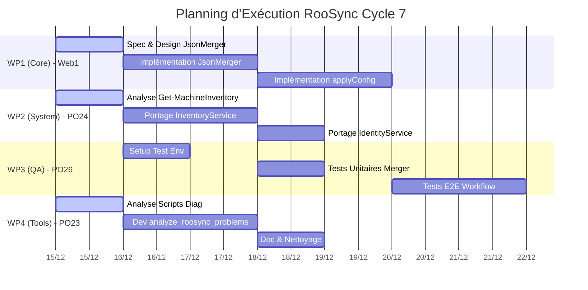

# Plan de Répartition Détaillé (Master Plan) - RooSync Cycle 7

**Date :** 2025-12-14
**Réf :** Tâche 10
**Source :** Tâche 9 (Stratégie) & Tâche 9b (Audit)

## 1. Objectifs de la Mission

Convertir la stratégie d'évolution technique en un plan d'action distribué, visant à consolider RooSync en une infrastructure TypeScript/MCP robuste, tout en éliminant la dette technique PowerShell.

**Exclusion explicite :** Le module Scheduler (Planificateur) est exclu du périmètre de migration actuel.

## 2. Principes de Répartition

*   **Lead Tech (`myia-web1`)** : Focus sur le cœur critique et l'architecture (Core Logic, Merge, Sécurité des configs).
*   **Dev Senior (`myia-po-2024`)** : Focus sur la migration de la logique système complexe (Inventaire, Environnement) de PowerShell vers TypeScript.
*   **QA/Test (`myia-po-2026`)** : Garantie de la non-régression et couverture des nouvelles fonctionnalités Core.
*   **Dev Support (`myia-po-2023`)** : Transformation des scripts d'analyse legacy en outils de diagnostic modernes (Tooling) et documentation technique associée. *Pas de rôle purement rédactionnel.*
*   **Coordination (`myia-ai-01`)** : Liant, Code Review transverse, Arbitrage.

## 3. Work Packages (WP) Détaillés

### WP1: Core Configuration Engine
**Responsable :** `myia-web1` (Lead Tech)
**Priorité :** P0 (Critique)

*   **Objectif :** Rendre `ConfigSharingService.applyConfig` pleinement opérationnel.
*   **Tâches :**
    1.  **Module `JsonMerger`** : Implémenter la logique de fusion intelligente (Deep Merge) en TypeScript, équivalente à `Merge-JsonObjects` (PS). Gestion des stratégies de conflits (Overwrite, Merge, Keep).
    2.  **`ConfigSharingService` Implementation** : Coder `applyConfig` avec gestion des backups (`.backup_YYYYMMDD`) et mode `dryRun`.
    3.  **Sécurité** : Implémenter le filtrage des clés sensibles (secrets) lors des exports/imports.

### WP2: System Inventory & Environment Migration
**Responsable :** `myia-po-2024` (Dev)
**Priorité :** P1 (Majeur)

*   **Objectif :** Porter les capacités d'inventaire système de PowerShell vers des outils MCP natifs.
*   **Tâches :**
    1.  **Migration Inventaire** : Analyser `Get-MachineInventory.ps1` et porter la logique de collecte (OS, Hardware, Node/PS versions) vers un nouveau service `InventoryService.ts`.
    2.  **Outil `get_machine_inventory`** : Exposer ce service via un outil MCP performant (avec cache).
    3.  **Migration Identité** : Porter `validate-roosync-identity-protection.ps1` vers un service de validation d'identité TypeScript (`IdentityService.ts`).

### WP3: Quality Assurance & Testing Infrastructure
**Responsable :** `myia-po-2026` (QA/Test)
**Priorité :** P1 (Transverse)

*   **Objectif :** Sécuriser la refonte du Core et garantir la stabilité.
*   **Tâches :**
    1.  **Tests Unitaires WP1** : Créer les tests pour `JsonMerger` (cas limites, tableaux, nulls) et `ConfigSharingService` (mock FS).
    2.  **Tests d'Intégration WP2** : Valider la collecte d'inventaire sur différents OS (mockés).
    3.  **Tests E2E** : Mettre à jour `roosync-workflow.test.ts` pour inclure le nouveau flux `applyConfig` (en mode dry-run).

### WP4: Diagnostic Tooling & Knowledge Base
**Responsable :** `myia-po-2023` (Dev Support)
**Priorité :** P2 (Support)

*   **Objectif :** Remplacer les scripts de diagnostic manuels par des outils MCP interactifs et documenter.
*   **Tâches :**
    1.  **Migration `PHASE3A`** : Analyser `PHASE3A-ANALYSE-RAPIDE.ps1` et créer l'outil MCP `analyze_roosync_problems` (détection automatique d'incohérences).
    2.  **Outil `diagnose_env`** : Créer un outil agrégant les checks de santé (accès fichiers, présence outils).
    3.  **Documentation Technique** : Mettre à jour la documentation d'architecture (`docs/architecture/`) pour refléter les nouveaux services (Inventory, Config, Identity) et supprimer les références aux scripts obsolètes.

### WP5: Coordination & Integration
**Responsable :** `myia-ai-01` (Coord)
**Priorité :** Continue

*   **Objectif :** Fluidité et cohérence.
*   **Tâches :**
    1.  **Code Review** : Valider les PRs des agents techniques.
    2.  **Gestion des Conflits** : Arbitrer les chevauchements (ex: interface Inventory utilisée par Config).
    3.  **Nettoyage Legacy** : Une fois les WP validés, procéder à l'archivage des scripts PowerShell correspondants (`scripts/inventory/`, `scripts/roosync/`).

## 4. Séquence d'Exécution

## 5. Critères de Validation (Definition of Done)

*   **WP1** : `applyConfig` fusionne correctement un settings.json complexe sans perte de données.
*   **WP2** : `get_machine_inventory` retourne un JSON complet et valide sans appel PowerShell externe lent.
*   **WP3** : 100% des nouveaux tests passent. Pas de régression sur les tests existants.
*   **WP4** : Les outils `analyze_...` détectent correctement les pannes simulées. La doc est à jour.
*   **Global** : Les scripts PowerShell legacy correspondants sont archivés.