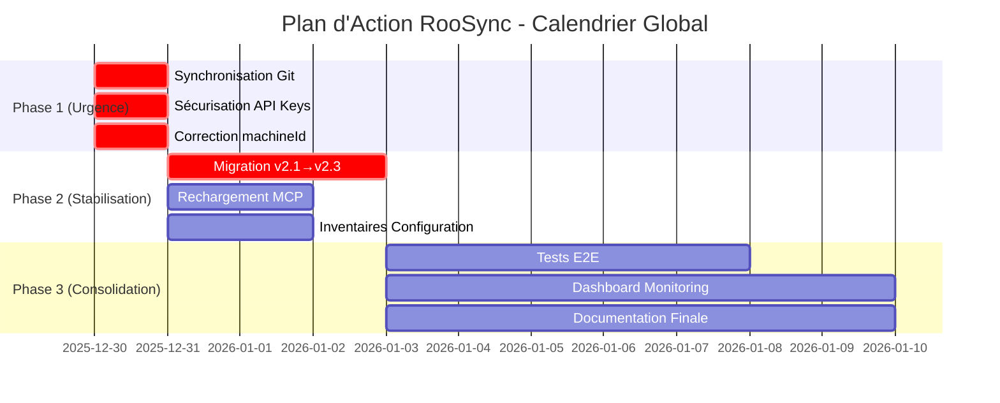
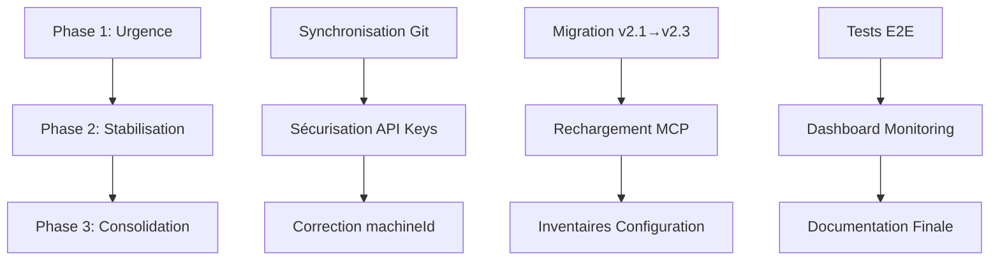

# 📋 PLAN D'ACTION DÉTAILLÉ - ENVIRONNEMENT MULTI-AGENT ROOSYNC

**Date** : 2025-12-29  
**MachineId** : myia-po-2026  
**Auteur** : Roo Code Mode (Sous-tâche 7/9)  
**Statut** : ✅ COMPLÉTÉ  
**Version** : 1.0

---

## 📊 RÉSUMÉ EXÉCUTIF

Ce plan d'action vise à stabiliser l'environnement multi-agent RooSync en résolvant les problèmes critiques identifiés dans le rapport de synthèse. Le système est actuellement dans un **état de transition critique** entre les versions v2.1 et v2.3, avec une **dualité architecturale** comme cause profonde de l'instabilité.

### Situation Actuelle

- **Score de santé global** : 5.5/10 ⚠️
- **Machines actives** : 5 (myia-ai-01, myia-po-2024, myia-po-2023, myia-web1, myia-po-2026)
- **Problèmes critiques** : 5
- **Problèmes majeurs** : 4
- **Problèmes moyens** : 3

### Objectif Principal

Stabiliser le système RooSync et finaliser la transition vers la version v2.3 en résolvant la dualité architecturale et en synchronisant toutes les machines.

### Horizon Temporel

- **Phase 1 (Urgence)** : 1-3 jours
- **Phase 2 (Stabilisation)** : 1-2 semaines
- **Phase 3 (Consolidation)** : 1-2 mois

---

## 🎯 OBJECTIFS DU PLAN D'ACTION

### Objectifs Critiques (P0)

1. **Éliminer la dualité architecturale v2.1/v2.3**
   - Déprécier [`BaselineService`](../../mcps/internal/servers/roo-state-manager/src/services/BaselineService.ts:1)
   - Migrer vers [`NonNominativeBaselineService`](../../mcps/internal/servers/roo-state-manager/src/services/roosync/NonNominativeBaselineService.ts:1)
   - Uniformiser l'API sur toutes les machines

2. **Synchroniser le dépôt principal**
   - Résoudre les 12 commits en attente
   - Aligner toutes les machines sur origin/main
   - Éliminer les risques de conflits

3. **Sécuriser les données sensibles**
   - Supprimer les API keys de sync-config.json
   - Migrer vers des variables d'environnement
   - Corriger l'incohérence machineId

### Objectifs Majeurs (P1)

4. **Stabiliser l'infrastructure MCP**
   - Configurer le rechargement automatique
   - Corriger l'incohérence InventoryCollector
   - Collecter les inventaires de configuration

5. **Finaliser le déploiement v2.3**
   - Déployer sur toutes les machines
   - Valider la compatibilité
   - Documenter la transition

### Objectifs Moyens (P2)

6. **Améliorer la qualité du code**
   - Corriger les vulnérabilités NPM
   - Déboguer Get-MachineInventory.ps1
   - Nettoyer les fichiers non suivis

7. **Renforcer la surveillance**
   - Créer un dashboard de monitoring
   - Automatiser les tests de régression
   - Améliorer la documentation

---

## 🏗️ STRATÉGIE GLOBALE

### Vue d'Ensemble des Phases

### Dépendances Entre Phases

### Stratégie de Coordination Multi-Agent

| Machine | Rôle Principal | Responsabilités |
|---------|----------------|-----------------|
| **myia-ai-01** | Baseline Master | Validation baseline, synchronisation principale, décisions critiques |
| **myia-po-2024** | Coordinateur Technique | Architecture, documentation, coordination inter-agents |
| **myia-po-2026** | Agent / QA / Tests | Tests unitaires, validation qualité, rapports |
| **myia-po-2023** | Agent de Développement | Implémentation, corrections, déploiement |
| **myia-web1** | Agent de Développement | Implémentation, corrections, déploiement |

---

## 🔴 TÂCHES CRITIQUES (PRIORITÉ CRITIQUE)

### TÂCHE C1 : Finaliser la Migration v2.1 → v2.3

**Priorité** : 🔴 CRITIQUE  
**Complexité** : Élevée  
**Durée estimée** : 3 jours  
**Assignée à** : myia-po-2024 (Coordinateur Technique) + myia-po-2023 (Agent)

**Description** : Migrer complètement l'architecture de BaselineService vers NonNominativeBaselineService.

**Sous-tâches** :

1. **C1.1** : Analyser les dépendances de BaselineService
   - Identifier tous les appels à BaselineService
   - Documenter les breaking changes
   - Créer un plan de migration détaillé
   - **Assignée à** : myia-po-2024
   - **Critère d'acceptation** : Liste complète des dépendances documentée

2. **C1.2** : Migrer les appels API vers NonNominativeBaselineService
   - Remplacer tous les appels à BaselineService
   - Mettre à jour les tests unitaires
   - Valider la compatibilité
   - **Assignée à** : myia-po-2023
   - **Critère d'acceptation** : Tous les tests passent (100%)

3. **C1.3** : Déprécier BaselineService
   - Ajouter des avertissements de dépréciation
   - Mettre à jour la documentation
   - Préparer la suppression future
   - **Assignée à** : myia-po-2024
   - **Critère d'acceptation** : Documentation mise à jour

4. **C1.4** : Tester la migration sur myia-po-2023
   - Déployer la version migrée
   - Valider le fonctionnement
   - Corriger les bugs éventuels
   - **Assignée à** : myia-po-2023
   - **Critère d'acceptation** : Système fonctionnel sur myia-po-2023

**Dépendances** : Aucune (tâche initiale)  
**Jalon** : Migration v2.1→v2.3 validée sur une machine

---

### TÂCHE C2 : Synchroniser le Dépôt Principal

**Priorité** : 🔴 CRITIQUE  
**Complexité** : Moyenne  
**Durée estimée** : 1 jour  
**Assignée à** : Toutes les machines

**Description** : Synchroniser toutes les machines sur origin/main et résoudre les 12 commits en attente.

**Sous-tâches** :

1. **C2.1** : Valider les 12 commits en attente
   - Examiner chaque commit
   - Vérifier la cohérence
   - Identifier les conflits potentiels
   - **Assignée à** : myia-po-2024
   - **Critère d'acceptation** : Tous les commits validés

2. **C2.2** : Synchroniser myia-po-2026
   - `git pull origin/main`
   - Résoudre les conflits
   - Valider l'état
   - **Assignée à** : myia-po-2026
   - **Critère d'acceptation** : Dépôt synchronisé

3. **C2.3** : Synchroniser myia-po-2024
   - `git pull origin/main`
   - Résoudre les conflits
   - Valider l'état
   - **Assignée à** : myia-po-2024
   - **Critère d'acceptation** : Dépôt synchronisé

4. **C2.4** : Synchroniser myia-po-2023
   - `git pull origin/main`
   - Résoudre les conflits
   - Valider l'état
   - **Assignée à** : myia-po-2023
   - **Critère d'acceptation** : Dépôt synchronisé

5. **C2.5** : Synchroniser myia-web1
   - `git pull origin/main`
   - Résoudre les conflits
   - Valider l'état
   - **Assignée à** : myia-web1
   - **Critère d'acceptation** : Dépôt synchronisé

6. **C2.6** : Valider la synchronisation globale
   - Vérifier que toutes les machines sont synchronisées
   - Confirmer l'absence de conflits
   - Documenter l'état final
   - **Assignée à** : myia-ai-01
   - **Critère d'acceptation** : Toutes les machines synchronisées

**Dépendances** : Aucune (tâche initiale)  
**Jalon** : Toutes les machines synchronisées sur origin/main

---

### TÂCHE C3 : Commiter la Nouvelle Référence du Sous-Module mcps/internal

**Priorité** : 🔴 CRITIQUE  
**Complexité** : Faible  
**Durée estimée** : 1 jour  
**Assignée à** : myia-po-2024 (Coordinateur Technique)

**Description** : Commiter la nouvelle référence du sous-module mcps/internal (commit 8afcfc9).

**Sous-tâches** :

1. **C3.1** : Valider le commit 8afcfc9
   - Examiner les changements
   - Vérifier la cohérence
   - Confirmer la correction ConfigSharingService
   - **Assignée à** : myia-po-2024
   - **Critère d'acceptation** : Commit validé

2. **C3.2** : Commiter la nouvelle référence
   - `git add mcps/internal`
   - `git commit -m "Update submodule mcps/internal to 8afcfc9 - Fix ConfigSharingService for RooSync v2.1"`
   - **Assignée à** : myia-po-2024
   - **Critère d'acceptation** : Commit créé

3. **C3.3** : Pusher vers origin/main
   - `git push origin main`
   - Valider le push
   - **Assignée à** : myia-po-2024
   - **Critère d'acceptation** : Push réussi

4. **C3.4** : Notifier les autres machines
   - Envoyer un message RooSync
   - Demander la synchronisation
   - **Assignée à** : myia-po-2024
   - **Critère d'acceptation** : Message envoyé

**Dépendances** : C2 (Synchroniser le dépôt principal)  
**Jalon** : Sous-module mcps/internal synchronisé

---

### TÂCHE C4 : Corriger l'Incohérence machineId

**Priorité** : 🔴 CRITIQUE  
**Complexité** : Faible  
**Durée estimée** : 1 jour  
**Assignée à** : Toutes les machines

**Description** : Corriger sync-config.json pour utiliser le vrai machineId au lieu de "local_machine".

**Sous-tâches** :

1. **C4.1** : Identifier les machines avec incohérence machineId
   - Scanner sync-config.json sur toutes les machines
   - Identifier les machines concernées
   - Documenter les incohérences
   - **Assignée à** : myia-ai-01
   - **Critère d'acceptation** : Liste des machines concernées

2. **C4.2** : Corriger myia-ai-01
   - Modifier sync-config.json
   - Remplacer "local_machine" par "myia-ai-01"
   - Valider la correction
   - **Assignée à** : myia-ai-01
   - **Critère d'acceptation** : machineId corrigé

3. **C4.3** : Corriger myia-po-2024
   - Modifier sync-config.json
   - Remplacer "local_machine" par "myia-po-2024"
   - Valider la correction
   - **Assignée à** : myia-po-2024
   - **Critère d'acceptation** : machineId corrigé

4. **C4.4** : Corriger myia-po-2026
   - Modifier sync-config.json
   - Remplacer "local_machine" par "myia-po-2026"
   - Valider la correction
   - **Assignée à** : myia-po-2026
   - **Critère d'acceptation** : machineId corrigé

5. **C4.5** : Corriger myia-po-2023
   - Modifier sync-config.json
   - Remplacer "local_machine" par "myia-po-2023"
   - Valider la correction
   - **Assignée à** : myia-po-2023
   - **Critère d'acceptation** : machineId corrigé

6. **C4.6** : Corriger myia-web1
   - Modifier sync-config.json
   - Remplacer "local_machine" par "myia-web1"
   - Valider la correction
   - **Assignée à** : myia-web1
   - **Critère d'acceptation** : machineId corrigé

7. **C4.7** : Valider la correction globale
   - Vérifier que tous les messages utilisent le bon expéditeur
   - Confirmer l'absence d'incohérences
   - **Assignée à** : myia-ai-01
   - **Critère d'acceptation** : Toutes les machines corrigées

**Dépendances** : Aucune (tâche initiale)  
**Jalon** : machineId cohérent sur toutes les machines

---

### TÂCHE C5 : Sécuriser les API Keys

**Priorité** : 🔴 CRITIQUE  
**Complexité** : Moyenne  
**Durée estimée** : 1 jour  
**Assignée à** : myia-ai-01 (Baseline Master)

**Description** : Déplacer les API keys de sync-config.json vers des variables d'environnement sécurisées.

**Sous-tâches** :

1. **C5.1** : Identifier les API keys stockées en clair
   - Scanner sync-config.json
   - Identifier toutes les API keys
   - Documenter leur utilisation
   - **Assignée à** : myia-ai-01
   - **Critère d'acceptation** : Liste des API keys identifiée

2. **C5.2** : Créer des variables d'environnement
   - Définir les variables d'environnement
   - Configurer les valeurs sécurisées
   - Documenter la procédure
   - **Assignée à** : myia-ai-01
   - **Critère d'acceptation** : Variables d'environnement créées

3. **C5.3** : Modifier le code pour utiliser les variables d'environnement
   - Mettre à jour les services qui utilisent les API keys
   - Remplacer les lectures de sync-config.json
   - Valider le fonctionnement
   - **Assignée à** : myia-po-2023
   - **Critère d'acceptation** : Code mis à jour

4. **C5.4** : Supprimer les API keys de sync-config.json
   - Retirer les API keys du fichier
   - Commiter les changements
   - **Assignée à** : myia-ai-01
   - **Critère d'acceptation** : API keys supprimées

5. **C5.5** : Déployer sur toutes les machines
   - Configurer les variables d'environnement
   - Valider le fonctionnement
   - **Assignée à** : Toutes les machines
   - **Critère d'acceptation** : Toutes les machines sécurisées

6. **C5.6** : Documenter la procédure de gestion des secrets
   - Créer un guide de gestion des secrets
   - Documenter les bonnes pratiques
   - **Assignée à** : myia-po-2024
   - **Critère d'acceptation** : Documentation créée

**Dépendances** : C4 (Corriger l'incohérence machineId)  
**Jalon** : API keys sécurisées sur toutes les machines

---

## 🟠 TÂCHES MAJEURES (PRIORITÉ MAJEURE)

### TÂCHE M1 : Configurer le Rechargement MCP

**Priorité** : 🟠 MAJEURE  
**Complexité** : Moyenne  
**Durée estimée** : 2 jours  
**Assignée à** : myia-po-2023 (Agent de Développement)

**Description** : Configurer `watchPaths` dans mcp_settings.json pour activer le rechargement automatique du MCP.

**Sous-tâches** :

1. **M1.1** : Analyser la configuration actuelle
   - Examiner mcp_settings.json
   - Identifier les watchPaths manquants
   - Documenter la configuration requise
   - **Assignée à** : myia-po-2023
   - **Critère d'acceptation** : Configuration analysée

2. **M1.2** : Configurer watchPaths pour roo-state-manager
   - Ajouter `mcps/internal/servers/roo-state-manager/build/index.js`
   - Configurer les options de rechargement
   - **Assignée à** : myia-po-2023
   - **Critère d'acceptation** : watchPaths configuré

3. **M1.3** : Tester le rechargement
   - Recompiler le MCP
   - Vérifier que les modifications sont appliquées
   - Valider le fonctionnement
   - **Assignée à** : myia-po-2023
   - **Critère d'acceptation** : Rechargement fonctionnel

4. **M1.4** : Déployer sur toutes les machines
   - Partager la configuration
   - Déployer sur myia-po-2024, myia-po-2026, myia-web1
   - Valider le fonctionnement
   - **Assignée à** : myia-po-2024
   - **Critère d'acceptation** : Toutes les machines configurées

**Dépendances** : C2 (Synchroniser le dépôt principal)  
**Jalon** : Rechargement MCP fonctionnel sur toutes les machines

---

### TÂCHE M2 : Corriger l'Incohérence InventoryCollector

**Priorité** : 🟠 MAJEURE  
**Complexité** : Moyenne  
**Durée estimée** : 2 jours  
**Assignée à** : myia-po-2023 (Agent de Développement)

**Description** : Corriger `applyConfig()` dans ConfigSharingService pour utiliser les mêmes chemins directs que la collecte.

**Sous-tâches** :

1. **M2.1** : Analyser le code de applyConfig()
   - Identifier les utilisations de InventoryCollector
   - Documenter les incohérences
   - Créer un plan de correction
   - **Assignée à** : myia-po-2023
   - **Critère d'acceptation** : Analyse complétée

2. **M2.2** : Corriger les résolutions de chemins
   - Remplacer les appels à InventoryCollector
   - Utiliser les chemins directs vers le workspace
   - Valider la cohérence
   - **Assignée à** : myia-po-2023
   - **Critère d'acceptation** : Chemins corrigés

3. **M2.3** : Mettre à jour les tests unitaires
   - Adapter les tests à la nouvelle implémentation
   - Valider que tous les tests passent
   - **Assignée à** : myia-po-2026
   - **Critère d'acceptation** : Tests mis à jour

4. **M2.4** : Tester la correction
   - Exécuter les tests unitaires
   - Valider le fonctionnement
   - Corriger les bugs éventuels
   - **Assignée à** : myia-po-2026
   - **Critère d'acceptation** : Tests passants (100%)

**Dépendances** : C2 (Synchroniser le dépôt principal)  
**Jalon** : InventoryCollector cohérent

---

### TÂCHE M3 : Collecter les Inventaires de Configuration

**Priorité** : 🟠 MAJEURE  
**Complexité** : Faible  
**Durée estimée** : 2 jours  
**Assignée à** : Toutes les machines

**Description** : Demander à tous les agents d'exécuter `roosync_collect_config` pour collecter les inventaires de configuration.

**Sous-tâches** :

1. **M3.1** : Envoyer un message RooSync à tous les agents
   - Rédiger le message de demande
   - Envoyer à myia-po-2023, myia-po-2024, myia-web1
   - **Assignée à** : myia-ai-01
   - **Critère d'acceptation** : Message envoyé

2. **M3.2** : Exécuter roosync_collect_config sur myia-po-2023
   - Exécuter la commande
   - Valider l'inventaire généré
   - **Assignée à** : myia-po-2023
   - **Critère d'acceptation** : Inventaire généré

3. **M3.3** : Exécuter roosync_collect_config sur myia-po-2024
   - Exécuter la commande
   - Valider l'inventaire généré
   - **Assignée à** : myia-po-2024
   - **Critère d'acceptation** : Inventaire généré

4. **M3.4** : Exécuter roosync_collect_config sur myia-web1
   - Exécuter la commande
   - Valider l'inventaire généré
   - **Assignée à** : myia-web1
   - **Critère d'acceptation** : Inventaire généré

5. **M3.5** : Valider les inventaires collectés
   - Vérifier que tous les inventaires sont disponibles
   - Confirmer la cohérence
   - **Assignée à** : myia-ai-01
   - **Critère d'acceptation** : 5/5 inventaires disponibles

**Dépendances** : C5 (Sécuriser les API keys)  
**Jalon** : Inventaires de configuration complets

---

### TÂCHE M4 : Accélérer le Déploiement v2.3

**Priorité** : 🟠 MAJEURE  
**Complexité** : Élevée  
**Durée estimée** : 3 jours  
**Assignée à** : myia-po-2024 (Coordinateur Technique)

**Description** : S'assurer que toutes les machines sont à jour avec la version v2.3 et que les 12 outils sont disponibles partout.

**Sous-tâches** :

1. **M4.1** : Vérifier l'état de déploiement v2.3
   - Scanner toutes les machines
   - Identifier les machines non à jour
   - Documenter l'état actuel
   - **Assignée à** : myia-po-2024
   - **Critère d'acceptation** : État documenté

2. **M4.2** : Déployer v2.3 sur myia-po-2023
   - Mettre à jour le code
   - Recompiler le MCP
   - Valider le déploiement
   - **Assignée à** : myia-po-2023
   - **Critère d'acceptation** : v2.3 déployée

3. **M4.3** : Déployer v2.3 sur myia-web1
   - Mettre à jour le code
   - Recompiler le MCP
   - Valider le déploiement
   - **Assignée à** : myia-web1
   - **Critère d'acceptation** : v2.3 déployée

4. **M4.4** : Valider les 12 outils sur toutes les machines
   - Vérifier la disponibilité des outils
   - Tester chaque outil
   - **Assignée à** : myia-po-2026
   - **Critère d'acceptation** : 12/12 outils disponibles

5. **M4.5** : Documenter la transition v2.1 → v2.3
   - Créer un guide de migration
   - Documenter les breaking changes
   - **Assignée à** : myia-po-2024
   - **Critère d'acceptation** : Documentation créée

**Dépendances** : C1 (Finaliser la migration v2.1 → v2.3)  
**Jalon** : v2.3 déployée sur toutes les machines

---

## 🟡 TÂCHES MOYENNES (PRIORITÉ MOYENNE)

### TÂCHE N1 : Déboguer le Script Get-MachineInventory.ps1

**Priorité** : 🟡 MOYENNE  
**Complexité** : Moyenne  
**Durée estimée** : 2 jours  
**Assignée à** : myia-po-2023 (Agent de Développement)

**Description** : Déboguer et corriger le script PowerShell qui échoue lors de l'exécution.

**Sous-tâches** :

1. **N1.1** : Analyser les erreurs du script
   - Exécuter le script
   - Capturer les messages d'erreur
   - Identifier la cause racine
   - **Assignée à** : myia-po-2023
   - **Critère d'acceptation** : Cause identifiée

2. **N1.2** : Corriger les erreurs identifiées
   - Implémenter les corrections
   - Tester les corrections
   - **Assignée à** : myia-po-2023
   - **Critère d'acceptation** : Erreurs corrigées

3. **N1.3** : Valider le script corrigé
   - Exécuter le script sur myia-po-2026
   - Vérifier la sortie
   - **Assignée à** : myia-po-2026
   - **Critère d'acceptation** : Script fonctionnel

4. **N1.4** : Tester sur d'autres machines
   - Exécuter sur myia-po-2023, myia-po-2024, myia-web1
   - Valider la compatibilité
   - **Assignée à** : myia-po-2023
   - **Critère d'acceptation** : Script compatible

**Dépendances** : Aucune (tâche indépendante)  
**Jalon** : Get-MachineInventory.ps1 fonctionnel

---

### TÂCHE N2 : Gérer les Fichiers Non Suivis dans archive/

**Priorité** : 🟡 MOYENNE  
**Complexité** : Faible  
**Durée estimée** : 1 jour  
**Assignée à** : myia-po-2026 (Agent / QA)

**Description** : Ajouter les artefacts de synchronisation au .gitignore ou les commiter.

**Sous-tâches** :

1. **N2.1** : Identifier les fichiers non suivis
   - Scanner le répertoire archive/
   - Lister les fichiers non suivis
   - Classer les fichiers (temporaires vs permanents)
   - **Assignée à** : myia-po-2026
   - **Critère d'acceptation** : Fichiers identifiés

2. **N2.2** : Mettre à jour .gitignore
   - Ajouter les fichiers temporaires
   - Valider la configuration
   - **Assignée à** : myia-po-2026
   - **Critère d'acceptation** : .gitignore mis à jour

3. **N2.3** : Commiter les fichiers permanents
   - Ajouter les fichiers permanents
   - Créer un commit
   - **Assignée à** : myia-po-2026
   - **Critère d'acceptation** : Fichiers commités

4. **N2.4** : Nettoyer les fichiers temporaires
   - Supprimer les fichiers temporaires
   - Valider le nettoyage
   - **Assignée à** : myia-po-2026
   - **Critère d'acceptation** : Nettoyage effectué

**Dépendances** : C2 (Synchroniser le dépôt principal)  
**Jalon** : archive/ propre

---

### TÂCHE N3 : Corriger les Vulnérabilités NPM

**Priorité** : 🟡 MOYENNE  
**Complexité** : Faible  
**Durée estimée** : 1 jour  
**Assignée à** : myia-po-2024 (Coordinateur Technique)

**Description** : Corriger les 9 vulnérabilités NPM détectées (4 moderate, 5 high).

**Sous-tâches** :

1. **N3.1** : Analyser les vulnérabilités
   - Exécuter `npm audit`
   - Identifier les paquets vulnérables
   - Documenter les vulnérabilités
   - **Assignée à** : myia-po-2024
   - **Critère d'acceptation** : Vulnérabilités documentées

2. **N3.2** : Exécuter npm audit fix
   - Corriger automatiquement les vulnérabilités
   - Vérifier les changements
   - **Assignée à** : myia-po-2024
   - **Critère d'acceptation** : Corrections appliquées

3. **N3.3** : Valider les corrections
   - Exécuter `npm audit` à nouveau
   - Confirmer l'absence de vulnérabilités
   - **Assignée à** : myia-po-2024
   - **Critère d'acceptation** : 0 vulnérabilités

4. **N3.4** : Déployer sur toutes les machines
   - Partager les corrections
   - Déployer sur myia-po-2023, myia-po-2026, myia-web1
   - **Assignée à** : myia-po-2024
   - **Critère d'acceptation** : Toutes les machines sécurisées

**Dépendances** : C2 (Synchroniser le dépôt principal)  
**Jalon** : 0 vulnérabilités NPM

---

### TÂCHE N4 : Automatiser les Tests de Régression

**Priorité** : 🟡 MOYENNE  
**Complexité** : Élevée  
**Durée estimée** : 5 jours  
**Assignée à** : myia-po-2026 (Agent / QA / Tests Unitaires)

**Description** : Mettre en place un pipeline CI/CD pour tester automatiquement à chaque commit.

**Sous-tâches** :

1. **N4.1** : Analyser les tests existants
   - Examiner les tests unitaires
   - Identifier les tests E2E
   - Documenter la couverture
   - **Assignée à** : myia-po-2026
   - **Critère d'acceptation** : Tests analysés

2. **N4.2** : Créer un workflow GitHub Actions
   - Définir les étapes du pipeline
   - Configurer les tests automatiques
   - **Assignée à** : myia-po-2026
   - **Critère d'acceptation** : Workflow créé

3. **N4.3** : Intégrer les tests unitaires
   - Configurer l'exécution des tests
   - Valider les résultats
   - **Assignée à** : myia-po-2026
   - **Critère d'acceptation** : Tests intégrés

4. **N4.4** : Ajouter des tests pour la transition v2.1 → v2.3
   - Créer des tests de migration
   - Valider la compatibilité
   - **Assignée à** : myia-po-2026
   - **Critère d'acceptation** : Tests créés

5. **N4.5** : Valider le pipeline
   - Exécuter le pipeline
   - Vérifier les résultats
   - Corriger les bugs éventuels
   - **Assignée à** : myia-po-2026
   - **Critère d'acceptation** : Pipeline fonctionnel

**Dépendances** : C1 (Finaliser la migration v2.1 → v2.3)  
**Jalon** : Pipeline CI/CD opérationnel

---

### TÂCHE N5 : Créer un Dashboard de Monitoring

**Priorité** : 🟡 MOYENNE  
**Complexité** : Élevée  
**Durée estimée** : 7 jours  
**Assignée à** : myia-po-2023 (Agent de Développement)

**Description** : Créer un dashboard pour visualiser l'état de synchronisation en temps réel.

**Sous-tâches** :

1. **N5.1** : Définir les métriques à surveiller
   - Identifier les indicateurs clés
   - Définir les seuils d'alerte
   - Documenter les métriques
   - **Assignée à** : myia-po-2024
   - **Critère d'acceptation** : Métriques définies

2. **N5.2** : Créer l'infrastructure de collecte
   - Implémenter la collecte des métriques
   - Configurer le stockage
   - **Assignée à** : myia-po-2023
   - **Critère d'acceptation** : Infrastructure créée

3. **N5.3** : Développer le dashboard
   - Créer l'interface utilisateur
   - Visualiser les métriques
   - **Assignée à** : myia-po-2023
   - **Critère d'acceptation** : Dashboard développé

4. **N5.4** : Configurer les alertes
   - Définir les règles d'alerte
   - Configurer les notifications
   - **Assignée à** : myia-po-2023
   - **Critère d'acceptation** : Alertes configurées

5. **N5.5** : Valider le dashboard
   - Tester le dashboard
   - Valider les alertes
   - **Assignée à** : myia-po-2026
   - **Critère d'acceptation** : Dashboard fonctionnel

**Dépendances** : M3 (Collecter les inventaires de configuration)  
**Jalon** : Dashboard de monitoring opérationnel

---

### TÂCHE N6 : Améliorer la Documentation

**Priorité** : 🟡 MOYENNE  
**Complexité** : Moyenne  
**Durée estimée** : 7 jours  
**Assignée à** : myia-po-2024 (Coordinateur Technique)

**Description** : Créer des tutoriels interactifs, ajouter des exemples concrets et standardiser le format des rapports.

**Sous-tâches** :

1. **N6.1** : Créer des tutoriels interactifs
   - Identifier les scénarios clés
   - Créer des tutoriels pas à pas
   - **Assignée à** : myia-po-2024
   - **Critère d'acceptation** : Tutoriels créés

2. **N6.2** : Ajouter des exemples concrets
   - Identifier les cas d'usage
   - Créer des exemples détaillés
   - **Assignée à** : myia-po-2024
   - **Critère d'acceptation** : Exemples ajoutés

3. **N6.3** : Standardiser le format des rapports
   - Définir un template de rapport
   - Documenter les conventions
   - **Assignée à** : myia-po-2024
   - **Critère d'acceptation** : Template créé

4. **N6.4** : Documenter l'architecture
   - Créer des diagrammes de séquence
   - Documenter les services RooSync modernes
   - **Assignée à** : myia-po-2024
   - **Critère d'acceptation** : Architecture documentée

5. **N6.5** : Créer un guide de migration v2.1 → v2.3
   - Documenter les breaking changes
   - Créer un guide de migration
   - **Assignée à** : myia-po-2024
   - **Critère d'acceptation** : Guide créé

**Dépendances** : C1 (Finaliser la migration v2.1 → v2.3)  
**Jalon** : Documentation améliorée

---

## 📅 CALENDRIER ESTIMÉ

### Phase 1 : Urgence (Jours 1-3)

| Jour | Tâches | Responsables |
|------|--------|--------------|
| **Jour 1** | C2.1, C2.2, C2.3, C2.4, C2.5, C2.6 (Synchronisation Git) | Toutes les machines |
| **Jour 1** | C4.1, C4.2, C4.3, C4.4, C4.5, C4.6, C4.7 (Correction machineId) | Toutes les machines |
| **Jour 2** | C3.1, C3.2, C3.3, C3.4 (Sous-module mcps/internal) | myia-po-2024 |
| **Jour 2** | C5.1, C5.2, C5.3, C5.4, C5.5, C5.6 (Sécurisation API Keys) | myia-ai-01, myia-po-2023 |
| **Jour 3** | Validation Phase 1 | myia-ai-01 |

### Phase 2 : Stabilisation (Jours 4-10)

| Jour | Tâches | Responsables |
|------|--------|--------------|
| **Jour 4** | C1.1 (Analyse dépendances BaselineService) | myia-po-2024 |
| **Jour 4** | M1.1, M1.2 (Configuration watchPaths) | myia-po-2023 |
| **Jour 5** | C1.2 (Migration appels API) | myia-po-2023 |
| **Jour 5** | M1.3, M1.4 (Test rechargement MCP) | myia-po-2023, myia-po-2024 |
| **Jour 6** | C1.3 (Dépréciation BaselineService) | myia-po-2024 |
| **Jour 6** | M2.1, M2.2 (Correction InventoryCollector) | myia-po-2023 |
| **Jour 7** | C1.4 (Test migration sur myia-po-2023) | myia-po-2023 |
| **Jour 7** | M2.3, M2.4 (Tests InventoryCollector) | myia-po-2026 |
| **Jour 8** | M3.1, M3.2, M3.3, M3.4, M3.5 (Inventaires configuration) | Toutes les machines |
| **Jour 9** | M4.1, M4.2, M4.3 (Déploiement v2.3) | myia-po-2024, myia-po-2023, myia-web1 |
| **Jour 10** | M4.4, M4.5 (Validation v2.3) | myia-po-2026, myia-po-2024 |
| **Jour 10** | Validation Phase 2 | myia-ai-01 |

### Phase 3 : Consolidation (Jours 11-30)

| Jour | Tâches | Responsables |
|------|--------|--------------|
| **Jour 11-12** | N1.1, N1.2, N1.3, N1.4 (Débogage Get-MachineInventory.ps1) | myia-po-2023, myia-po-2026 |
| **Jour 13** | N2.1, N2.2, N2.3, N2.4 (Fichiers non suivis) | myia-po-2026 |
| **Jour 14** | N3.1, N3.2, N3.3, N3.4 (Vulnérabilités NPM) | myia-po-2024 |
| **Jour 15-19** | N4.1, N4.2, N4.3, N4.4, N4.5 (Pipeline CI/CD) | myia-po-2026 |
| **Jour 20-26** | N5.1, N5.2, N5.3, N5.4, N5.5 (Dashboard monitoring) | myia-po-2023, myia-po-2024, myia-po-2026 |
| **Jour 27-30** | N6.1, N6.2, N6.3, N6.4, N6.5 (Documentation) | myia-po-2024 |
| **Jour 30** | Validation Phase 3 | myia-ai-01 |

---

## 📊 INDICATEURS DE SUCCÈS

### Indicateurs Critiques (P0)

| Indicateur | Objectif | Méthode de mesure |
|------------|----------|-------------------|
| **Dualité architecturale** | Éliminée | Vérification de l'absence de BaselineService |
| **Synchronisation Git** | 100% des machines synchronisées | `git status` sur toutes les machines |
| **Sous-modules** | Cohérents | `git submodule status` sur toutes les machines |
| **machineId** | Cohérent sur toutes les machines | Vérification de sync-config.json |
| **API keys** | Sécurisées | Absence d'API keys dans sync-config.json |

### Indicateurs Majeurs (P1)

| Indicateur | Objectif | Méthode de mesure |
|------------|----------|-------------------|
| **Rechargement MCP** | Fonctionnel sur toutes les machines | Test de recompilation |
| **InventoryCollector** | Cohérent | Tests unitaires passants |
| **Inventaires de configuration** | 5/5 disponibles | Vérification dans shared state |
| **Déploiement v2.3** | 100% des machines à jour | Vérification de la version |

### Indicateurs Moyens (P2)

| Indicateur | Objectif | Méthode de mesure |
|------------|----------|-------------------|
| **Get-MachineInventory.ps1** | Fonctionnel | Exécution du script |
| **Fichiers non suivis** | 0 dans archive/ | `git status` |
| **Vulnérabilités NPM** | 0 | `npm audit` |
| **Pipeline CI/CD** | Opérationnel | Exécution du pipeline |
| **Dashboard monitoring** | Opérationnel | Accès au dashboard |
| **Documentation** | Améliorée | Revue de la documentation |

### Score de Santé Global

| Phase | Score Cible | Score Actuel |
|-------|-------------|--------------|
| **Initial** | 5.5/10 | 5.5/10 |
| **Phase 1** | 7.0/10 | - |
| **Phase 2** | 8.5/10 | - |
| **Phase 3** | 9.5/10 | - |

---

## ⚠️ RISQUES ET MITIGATIONS

### Risques Critiques

| Risque | Impact | Probabilité | Mitigation |
|--------|--------|-------------|------------|
| **Conflits Git lors de la synchronisation** | Élevé | Moyenne | Valider les commits avant le pull, préparer un plan de résolution |
| **Perte de données lors de la migration v2.1→v2.3** | Critique | Faible | Créer des backups avant la migration, tester sur une machine |
| **Fuite d'API keys** | Critique | Faible | Supprimer immédiatement les API keys de sync-config.json, utiliser des variables d'environnement |

### Risques Majeurs

| Risque | Impact | Probabilité | Mitigation |
|--------|--------|-------------|------------|
| **Incompatibilité entre machines après migration** | Élevé | Moyenne | Tester la migration sur une machine avant déploiement général |
| **Échec du rechargement MCP** | Moyen | Moyenne | Configurer watchPaths correctement, tester sur toutes les machines |
| **Inventaires de configuration incomplets** | Moyen | Moyenne | Envoyer des rappels aux agents, surveiller l'arrivée des inventaires |

### Risques Moyens

| Risque | Impact | Probabilité | Mitigation |
|--------|--------|-------------|------------|
| **Retard dans le déploiement v2.3** | Moyen | Moyenne | Prioriser le déploiement, allouer des ressources supplémentaires |
| **Bugs dans Get-MachineInventory.ps1** | Faible | Moyenne | Déboguer systématiquement, tester sur toutes les machines |
| **Vulnérabilités NPM non corrigées** | Faible | Faible | Exécuter `npm audit fix` régulièrement |

### Plan de Contingence

1. **Si la synchronisation Git échoue** :
   - Revenir à l'état précédent
   - Analyser les conflits
   - Résoudre manuellement

2. **Si la migration v2.1→v2.3 échoue** :
   - Restaurer les backups
   - Analyser les erreurs
   - Corriger et réessayer

3. **Si le rechargement MCP ne fonctionne pas** :
   - Recharger manuellement le MCP
   - Analyser la configuration
   - Corriger et tester

---

## 📋 JALONS (MILESTONES)

### Jalon 1 : Synchronisation Git Complétée
- **Date cible** : Jour 1
- **Critères de succès** :
  - Toutes les machines synchronisées sur origin/main
  - Aucun conflit en attente
  - Sous-module mcps/internal cohérent

### Jalon 2 : Sécurisation des Données Sensibles
- **Date cible** : Jour 2
- **Critères de succès** :
  - machineId cohérent sur toutes les machines
  - API keys sécurisées dans des variables d'environnement
  - Aucune API key en clair dans sync-config.json

### Jalon 3 : Migration v2.1→v2.3 Validée
- **Date cible** : Jour 7
- **Critères de succès** :
  - BaselineService déprécié
  - NonNominativeBaselineService utilisé
  - Tests unitaires passants (100%)

### Jalon 4 : Infrastructure MCP Stabilisée
- **Date cible** : Jour 10
- **Critères de succès** :
  - Rechargement MCP fonctionnel
  - InventoryCollector cohérent
  - Inventaires de configuration complets (5/5)

### Jalon 5 : Déploiement v2.3 Complété
- **Date cible** : Jour 10
- **Critères de succès** :
  - v2.3 déployée sur toutes les machines
  - 12/12 outils disponibles
  - Documentation de transition créée

### Jalon 6 : Pipeline CI/CD Opérationnel
- **Date cible** : Jour 19
- **Critères de succès** :
  - Pipeline GitHub Actions créé
  - Tests automatiques à chaque commit
  - Tests de migration v2.1→v2.3 intégrés

### Jalon 7 : Dashboard de Monitoring Opérationnel
- **Date cible** : Jour 26
- **Critères de succès** :
  - Dashboard accessible
  - Métriques visualisées en temps réel
  - Alertes configurées

### Jalon 8 : Documentation Améliorée
- **Date cible** : Jour 30
- **Critères de succès** :
  - Tutoriels interactifs créés
  - Exemples concrets ajoutés
  - Format des rapports standardisé
  - Architecture documentée
  - Guide de migration v2.1→v2.3 créé

---

## 📝 CONCLUSION

Ce plan d'action détaillé fournit une feuille de route claire pour stabiliser l'environnement multi-agent RooSync et finaliser la transition vers la version v2.3. Les tâches sont priorisées et assignées aux machines appropriées en fonction de leurs rôles et capacités.

### Points Clés

- **Phase 1 (Urgence)** : Résoudre les problèmes critiques en 3 jours
- **Phase 2 (Stabilisation)** : Stabiliser l'infrastructure en 1 semaine
- **Phase 3 (Consolidation)** : Améliorer la qualité et la surveillance en 3 semaines

### Prochaines Étapes

1. Démarrer immédiatement la Phase 1
2. Surveiller la progression des tâches
3. Ajuster le plan en cas de problèmes
4. Valider chaque jalon avant de passer à la phase suivante

### Indicateurs de Succès

- **Score de santé global** : 9.5/10 (objectif final)
- **Toutes les machines synchronisées** : 100%
- **Dualité architecturale** : Éliminée
- **API keys sécurisées** : 100%

---

**Plan d'action généré le : 2025-12-29T22:25:00Z  
Machine** : myia-po-2026 (Agent / QA / Tests Unitaires)  
**Sous-tâche** : 7/9 - Créer le plan d'action détaillé avec tâches variées
