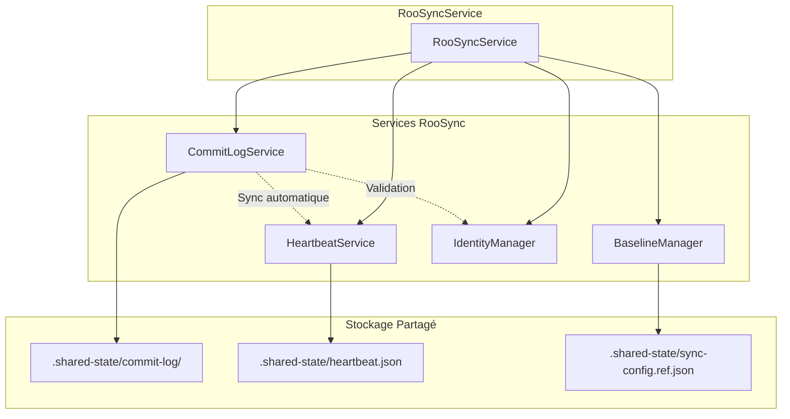

# T3.15c - Architecture du Commit Log Ordonné

**Date :** 2026-01-18
**Auteur :** Claude Code (myia-po-2024)
**Statut :** Architecture proposée
**Version :** 1.0.0

---

## 1. Résumé Exécutif

Ce document définit l'architecture détaillée du **Commit Log Service** pour RooSync v2.3, qui garantit que toutes les machines atteignent le même état via un log ordonné, évitant les scénarios de défaillance.

### Objectif Principal

Créer un service `CommitLogService` qui implémente un **commit log ordonné** pour garantir la cohérence distribuée entre les machines RooSync.

### Problème Résolu

Sans commit log ordonné, les scénarios de défaillance suivants sont possibles :

```
T1: myia-ai-01 applique décision D1
T2: myia-po-2024 offline, ne voit pas D1
T3: myia-po-2024 crée décision D2 (conflictuelle)
T4: Deux décisions coexistent, pas de résolution
```

### Solution

Un commit log ordonné garantit que toutes les machines appliquent les mêmes opérations dans le même ordre, assurant la cohérence finale.

---

## 2. Architecture Cible

### 2.1 Structure des Fichiers

```
.shared-state/
├── commit-log/                    # [NEW] Log ordonné
│   ├── 0000001.json              # Décision D1
│   ├── 0000002.json              # Config C1
│   ├── 0000003.json              # Décision D2
│   └── state.json                # État du commit log
```

### 2.2 Diagramme d'Architecture



---

## 3. Types TypeScript

### 3.1 Types Principaux

```typescript
/**
 * Types d'entrées dans le commit log
 */
export enum CommitEntryType {
  DECISION = 'decision',      // Décision de synchronisation
  CONFIG = 'config',          // Changement de configuration
  BASELINE = 'baseline',      // Mise à jour de baseline
  HEARTBEAT = 'heartbeat',    // Événement de heartbeat
  SYSTEM = 'system'           // Événement système
}

/**
 * Statut d'une entrée de commit
 */
export enum CommitStatus {
  PENDING = 'pending',        // En attente d'application
  APPLIED = 'applied',        // Appliquée avec succès
  FAILED = 'failed',          // Échec d'application
  ROLLED_BACK = 'rolled_back' // Annulée (rollback)
}

/**
 * Entrée de commit log
 */
export interface CommitEntry {
  /** Numéro de séquence unique (auto-incrémenté) */
  sequenceNumber: number;
  
  /** Type de l'entrée */
  type: CommitEntryType;
  
  /** Identifiant de la machine qui a créé l'entrée */
  machineId: string;
  
  /** Timestamp de création */
  timestamp: string;
  
  /** Statut de l'entrée */
  status: CommitStatus;
  
  /** Données de l'entrée (structure selon le type) */
  data: CommitEntryData;
  
  /** Hash de l'entrée pour vérification d'intégrité */
  hash: string;
  
  /** Signature optionnelle pour authentification */
  signature?: string;
  
  /** Métadonnées supplémentaires */
  metadata?: {
    parentId?: number;        // Entrée parente (pour dépendances)
    retryCount?: number;      // Nombre de tentatives
    lastError?: string;       // Dernière erreur
    appliedAt?: string;       // Timestamp d'application
    appliedBy?: string;       // Machine qui a appliqué
  };
}

/**
 * Données de l'entrée selon le type
 */
export type CommitEntryData = 
  | DecisionCommitData
  | ConfigCommitData
  | BaselineCommitData
  | HeartbeatCommitData
  | SystemCommitData;

/**
 * Données pour une décision de synchronisation
 */
export interface DecisionCommitData {
  /** Identifiant de la décision */
  decisionId: string;
  
  /** Type de décision */
  decisionType: 'apply' | 'rollback' | 'approve' | 'reject';
  
  /** Cible de la décision */
  target: {
    machineId?: string;
    configPath?: string;
    baselineId?: string;
  };
  
  /** Paramètres de la décision */
  parameters?: Record<string, any>;
}

/**
 * Données pour un changement de configuration
 */
export interface ConfigCommitData {
  /** Chemin du fichier de configuration */
  configPath: string;
  
  /** Type de changement */
  changeType: 'create' | 'update' | 'delete';
  
  /** Contenu de la configuration (si applicable) */
  content?: any;
  
  /** Diff du changement (si applicable) */
  diff?: {
    before?: any;
    after?: any;
  };
}

/**
 * Données pour une mise à jour de baseline
 */
export interface BaselineCommitData {
  /** Identifiant de la baseline */
  baselineId: string;
  
  /** Type de mise à jour */
  updateType: 'create' | 'update' | 'migrate';
  
  /** Version de la baseline */
  version: string;
  
  /** Machine source de la baseline */
  sourceMachineId: string;
}

/**
 * Données pour un événement de heartbeat
 */
export interface HeartbeatCommitData {
  /** Statut de la machine */
  status: 'online' | 'offline' | 'warning';
  
  /** Métadonnées du heartbeat */
  metadata?: {
    uptime?: number;
    load?: number;
    memory?: number;
  };
}

/**
 * Données pour un événement système
 */
export interface SystemCommitData {
  /** Type d'événement système */
  eventType: 'startup' | 'shutdown' | 'error' | 'maintenance';
  
  /** Message de l'événement */
  message: string;
  
  /** Détails de l'événement */
  details?: Record<string, any>;
}
```

### 3.2 État du Service

```typescript
/**
 * État du Commit Log Service
 */
export interface CommitLogState {
  /** Numéro de séquence actuel */
  currentSequenceNumber: number;
  
  /** Entrées de commit par numéro de séquence */
  entries: Map<number, CommitEntry>;
  
  /** Entrées par statut */
  entriesByStatus: {
    pending: number[];
    applied: number[];
    failed: number[];
    rolledBack: number[];
  };
  
  /** Statistiques */
  statistics: {
    totalEntries: number;
    pendingEntries: number;
    appliedEntries: number;
    failedEntries: number;
    rolledBackEntries: number;
    lastCommitTimestamp: string;
    lastAppliedTimestamp: string;
  };
  
  /** Métadonnées du service */
  metadata: {
    version: string;
    createdAt: string;
    lastUpdated: string;
    machineId: string;
  };
}
```

### 3.3 Configuration

```typescript
/**
 * Configuration du Commit Log Service
 */
export interface CommitLogConfig {
  /** Chemin vers le répertoire du commit log */
  commitLogPath: string;
  
  /** Intervalle de synchronisation automatique (ms) */
  syncInterval: number;
  
  /** Nombre maximum d'entrées à conserver */
  maxEntries: number;
  
  /** Nombre maximum de tentatives pour une entrée échouée */
  maxRetryAttempts: number;
  
  /** Délai entre les tentatives (ms) */
  retryDelay: number;
  
  /** Activer la compression des entrées anciennes */
  enableCompression: boolean;
  
  /** Âge maximum avant compression (ms) */
  compressionAge: number;
  
  /** Activer la signature des entrées */
  enableSigning: boolean;
  
  /** Algorithme de hashage */
  hashAlgorithm: 'sha256' | 'sha512';
}
```

### 3.4 Résultats d'Opérations

```typescript
/**
 * Résultat d'ajout d'une entrée
 */
export interface AppendCommitResult {
  /** Succès de l'opération */
  success: boolean;
  
  /** Numéro de séquence assigné */
  sequenceNumber?: number;
  
  /** Hash de l'entrée */
  hash?: string;
  
  /** Message d'erreur si échec */
  error?: string;
}

/**
 * Résultat de récupération d'entrées
 */
export interface GetCommitsResult {
  /** Entrées récupérées */
  entries: CommitEntry[];
  
  /** Nombre total d'entrées */
  totalCount: number;
  
  /** Indicateur de pagination */
  hasMore: boolean;
  
  /** Prochain numéro de séquence */
  nextSequenceNumber?: number;
}

/**
 * Résultat de vérification de cohérence
 */
export interface ConsistencyCheckResult {
  /** Cohérence globale */
  isConsistent: boolean;
  
  /** Entrées incohérentes */
  inconsistentEntries: Array<{
    sequenceNumber: number;
    issue: string;
    severity: 'low' | 'medium' | 'high';
  }>;
  
  /** Recommandations */
  recommendations: string[];
  
  /** Statistiques de cohérence */
  statistics: {
    totalEntries: number;
    consistentEntries: number;
    inconsistentEntries: number;
    consistencyRate: number;
  };
}

/**
 * Résultat d'application d'une entrée
 */
export interface ApplyCommitResult {
  /** Succès de l'application */
  success: boolean;
  
  /** Numéro de séquence appliqué */
  sequenceNumber: number;
  
  /** Timestamp d'application */
  appliedAt: string;
  
  /** Message d'erreur si échec */
  error?: string;
  
  /** Détails de l'application */
  details?: {
    operation: string;
    duration: number;
    affectedFiles?: string[];
  };
}
```

---

## 4. Interface du Service

### 4.1 Classe CommitLogService

```typescript
/**
 * Service de Commit Log pour RooSync
 * 
 * Responsable de la gestion du log ordonné des commits,
 * garantissant la cohérence distribuée entre les machines.
 * 
 * @module CommitLogService
 * @version 1.0.0
 */
export class CommitLogService {
  private config: CommitLogConfig;
  private state: CommitLogState;
  private syncInterval: NodeJS.Timeout | null = null;
  private logger: any;
  
  constructor(
    config: Partial<CommitLogConfig> = {}
  );
  
  /**
   * Initialise le service et charge l'état existant
   */
  private async initializeService(): Promise<void>;
  
  /**
   * Charge l'état du service depuis le disque
   */
  private async loadState(): Promise<void>;
  
  /**
   * Sauvegarde l'état du service sur le disque
   */
  private async saveState(): Promise<void>;
  
  /**
   * Ajoute une entrée au commit log
   */
  public async appendCommit(entry: Omit<CommitEntry, 'sequenceNumber' | 'timestamp' | 'hash'>): Promise<AppendCommitResult>;
  
  /**
   * Récupère une entrée par numéro de séquence
   */
  public async getCommit(sequenceNumber: number): Promise<CommitEntry | null>;
  
  /**
   * Récupère les N dernières entrées
   */
  public async getLatestCommits(count: number): Promise<GetCommitsResult>;
  
  /**
   * Récupère les entrées depuis une date
   */
  public async getCommitsSince(timestamp: string): Promise<GetCommitsResult>;
  
  /**
   * Récupère les entrées en attente d'application
   */
  public async getPendingCommits(): Promise<CommitEntry[]>;
  
  /**
   * Applique une entrée de commit
   */
  public async applyCommit(sequenceNumber: number): Promise<ApplyCommitResult>;
  
  /**
   * Applique toutes les entrées en attente
   */
  public async applyPendingCommits(): Promise<ApplyCommitResult[]>;
  
  /**
   * Annule une entrée de commit (rollback)
   */
  public async rollbackCommit(sequenceNumber: number, reason: string): Promise<boolean>;
  
  /**
   * Vérifie la cohérence du commit log
   */
  public async verifyConsistency(): Promise<ConsistencyCheckResult>;
  
  /**
   * Compresse les entrées anciennes
   */
  public async compressOldEntries(): Promise<number>;
  
  /**
   * Nettoie les entrées échouées après N tentatives
   */
  public async cleanupFailedEntries(): Promise<number>;
  
  /**
   * Synchronise le commit log avec les autres machines
   */
  public async syncWithRemote(): Promise<void>;
  
  /**
   * Démarre la synchronisation automatique
   */
  public async startAutoSync(): Promise<void>;
  
  /**
   * Arrête la synchronisation automatique
   */
  public async stopAutoSync(): Promise<void>;
  
  /**
   * Obtient l'état complet du service
   */
  public getState(): CommitLogState;
  
  /**
   * Obtient les statistiques du service
   */
  public getStatistics(): CommitLogState['statistics'];
  
  /**
   * Réinitialise le commit log (DANGER: supprime toutes les entrées)
   */
  public async resetCommitLog(confirm: boolean): Promise<void>;
}
```

### 4.2 Méthodes Utilitaires

```typescript
/**
 * Calcule le hash d'une entrée de commit
 */
export function computeCommitHash(entry: CommitEntry, algorithm: 'sha256' | 'sha512' = 'sha256'): string;

/**
 * Signe une entrée de commit
 */
export function signCommit(entry: CommitEntry, privateKey: string): string;

/**
 * Vérifie la signature d'une entrée de commit
 */
export function verifyCommitSignature(entry: CommitEntry, publicKey: string): boolean;

/**
 * Valide la structure d'une entrée de commit
 */
export function validateCommitEntry(entry: CommitEntry): { isValid: boolean; errors: string[] };

/**
 * Compare deux entrées de commit
 */
export function compareCommitEntries(a: CommitEntry, b: CommitEntry): number;
```

---

## 5. Intégration avec RooSyncService

### 5.1 Modifications dans RooSyncService

```typescript
// Dans RooSyncService.ts

export class RooSyncService {
  // ... propriétés existantes ...
  
  private commitLogService: CommitLogService;
  
  private constructor(cacheOptions?: CacheOptions, config?: RooSyncConfig) {
    // ... initialisation existante ...
    
    // Initialiser le CommitLogService
    this.commitLogService = new CommitLogService({
      commitLogPath: join(this.config.sharedPath, 'commit-log'),
      syncInterval: 30000, // 30 secondes
      maxEntries: 10000,
      maxRetryAttempts: 3,
      retryDelay: 5000,
      enableCompression: true,
      compressionAge: 86400000, // 24 heures
      enableSigning: false,
      hashAlgorithm: 'sha256'
    });
  }
  
  /**
   * Obtient le service de commit log
   */
  public getCommitLogService(): CommitLogService {
    return this.commitLogService;
  }
  
  /**
   * Ajoute une décision au commit log
   */
  public async appendDecisionToCommitLog(decisionId: string): Promise<AppendCommitResult> {
    const decision = await this.getDecision(decisionId);
    if (!decision) {
      throw new RooSyncServiceError(
        `Décision ${decisionId} non trouvée`,
        'DECISION_NOT_FOUND'
      );
    }
    
    return await this.commitLogService.appendCommit({
      type: CommitEntryType.DECISION,
      machineId: this.config.machineId,
      status: CommitStatus.PENDING,
      data: {
        decisionId,
        decisionType: 'apply',
        target: {
          machineId: decision.targetMachineId
        }
      }
    });
  }
  
  /**
   * Applique les décisions en attente depuis le commit log
   */
  public async applyPendingDecisionsFromCommitLog(): Promise<ApplyCommitResult[]> {
    const pendingCommits = await this.commitLogService.getPendingCommits();
    const results: ApplyCommitResult[] = [];
    
    for (const commit of pendingCommits) {
      if (commit.type === CommitEntryType.DECISION) {
        const result = await this.executeDecision(
          commit.data.decisionId,
          { dryRun: false }
        );
        
        if (result.success) {
          await this.commitLogService.applyCommit(commit.sequenceNumber);
        } else {
          // Marquer comme échoué
          await this.commitLogService.rollbackCommit(
            commit.sequenceNumber,
            result.error || 'Échec d\'exécution'
          );
        }
        
        results.push({
          success: result.success,
          sequenceNumber: commit.sequenceNumber,
          appliedAt: new Date().toISOString(),
          error: result.error
        });
      }
    }
    
    return results;
  }
  
  /**
   * Synchronise automatiquement lors de la détection offline
   */
  private async syncOnMachineOffline(machineId: string): Promise<void> {
    // ... code existant ...
    
    // Ajouter une entrée de commit pour la détection offline
    await this.commitLogService.appendCommit({
      type: CommitEntryType.HEARTBEAT,
      machineId: this.config.machineId,
      status: CommitStatus.APPLIED,
      data: {
        status: 'offline',
        metadata: {
          detectedMachineId: machineId
        }
      }
    });
  }
  
  /**
   * Synchronise automatiquement lors du retour online
   */
  private async syncOnMachineOnline(machineId: string): Promise<void> {
    // ... code existant ...
    
    // Ajouter une entrée de commit pour le retour online
    await this.commitLogService.appendCommit({
      type: CommitEntryType.HEARTBEAT,
      machineId: this.config.machineId,
      status: CommitStatus.APPLIED,
      data: {
        status: 'online',
        metadata: {
          detectedMachineId: machineId
        }
      }
    });
  }
}
```

### 5.2 Intégration avec HeartbeatService

```typescript
// Dans HeartbeatService.ts

export class HeartbeatService {
  // ... propriétés existantes ...
  
  private commitLogService?: CommitLogService;
  
  constructor(
    sharedPath: string,
    config?: Partial<HeartbeatConfig>,
    commitLogService?: CommitLogService
  ) {
    // ... initialisation existante ...
    
    this.commitLogService = commitLogService;
  }
  
  /**
   * Enregistre un heartbeat pour une machine
   */
  public async registerHeartbeat(
    machineId: string,
    metadata?: Record<string, any>
  ): Promise<void> {
    // ... code existant ...
    
    // Ajouter une entrée de commit pour le heartbeat
    if (this.commitLogService) {
      await this.commitLogService.appendCommit({
        type: CommitEntryType.HEARTBEAT,
        machineId,
        status: CommitStatus.APPLIED,
        data: {
          status: 'online',
          metadata
        }
      });
    }
  }
  
  /**
   * Vérifie les heartbeats et détecte les machines offline
   */
  public async checkHeartbeats(): Promise<HeartbeatCheckResult> {
    const result = await super.checkHeartbeats();
    
    // Ajouter des entrées de commit pour les changements de statut
    if (this.commitLogService) {
      for (const machineId of result.newlyOfflineMachines) {
        await this.commitLogService.appendCommit({
          type: CommitEntryType.HEARTBEAT,
          machineId,
          status: CommitStatus.APPLIED,
          data: {
            status: 'offline'
          }
        });
      }
      
      for (const machineId of result.newlyOnlineMachines) {
        await this.commitLogService.appendCommit({
          type: CommitEntryType.HEARTBEAT,
          machineId,
          status: CommitStatus.APPLIED,
          data: {
            status: 'online'
          }
        });
      }
    }
    
    return result;
  }
}
```

---

## 6. Gestion des Fichiers

### 6.1 Structure du Répertoire

```
.shared-state/commit-log/
├── 0000001.json              # Entrée de commit #1
├── 0000002.json              # Entrée de commit #2
├── 0000003.json              # Entrée de commit #3
├── ...
├── state.json                # État du service
├── archive/                  # Entrées archivées/compressées
│   ├── 2026-01/
│   │   ├── commits-2026-01-15.json.gz
│   │   └── commits-2026-01-16.json.gz
│   └── 2026-02/
└── .lock                     # Fichier de lock pour accès concurrent
```

### 6.2 Format des Fichiers

#### 6.2.1 Fichier d'Entrée (0000001.json)

```json
{
  "sequenceNumber": 1,
  "type": "decision",
  "machineId": "myia-ai-01",
  "timestamp": "2026-01-18T15:00:00.000Z",
  "status": "applied",
  "data": {
    "decisionId": "D1",
    "decisionType": "apply",
    "target": {
      "machineId": "myia-po-2024"
    }
  },
  "hash": "a1b2c3d4e5f6...",
  "metadata": {
    "appliedAt": "2026-01-18T15:00:05.000Z",
    "appliedBy": "myia-po-2024"
  }
}
```

#### 6.2.2 Fichier d'État (state.json)

```json
{
  "currentSequenceNumber": 3,
  "entries": {
    "1": { ... },
    "2": { ... },
    "3": { ... }
  },
  "entriesByStatus": {
    "pending": [],
    "applied": [1, 2, 3],
    "failed": [],
    "rolledBack": []
  },
  "statistics": {
    "totalEntries": 3,
    "pendingEntries": 0,
    "appliedEntries": 3,
    "failedEntries": 0,
    "rolledBackEntries": 0,
    "lastCommitTimestamp": "2026-01-18T15:00:00.000Z",
    "lastAppliedTimestamp": "2026-01-18T15:00:05.000Z"
  },
  "metadata": {
    "version": "1.0.0",
    "createdAt": "2026-01-18T14:00:00.000Z",
    "lastUpdated": "2026-01-18T15:00:05.000Z",
    "machineId": "myia-ai-01"
  }
}
```

### 6.3 Gestion des Locks

```typescript
/**
 * Gestionnaire de locks pour accès concurrent au commit log
 */
class CommitLogLockManager {
  private lockFilePath: string;
  private lockTimeout: number;
  
  constructor(commitLogPath: string, lockTimeout: number = 30000) {
    this.lockFilePath = join(commitLogPath, '.lock');
    this.lockTimeout = lockTimeout;
  }
  
  /**
   * Acquiert un lock
   */
  public async acquireLock(): Promise<boolean> {
    // Implémentation avec retry et timeout
  }
  
  /**
   * Libère un lock
   */
  public async releaseLock(): Promise<void> {
    // Implémentation
  }
  
  /**
   * Vérifie si un lock est détenu
   */
  public async isLocked(): Promise<boolean> {
    // Implémentation
  }
  
  /**
   * Force la libération d'un lock expiré
   */
  public async forceReleaseLock(): Promise<void> {
    // Implémentation
  }
}
```

---

## 7. Stratégie de Test

### 7.1 Tests Unitaires

#### 7.1.1 Structure des Tests

```typescript
// CommitLogService.test.ts

import { describe, it, expect, vi, beforeEach, afterEach } from 'vitest';
import { CommitLogService } from '../CommitLogService';
import { CommitEntryType, CommitStatus } from '../types/commit-log.types';

describe('CommitLogService', () => {
  let service: CommitLogService;
  const mockCommitLogPath = '/mock/commit-log';
  
  beforeEach(() => {
    vi.clearAllMocks();
    service = new CommitLogService({
      commitLogPath: mockCommitLogPath,
      syncInterval: 1000,
      maxEntries: 100,
      maxRetryAttempts: 3,
      retryDelay: 100
    });
  });
  
  afterEach(async () => {
    await service.stopAutoSync();
    vi.restoreAllMocks();
  });
  
  describe('appendCommit', () => {
    it('should append a commit entry successfully', async () => {
      const result = await service.appendCommit({
        type: CommitEntryType.DECISION,
        machineId: 'test-machine',
        status: CommitStatus.PENDING,
        data: {
          decisionId: 'D1',
          decisionType: 'apply',
          target: {}
        }
      });
      
      expect(result.success).toBe(true);
      expect(result.sequenceNumber).toBe(1);
      expect(result.hash).toBeDefined();
    });
    
    it('should increment sequence number for each commit', async () => {
      const result1 = await service.appendCommit({
        type: CommitEntryType.DECISION,
        machineId: 'test-machine',
        status: CommitStatus.PENDING,
        data: { decisionId: 'D1', decisionType: 'apply', target: {} }
      });
      
      const result2 = await service.appendCommit({
        type: CommitEntryType.DECISION,
        machineId: 'test-machine',
        status: CommitStatus.PENDING,
        data: { decisionId: 'D2', decisionType: 'apply', target: {} }
      });
      
      expect(result1.sequenceNumber).toBe(1);
      expect(result2.sequenceNumber).toBe(2);
    });
    
    it('should compute hash for each commit', async () => {
      const result = await service.appendCommit({
        type: CommitEntryType.DECISION,
        machineId: 'test-machine',
        status: CommitStatus.PENDING,
        data: { decisionId: 'D1', decisionType: 'apply', target: {} }
      });
      
      expect(result.hash).toMatch(/^[a-f0-9]{64}$/); // SHA-256 hash
    });
  });
  
  describe('getCommit', () => {
    it('should retrieve a commit by sequence number', async () => {
      const appendResult = await service.appendCommit({
        type: CommitEntryType.DECISION,
        machineId: 'test-machine',
        status: CommitStatus.PENDING,
        data: { decisionId: 'D1', decisionType: 'apply', target: {} }
      });
      
      const commit = await service.getCommit(appendResult.sequenceNumber!);
      
      expect(commit).not.toBeNull();
      expect(commit?.sequenceNumber).toBe(appendResult.sequenceNumber);
      expect(commit?.type).toBe(CommitEntryType.DECISION);
    });
    
    it('should return null for non-existent commit', async () => {
      const commit = await service.getCommit(999);
      expect(commit).toBeNull();
    });
  });
  
  describe('getLatestCommits', () => {
    it('should retrieve the latest N commits', async () => {
      // Append 5 commits
      for (let i = 1; i <= 5; i++) {
        await service.appendCommit({
          type: CommitEntryType.DECISION,
          machineId: 'test-machine',
          status: CommitStatus.PENDING,
          data: { decisionId: `D${i}`, decisionType: 'apply', target: {} }
        });
      }
      
      const result = await service.getLatestCommits(3);
      
      expect(result.entries).toHaveLength(3);
      expect(result.entries[0].sequenceNumber).toBe(3);
      expect(result.entries[1].sequenceNumber).toBe(4);
      expect(result.entries[2].sequenceNumber).toBe(5);
    });
  });
  
  describe('getCommitsSince', () => {
    it('should retrieve commits since a timestamp', async () => {
      const timestamp1 = new Date().toISOString();
      
      await service.appendCommit({
        type: CommitEntryType.DECISION,
        machineId: 'test-machine',
        status: CommitStatus.PENDING,
        data: { decisionId: 'D1', decisionType: 'apply', target: {} }
      });
      
      await new Promise(resolve => setTimeout(resolve, 100));
      
      const timestamp2 = new Date().toISOString();
      
      await service.appendCommit({
        type: CommitEntryType.DECISION,
        machineId: 'test-machine',
        status: CommitStatus.PENDING,
        data: { decisionId: 'D2', decisionType: 'apply', target: {} }
      });
      
      const result = await service.getCommitsSince(timestamp2);
      
      expect(result.entries).toHaveLength(1);
      expect(result.entries[0].data.decisionId).toBe('D2');
    });
  });
  
  describe('applyCommit', () => {
    it('should apply a pending commit successfully', async () => {
      const appendResult = await service.appendCommit({
        type: CommitEntryType.DECISION,
        machineId: 'test-machine',
        status: CommitStatus.PENDING,
        data: { decisionId: 'D1', decisionType: 'apply', target: {} }
      });
      
      const applyResult = await service.applyCommit(appendResult.sequenceNumber!);
      
      expect(applyResult.success).toBe(true);
      expect(applyResult.sequenceNumber).toBe(appendResult.sequenceNumber);
      expect(applyResult.appliedAt).toBeDefined();
      
      const commit = await service.getCommit(appendResult.sequenceNumber!);
      expect(commit?.status).toBe(CommitStatus.APPLIED);
    });
  });
  
  describe('verifyConsistency', () => {
    it('should verify consistency of the commit log', async () => {
      // Append some commits
      for (let i = 1; i <= 3; i++) {
        await service.appendCommit({
          type: CommitEntryType.DECISION,
          machineId: 'test-machine',
          status: CommitStatus.APPLIED,
          data: { decisionId: `D${i}`, decisionType: 'apply', target: {} }
        });
      }
      
      const result = await service.verifyConsistency();
      
      expect(result.isConsistent).toBe(true);
      expect(result.inconsistentEntries).toHaveLength(0);
      expect(result.statistics.consistencyRate).toBe(1.0);
    });
  });
});
```

#### 7.1.2 Scénarios de Test

| Scénario | Description | Attendu |
|-----------|-------------|----------|
| Append simple | Ajouter une entrée de commit | Succès, numéro de séquence assigné |
| Append multiple | Ajouter plusieurs entrées | Numéros de séquence incrémentaux |
| Get commit | Récupérer une entrée existante | Entrée retournée correctement |
| Get non-existent | Récupérer une entrée inexistante | Null retourné |
| Get latest | Récupérer les N dernières entrées | Entrées triées par séquence |
| Get since timestamp | Récupérer depuis une date | Entrées filtrées correctement |
| Apply pending | Appliquer une entrée en attente | Statut changé à APPLIED |
| Apply applied | Ré-appliquer une entrée déjà appliquée | Erreur ou no-op |
| Rollback | Annuler une entrée appliquée | Statut changé à ROLLED_BACK |
| Verify consistency | Vérifier la cohérence du log | Rapport de cohérence généré |
| Compress old | Compresser les entrées anciennes | Entrées déplacées vers archive |
| Cleanup failed | Nettoyer les entrées échouées | Entrées supprimées après N tentatives |

### 7.2 Tests d'Intégration

#### 7.2.1 Intégration avec RooSyncService

```typescript
// CommitLogService.integration.test.ts

import { describe, it, expect, beforeAll, afterAll } from 'vitest';
import { RooSyncService } from '../../RooSyncService';
import { CommitLogService } from '../CommitLogService';

describe('CommitLogService Integration', () => {
  let rooSyncService: RooSyncService;
  let commitLogService: CommitLogService;
  
  beforeAll(async () => {
    rooSyncService = RooSyncService.getInstance();
    commitLogService = rooSyncService.getCommitLogService();
  });
  
  afterAll(async () => {
    await commitLogService.stopAutoSync();
  });
  
  it('should integrate with RooSyncService', async () => {
    expect(commitLogService).toBeDefined();
    expect(commitLogService.getState()).toBeDefined();
  });
  
  it('should append decision to commit log', async () => {
    const result = await rooSyncService.appendDecisionToCommitLog('test-decision-id');
    expect(result.success).toBe(true);
    expect(result.sequenceNumber).toBeGreaterThan(0);
  });
  
  it('should apply pending decisions from commit log', async () => {
    const results = await rooSyncService.applyPendingDecisionsFromCommitLog();
    expect(Array.isArray(results)).toBe(true);
  });
});
```

#### 7.2.2 Intégration avec HeartbeatService

```typescript
// HeartbeatService.integration.test.ts

import { describe, it, expect, beforeAll, afterAll } from 'vitest';
import { RooSyncService } from '../../RooSyncService';
import { HeartbeatService } from '../HeartbeatService';
import { CommitLogService } from '../CommitLogService';

describe('HeartbeatService + CommitLogService Integration', () => {
  let rooSyncService: RooSyncService;
  let heartbeatService: HeartbeatService;
  let commitLogService: CommitLogService;
  
  beforeAll(async () => {
    rooSyncService = RooSyncService.getInstance();
    heartbeatService = rooSyncService.getHeartbeatService();
    commitLogService = rooSyncService.getCommitLogService();
  });
  
  afterAll(async () => {
    await heartbeatService.stopHeartbeatService();
    await commitLogService.stopAutoSync();
  });
  
  it('should append heartbeat commits to commit log', async () => {
    const machineId = 'test-machine';
    await heartbeatService.registerHeartbeat(machineId);
    
    const latestCommits = await commitLogService.getLatestCommits(1);
    expect(latestCommits.entries).toHaveLength(1);
    expect(latestCommits.entries[0].type).toBe('heartbeat');
  });
  
  it('should detect offline and append to commit log', async () => {
    // Simuler une machine offline
    const result = await heartbeatService.checkHeartbeats();
    
    if (result.newlyOfflineMachines.length > 0) {
      const latestCommits = await commitLogService.getLatestCommits(1);
      expect(latestCommits.entries[0].data.status).toBe('offline');
    }
  });
});
```

### 7.3 Tests E2E

#### 7.3.1 Scénario Multi-Machine

```typescript
// CommitLogService.e2e.test.ts

import { describe, it, expect, beforeAll, afterAll } from 'vitest';
import { RooSyncService } from '../../RooSyncService';

describe('CommitLogService E2E - Multi-Machine', () => {
  let service1: RooSyncService;
  let service2: RooSyncService;
  
  beforeAll(async () => {
    // Simuler deux machines différentes
    process.env.ROOSYNC_MACHINE_ID = 'machine-1';
    service1 = RooSyncService.getInstance();
    
    process.env.ROOSYNC_MACHINE_ID = 'machine-2';
    service2 = RooSyncService.getInstance();
  });
  
  afterAll(async () => {
    await service1.getCommitLogService().stopAutoSync();
    await service2.getCommitLogService().stopAutoSync();
  });
  
  it('should maintain consistency across machines', async () => {
    // Machine 1 ajoute une décision
    const result1 = await service1.appendDecisionToCommitLog('D1');
    expect(result1.success).toBe(true);
    
    // Attendre synchronisation
    await new Promise(resolve => setTimeout(resolve, 2000));
    
    // Machine 2 devrait voir la même entrée
    const commit2 = await service2.getCommitLogService().getCommit(result1.sequenceNumber!);
    expect(commit2).not.toBeNull();
    expect(commit2?.sequenceNumber).toBe(result1.sequenceNumber);
  });
  
  it('should handle concurrent commits correctly', async () => {
    // Les deux machines ajoutent des commits simultanément
    const [result1, result2] = await Promise.all([
      service1.appendDecisionToCommitLog('D2'),
      service2.appendDecisionToCommitLog('D3')
    ]);
    
    expect(result1.success).toBe(true);
    expect(result2.success).toBe(true);
    
    // Les numéros de séquence devraient être uniques
    expect(result1.sequenceNumber).not.toBe(result2.sequenceNumber);
  });
});
```

---

## 8. Dépendances Identifiées

### 8.1 Dépendances Internes

| Service | Dépendance | Utilisation |
|---------|-------------|------------|
| `CommitLogService` | `RooSyncConfig` | Configuration du chemin partagé |
| `CommitLogService` | `StateManagerError` | Gestion des erreurs |
| `CommitLogService` | `createLogger` | Logging |
| `RooSyncService` | `CommitLogService` | Délégation des opérations de commit |
| `HeartbeatService` | `CommitLogService` | Enregistrement des heartbeats |
| `BaselineManager` | `CommitLogService` | Enregistrement des mises à jour de baseline |

### 8.2 Dépendances Externes

| Module | Version | Utilisation |
|--------|---------|------------|
| `fs/promises` | Node.js builtin | Opérations de fichier asynchrones |
| `fs` | Node.js builtin | Opérations de fichier synchrones |
| `path` | Node.js builtin | Manipulation de chemins |
| `crypto` | Node.js builtin | Hashage et signature |
| `zlib` | Node.js builtin | Compression des entrées |

### 8.3 Dépendances de Développement

| Module | Version | Utilisation |
|--------|---------|------------|
| `vitest` | ^1.0.0 | Framework de test |
| `@types/node` | ^20.0.0 | Types Node.js |

---

## 9. Plan d'Implémentation

### 9.1 Phases de Développement

#### Phase 1: Fondations (2-3h)
- [ ] Créer les types TypeScript (`commit-log.types.ts`)
- [ ] Implémenter la classe `CommitLogService` de base
- [ ] Implémenter les méthodes de gestion d'état
- [ ] Tests unitaires pour les types et l'état

#### Phase 2: Opérations de Commit (2-3h)
- [ ] Implémenter `appendCommit()`
- [ ] Implémenter `getCommit()`
- [ ] Implémenter `getLatestCommits()`
- [ ] Implémenter `getCommitsSince()`
- [ ] Tests unitaires pour les opérations de commit

#### Phase 3: Application et Rollback (2-3h)
- [ ] Implémenter `applyCommit()`
- [ ] Implémenter `applyPendingCommits()`
- [ ] Implémenter `rollbackCommit()`
- [ ] Tests unitaires pour l'application et le rollback

#### Phase 4: Cohérence et Maintenance (1-2h)
- [ ] Implémenter `verifyConsistency()`
- [ ] Implémenter `compressOldEntries()`
- [ ] Implémenter `cleanupFailedEntries()`
- [ ] Tests unitaires pour la cohérence et la maintenance

#### Phase 5: Synchronisation (1-2h)
- [ ] Implémenter `syncWithRemote()`
- [ ] Implémenter `startAutoSync()`
- [ ] Implémenter `stopAutoSync()`
- [ ] Tests unitaires pour la synchronisation

#### Phase 6: Intégration (2-3h)
- [ ] Intégrer avec `RooSyncService`
- [ ] Intégrer avec `HeartbeatService`
- [ ] Tests d'intégration
- [ ] Tests E2E

### 9.2 Ordre de Priorité

1. **P0 - Critique** : Types, état, opérations de commit de base
2. **P1 - High** : Application, rollback, cohérence
3. **P2 - Medium** : Synchronisation automatique, compression
4. **P3 - Low** : Signature, tests E2E avancés

---

## 10. Risques et Mitigations

### 10.1 Risques Identifiés

| Risque | Impact | Probabilité | Mitigation |
|--------|--------|-------------|------------|
| Conflits d'accès concurrent | High | Medium | Utilisation de locks fichier |
| Corruption du commit log | High | Low | Hashage et vérification d'intégrité |
| Performance avec beaucoup d'entrées | Medium | Medium | Compression et archivage automatique |
| Incohérence entre machines | High | Medium | Synchronisation automatique et vérification |
| Perte de données | Critical | Low | Backup automatique avant modifications |

### 10.2 Stratégies de Mitigation

#### 10.2.1 Gestion des Conflits

```typescript
/**
 * Stratégie de résolution des conflits d'accès
 */
enum ConflictResolutionStrategy {
  RETRY = 'retry',           // Réessayer après délai
  QUEUE = 'queue',           // Mettre en file d'attente
  MERGE = 'merge',           // Fusionner les changements
  FAIL = 'fail'              // Échouer l'opération
}

/**
 * Résout un conflit d'accès
 */
async function resolveConflict(
  conflict: Conflict,
  strategy: ConflictResolutionStrategy
): Promise<ConflictResolution> {
  switch (strategy) {
    case ConflictResolutionStrategy.RETRY:
      return await retryWithBackoff(conflict.operation);
    case ConflictResolutionStrategy.QUEUE:
      return await queueOperation(conflict.operation);
    case ConflictResolutionStrategy.MERGE:
      return await mergeChanges(conflict.changes);
    case ConflictResolutionStrategy.FAIL:
      throw new CommitLogError('Conflict detected', 'CONFLICT');
  }
}
```

#### 10.2.2 Vérification d'Intégrité

```typescript
/**
 * Vérifie l'intégrité d'une entrée de commit
 */
function verifyCommitIntegrity(entry: CommitEntry): boolean {
  // Vérifier le hash
  const computedHash = computeCommitHash(entry);
  if (computedHash !== entry.hash) {
    return false;
  }
  
  // Vérifier la signature si activée
  if (entry.signature) {
    return verifyCommitSignature(entry, publicKey);
  }
  
  // Vérifier la structure
  const validation = validateCommitEntry(entry);
  return validation.isValid;
}
```

---

## 11. Documentation

### 11.1 Documentation Utilisateur

```markdown
# Commit Log Service - Guide Utilisateur

## Qu'est-ce que le Commit Log Service?

Le Commit Log Service garantit que toutes les machines RooSync atteignent le même état via un log ordonné des opérations.

## Utilisation

### Ajouter une entrée au commit log

```typescript
const result = await commitLogService.appendCommit({
  type: CommitEntryType.DECISION,
  machineId: 'my-machine',
  status: CommitStatus.PENDING,
  data: {
    decisionId: 'D1',
    decisionType: 'apply',
    target: {}
  }
});
```

### Récupérer les dernières entrées

```typescript
const result = await commitLogService.getLatestCommits(10);
console.log(result.entries);
```

### Vérifier la cohérence

```typescript
const result = await commitLogService.verifyConsistency();
if (!result.isConsistent) {
  console.error('Incohérences détectées:', result.inconsistentEntries);
}
```
```

### 11.2 Documentation Développeur

```markdown
# Commit Log Service - Guide Développeur

## Architecture

Le service utilise un pattern Singleton avec état persistant sur disque.

## Extension

Pour ajouter un nouveau type d'entrée:

1. Ajouter le type dans `CommitEntryType`
2. Définir l'interface de données correspondante
3. Implémenter la logique d'application dans `applyCommit()`
4. Ajouter des tests unitaires

## Tests

Exécuter les tests unitaires:
```bash
npm test -- CommitLogService.test.ts
```

Exécuter les tests d'intégration:
```bash
npm test -- CommitLogService.integration.test.ts
```
```

---

## 12. Conclusion

Cette architecture définit un service `CommitLogService` robuste et évolutif qui garantit la cohérence distribuée entre les machines RooSync. Le service suit les patterns établis dans le codebase et s'intègre harmonieusement avec les services existants.

### Points Clés

- **Cohérence garantie** : Log ordonné avec numéros de séquence uniques
- **Résilience** : Gestion des erreurs, retries, et rollback
- **Performance** : Compression et archivage automatique
- **Sécurité** : Hashage et signature optionnelle
- **Observabilité** : Logging détaillé et statistiques

### Prochaines Étapes

1. Valider cette architecture avec l'équipe
2. Créer les tickets de développement
3. Implémenter selon le plan de phases
4. Tests unitaires et d'intégration
5. Documentation utilisateur et développeur

---

**Rapport généré par Claude Code (myia-po-2024)**
**Date :** 2026-01-18T15:18:00Z
**Version :** 1.0.0
