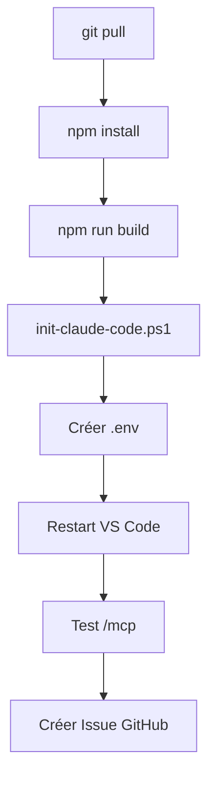

# T4.1 - Analyse des Besoins de Déploiement Multi-Agent

**Date :** 2026-01-15
**Auteur :** Claude Code (myia-po-2023)
**Statut :** Analyse complétée

---

## 1. Résumé Exécutif

Le déploiement RooSync sur 5 machines nécessite actuellement **~5x d'effort manuel redondant**. L'architecture est solide mais manque d'**orchestration automatisée**.

| Aspect | État | Problème |
|--------|------|----------|
| Build | npm + tsc | Manuel sur 5 machines |
| Config | Template + script | Manuel par machine |
| Secrets | `.env` files | Création manuelle |
| Verification | Tests visuels | Sujet aux erreurs |
| Rollback | git revert manuel | Complexe |

---

## 2. Architecture Actuelle

### 2.1 Serveurs MCP Déployés

| Serveur | Outils | Version |
|---------|--------|---------|
| `github-projects-mcp` | 57 | v0.1.0 |
| `roo-state-manager` | 80+ → 11 (wrapper) | v1.0.14 |

**Wrapper intelligent :** `mcp-wrapper.cjs` filtre 80+ outils vers 11 outils RooSync sûrs pour Claude Code.

### 2.2 État des Machines

| Machine | Statut MCP | Notes |
|---------|------------|-------|
| **myia-ai-01** | ✅ Opérationnel | Coordinateur |
| **myia-po-2023** | ✅ Opérationnel | Cette machine |
| **myia-po-2024** | ❌ À configurer | |
| **myia-po-2026** | ❌ À configurer | HS (reboot requis) |
| **myia-web-01** | ❌ À configurer | |

### 2.3 Processus de Déploiement Actuel



**Étapes manuelles par machine : 8**
**Temps estimé : 15-30 min/machine**
**Total pour 5 machines : 1h30-2h30**

---

## 3. Fichiers Clés

### 3.1 Scripts de Déploiement

| Fichier | Lignes | Fonction |
|---------|--------|----------|
| `.claude/scripts/init-claude-code.ps1` | 346 | Déploiement MCP |
| `roo-modes/n5/scripts/deploy.ps1` | - | Config modes |

### 3.2 Templates de Configuration

| Fichier | Contenu |
|---------|---------|
| `.mcp.json.template` | 2 MCPs avec placeholders |
| `.env.example` | Tokens GitHub |
| `config/sync-config.json` | Config RooSync |

### 3.3 Build System

```json
// package.json (github-projects-mcp)
{
  "scripts": {
    "build": "tsc",
    "start": "node dist/index.js"
  }
}
```

---

## 4. Points de Douleur

### 4.1 Effort Redondant (CRITIQUE)

| Action | Répétitions | Automatisable |
|--------|-------------|---------------|
| `npm install && npm run build` | 5x | ✅ Oui |
| `init-claude-code.ps1` | 5x | ✅ Oui |
| Créer `.env` | 5x | ⚠️ Partiel |
| Restart VS Code | 5x | ❌ Manuel |
| Test `/mcp` | 5x | ✅ Oui |

### 4.2 Risques

| Risque | Impact | Probabilité |
|--------|--------|-------------|
| Configuration drift | Machine désynchronisée | MEDIUM |
| Token expiré | MCP inaccessible | HIGH |
| Build échoué non détecté | Outils manquants | MEDIUM |
| Rollback difficile | Longue récupération | HIGH |

---

## 5. Opportunités d'Automatisation

### 5.1 Priorité Haute

#### Script de Déploiement Batch

```powershell
# deploy-all-machines.ps1
$machines = @("myia-ai-01", "myia-po-2023", "myia-po-2024", "myia-po-2026", "myia-web-01")

foreach ($machine in $machines) {
    Write-Host "Deploying to $machine..."
    # SSH/WinRM remote execution
    Invoke-Command -ComputerName $machine -ScriptBlock {
        cd D:\Dev\roo-extensions
        git pull
        npm install
        npm run build
        .\.claude\scripts\init-claude-code.ps1 -Scope Global
    }
}
```

#### Validation Automatique Post-Déploiement

```powershell
function Test-MCPDeployment {
    param([string]$Machine)

    # Vérifier que les serveurs sont buildés
    $serverPaths = @(
        "mcps/internal/servers/github-projects-mcp/dist/index.js",
        "mcps/internal/servers/roo-state-manager/mcp-wrapper.cjs"
    )

    foreach ($path in $serverPaths) {
        if (-not (Test-Path $path)) {
            return $false
        }
    }
    return $true
}
```

### 5.2 Priorité Moyenne

#### Gestion Centralisée des Credentials

```
G:/Mon Drive/Synchronisation/RooSync/.credentials/
├── base.env.encrypted           # Template chiffré
├── myia-ai-01.env.encrypted     # Spécifique machine
└── rotation-log.json            # Historique rotations
```

#### Détection de Drift

```typescript
// Comparer hash de configuration actuel vs attendu
async function detectConfigDrift(machineId: string): Promise<DriftReport> {
  const expected = await getExpectedConfig(machineId);
  const actual = await getCurrentConfig(machineId);
  return compareConfigs(expected, actual);
}
```

---

## 6. Architecture Cible

### 6.1 Déploiement Orchestré

```
                    ┌─────────────────┐
                    │  Coordinateur   │
                    │  (myia-ai-01)   │
                    └────────┬────────┘
                             │
            ┌────────────────┼────────────────┐
            │                │                │
    ┌───────▼───────┐ ┌──────▼──────┐ ┌──────▼──────┐
    │ myia-po-2023  │ │ myia-po-2024│ │ myia-web-01 │
    │   (Agent)     │ │   (Agent)   │ │   (Agent)   │
    └───────────────┘ └─────────────┘ └─────────────┘
```

### 6.2 Workflow Automatisé

```
1. Trigger: git push to main
2. CI: Build + test tous les MCPs
3. Notify: Message RooSync aux machines
4. Deploy: Chaque machine pull + rebuild
5. Verify: Health check automatique
6. Report: Status dans sync-dashboard.json
```

---

## 7. Plan d'Action

### Phase 1 : Scripts de Base (T4.2a)

| Tâche | Description | Effort |
|-------|-------------|--------|
| Créer `deploy-all.ps1` | Déploiement parallèle | 3-4h |
| Créer `verify-deployment.ps1` | Health checks | 2h |
| Créer `rollback.ps1` | Restauration rapide | 2h |

### Phase 2 : Orchestration (T4.2b)

| Tâche | Description | Effort |
|-------|-------------|--------|
| Intégrer WinRM/SSH | Exécution remote | 4h |
| Ajouter notifications | RooSync messages | 2h |
| Dashboard status | sync-dashboard.json | 2h |

### Phase 3 : Monitoring (T4.2c)

| Tâche | Description | Effort |
|-------|-------------|--------|
| Drift detection | Vérification périodique | 3h |
| Token expiration alerts | Monitoring .env | 2h |
| Deployment logs | Historique centralisé | 2h |

---

## 8. IDs Critiques à Préserver

```json
{
  "github_projects": {
    "project_id": "PVT_kwHOADA1Xc4BLw3w",
    "status_field": "PVTSSF_lAHOADA1Xc4BLw3wzg7PYHY",
    "options": {
      "Todo": "f75ad846",
      "In Progress": "47fc9ee4",
      "Done": "98236657"
    }
  }
}
```

---

## 9. Conclusion

Le système de déploiement actuel est **fonctionnel mais non scalable**. L'ajout d'un script de déploiement batch + validation automatique réduirait l'effort de ~2h30 à ~15 minutes pour les 5 machines.

**Recommandation :** Implémenter Phase 1 (scripts de base) en priorité pour réduire immédiatement l'effort manuel.

---

**Rapport généré par Claude Code (myia-po-2023)**
**Date :** 2026-01-15T12:45:00Z
