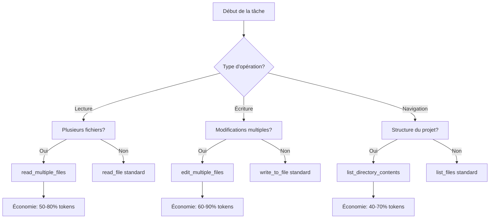

# Guide d'utilisation optimisée du MCP QuickFiles

## Table des matières

1. [Introduction](#introduction)
2. [Avantages en termes d'économie de tokens](#avantages-en-termes-déconomie-de-tokens)
3. [Fonctionnalités principales](#fonctionnalités-principales)
4. [Guide d'utilisation par mode](#guide-dutilisation-par-mode)
5. [Exemples de code détaillés](#exemples-de-code-détaillés)
6. [Intégration avec d'autres MCPs](#intégration-avec-dautres-mcps)
7. [Bonnes pratiques et optimisations](#bonnes-pratiques-et-optimisations)
8. [Référence technique](#référence-technique)
9. [Dépannage](#dépannage)

## Introduction

Le MCP QuickFiles est un serveur qui fournit des méthodes optimisées pour manipuler efficacement des fichiers et répertoires multiples en une seule opération. Il a été conçu spécifiquement pour réduire la consommation de tokens lors des interactions avec les fichiers, tout en offrant des fonctionnalités avancées comme la lecture d'extraits spécifiques ou l'édition groupée.

Ce guide vous aidera à tirer le meilleur parti du MCP QuickFiles dans les différents modes de Roo, avec des exemples concrets et des recommandations adaptées à chaque contexte d'utilisation.

## Avantages en termes d'économie de tokens

L'utilisation du MCP QuickFiles permet de réaliser des économies significatives de tokens par rapport aux méthodes traditionnelles :

| Opération | Méthode standard | MCP QuickFiles | Économie de tokens | Modes bénéficiaires |
|-----------|------------------|----------------|-------------------|---------------------|
| Lecture de 5 fichiers | 5 appels à read_file | 1 appel à read_multiple_files | ~75% | Code, Debug, Ask |
| Lecture d'extraits | Lecture complète + filtrage | read_multiple_files avec excerpts | ~90% | Debug, Ask |
| Édition de 3 fichiers | 3 appels à write_to_file | 1 appel à edit_multiple_files | ~70% | Code, Architect |
| Navigation dans 10 dossiers | 10 appels à list_files | 1 appel à list_directory_contents | ~85% | Architect, Orchestrator |
| Suppression de fichiers | Appels multiples à execute_command | 1 appel à delete_files | ~60% | Code, Debug |

Ces économies sont réalisées grâce à :
- La réduction du nombre de requêtes et des métadonnées associées
- L'extraction ciblée de contenu pertinent uniquement
- Le traitement par lots des opérations similaires
- Le formatage optimisé des réponses

## Fonctionnalités principales

### 1. read_multiple_files

Permet de lire plusieurs fichiers en une seule requête avec des options avancées :
- Lecture de fichiers complets ou d'extraits spécifiques
- Numérotation de lignes optionnelle
- Limitation du nombre de lignes par fichier et au total

### 2. list_directory_contents

Liste le contenu de répertoires avec des informations détaillées :
- Navigation récursive optionnelle
- Affichage de métadonnées (taille, type, nombre de lignes)
- Limitation du nombre de lignes dans la sortie

### 3. delete_files

Supprime plusieurs fichiers en une seule opération :
- Suppression groupée efficace
- Rapport détaillé des résultats

### 4. edit_multiple_files

Modifie plusieurs fichiers en une seule opération :
- Application de plusieurs modifications par fichier
- Possibilité de cibler des sections spécifiques (à partir d'une ligne donnée)
- Rapport détaillé des modifications effectuées

## Guide d'utilisation par mode

### Mode Code

**Cas d'usage optimaux :**
- Analyse rapide de multiples fichiers de code source
- Refactorisation de code à travers plusieurs fichiers
- Recherche de patterns dans la base de code

**Fonctionnalités recommandées :**
1. `read_multiple_files` avec extraits pour analyser des portions spécifiques du code
2. `edit_multiple_files` pour appliquer des modifications cohérentes à travers la base de code
3. `list_directory_contents` pour comprendre la structure du projet

**Économie de tokens :** 60-80% selon les opérations

**Exemple d'utilisation :**
```javascript
// Refactorisation d'une fonction dans plusieurs fichiers
await client.callTool('quickfiles-server', 'edit_multiple_files', {
  files: [
    {
      path: 'src/utils.js',
      diffs: [
        {
          search: 'function oldName(params) {',
          replace: 'function newName(params) {'
        }
      ]
    },
    {
      path: 'src/components/Component.js',
      diffs: [
        {
          search: 'oldName(',
          replace: 'newName('
        }
      ]
    }
  ]
});
```

### Mode Debug

**Cas d'usage optimaux :**
- Inspection de fichiers de logs et de configuration
- Analyse de sections spécifiques de code pour identifier des bugs
- Comparaison de différentes versions de fichiers

**Fonctionnalités recommandées :**
1. `read_multiple_files` avec numérotation de lignes pour faciliter le débogage
2. `list_directory_contents` pour identifier rapidement les fichiers pertinents
3. `edit_multiple_files` pour corriger des bugs similaires dans plusieurs fichiers

**Économie de tokens :** 70-90% pour l'analyse de logs

**Exemple d'utilisation :**
```javascript
// Analyse de logs d'erreur dans plusieurs fichiers
const logsResult = await client.callTool('quickfiles-server', 'read_multiple_files', {
  paths: [
    {
      path: 'logs/error.log',
      excerpts: [
        { start: 1000, end: 1050 }  // Cibler la section avec l'erreur
      ]
    },
    {
      path: 'logs/app.log',
      excerpts: [
        { start: 500, end: 550 }
      ]
    }
  ],
  show_line_numbers: true  // Facilite la référence aux lignes spécifiques
});
```

### Mode Architect

**Cas d'usage optimaux :**
- Vue d'ensemble de la structure du projet
- Analyse de la cohérence architecturale à travers plusieurs fichiers
- Documentation et génération de rapports

**Fonctionnalités recommandées :**
1. `list_directory_contents` pour cartographier la structure du projet
2. `read_multiple_files` pour analyser les interfaces et les dépendances
3. `edit_multiple_files` pour mettre à jour la documentation dans plusieurs fichiers

**Économie de tokens :** 50-75% pour l'analyse de structure

**Exemple d'utilisation :**
```javascript
// Cartographie de la structure du projet
const structureResult = await client.callTool('quickfiles-server', 'list_directory_contents', {
  paths: [
    {
      path: 'src',
      recursive: true  // Explorer toute la structure
    }
  ]
});
```

### Mode Ask

**Cas d'usage optimaux :**
- Recherche rapide d'informations dans plusieurs fichiers
- Extraction de contexte pertinent pour répondre aux questions
- Accès efficace aux fichiers de documentation

**Fonctionnalités recommandées :**
1. `read_multiple_files` avec extraits pour obtenir uniquement l'information pertinente
2. `list_directory_contents` pour identifier les fichiers contenant potentiellement l'information recherchée

**Économie de tokens :** 80-95% pour la recherche d'informations

**Exemple d'utilisation :**
```javascript
// Recherche d'informations sur une API dans la documentation
const docsResult = await client.callTool('quickfiles-server', 'read_multiple_files', {
  paths: [
    'docs/api.md',
    'docs/examples.md',
    'README.md'
  ],
  show_line_numbers: false,
  max_lines_per_file: 500  // Limiter la quantité d'information
});
```

### Mode Orchestrator

**Cas d'usage optimaux :**
- Coordination efficace entre différents modes
- Transfert optimal de contexte entre les modes
- Gestion efficace des ressources (tokens)

**Fonctionnalités recommandées :**
1. Toutes les fonctionnalités pour optimiser le transfert de contexte entre les modes
2. `read_multiple_files` avec limitation de lignes pour contrôler la consommation de tokens
3. `edit_multiple_files` pour appliquer des modifications recommandées par différents modes

**Économie de tokens :** 60-85% pour la coordination entre modes

**Exemple d'utilisation :**
```javascript
// Préparation de contexte pour transfert entre modes
const contextResult = await client.callTool('quickfiles-server', 'read_multiple_files', {
  paths: [
    {
      path: 'src/main.js',
      excerpts: [
        { start: 10, end: 50 }  // Section pertinente uniquement
      ]
    },
    'package.json',
    'tsconfig.json'
  ],
  max_total_lines: 200  // Contrôle strict de la consommation de tokens
});
```

## Exemples de code détaillés

### Exemple 1: Analyse de code à travers plusieurs fichiers

```javascript
// Scénario: Analyser l'utilisation d'une fonction spécifique dans plusieurs fichiers
const analysisResult = await client.callTool('quickfiles-server', 'read_multiple_files', {
  paths: [
    // Rechercher dans tous les fichiers JavaScript du dossier src
    ...jsFiles.map(file => ({
      path: file,
      excerpts: [
        // Extraire uniquement les lignes contenant la fonction recherchée
        // avec quelques lignes de contexte avant et après
        ...findFunctionOccurrences(file, 'targetFunction', 3)
      ]
    }))
  ],
  show_line_numbers: true,
  max_total_lines: 1000
});

// Fonction helper pour trouver les occurrences (simulation)
function findFunctionOccurrences(file, functionName, contextLines) {
  // Cette fonction analyserait le fichier pour trouver les lignes
  // contenant la fonction et retournerait des objets { start, end }
  // pour chaque occurrence avec le contexte demandé
  return [
    { start: 45, end: 52 },
    { start: 120, end: 127 }
  ];
}
```

### Exemple 2: Refactorisation à grande échelle

```javascript
// Scénario: Mise à jour des imports dans plusieurs fichiers
const editResult = await client.callTool('quickfiles-server', 'edit_multiple_files', {
  files: [
    // Appliquer les modifications à tous les fichiers concernés
    ...affectedFiles.map(file => ({
      path: file,
      diffs: [
        {
          // Mettre à jour les imports
          search: "import { OldComponent } from '@/components';",
          replace: "import { NewComponent } from '@/components/new';"
        },
        {
          // Mettre à jour les utilisations
          search: "<OldComponent",
          replace: "<NewComponent"
        },
        {
          // Mettre à jour les fermetures de balises
          search: "</OldComponent>",
          replace: "</NewComponent>"
        }
      ]
    }))
  ]
});

// Vérification des modifications
console.log(`${editResult.filter(r => r.modified).length} fichiers modifiés sur ${affectedFiles.length}`);
```

### Exemple 3: Analyse de structure de projet

```javascript
// Scénario: Générer un rapport sur la structure du projet
const structureResult = await client.callTool('quickfiles-server', 'list_directory_contents', {
  paths: [
    {
      path: 'src',
      recursive: true
    },
    {
      path: 'tests',
      recursive: true
    }
  ],
  max_lines: 5000
});

// Analyse des résultats
const fileTypes = {};
const directoryStructure = {};

// Traitement des résultats pour extraire des statistiques
// ...

// Génération d'un rapport Markdown
const reportContent = `# Rapport de structure du projet\n\n...`;

// Sauvegarde du rapport
await client.callTool('quickfiles-server', 'edit_multiple_files', {
  files: [{
    path: 'docs/project-structure.md',
    diffs: [{
      search: ".*",
      replace: reportContent
    }]
  }]
});
```

## Intégration avec d'autres MCPs

Le MCP QuickFiles peut être utilisé en combinaison avec d'autres MCPs pour créer des workflows puissants et économes en tokens.

### Intégration avec Jinavigator

```javascript
// Scénario: Récupérer du contenu web, le convertir en Markdown et le sauvegarder
// 1. Utiliser Jinavigator pour convertir des pages web en Markdown
const webContents = await jinavigatorClient.callTool('multi_convert', {
  urls: [
    { url: 'https://example.com/docs/page1' },
    { url: 'https://example.com/docs/page2' }
  ]
});

// 2. Utiliser QuickFiles pour sauvegarder les contenus convertis
await quickfilesClient.callTool('edit_multiple_files', {
  files: webContents.map((result, index) => ({
    path: `docs/web-content-${index + 1}.md`,
    diffs: [{
      search: ".*",
      replace: result.content
    }]
  }))
});

// 3. Générer un index des contenus sauvegardés
const indexContent = `# Index des contenus web\n\n${
  webContents.map((_, index) => 
    `- [Contenu ${index + 1}](web-content-${index + 1}.md)`
  ).join('\n')
}`;

await quickfilesClient.callTool('edit_multiple_files', {
  files: [{
    path: 'docs/index.md',
    diffs: [{
      search: ".*",
      replace: indexContent
    }]
  }]
});
```

### Workflow d'analyse de code

```javascript
// Scénario: Analyser du code, générer un rapport et le sauvegarder
// 1. Utiliser QuickFiles pour lire les fichiers de code
const codeFiles = await quickfilesClient.callTool('read_multiple_files', {
  paths: [
    'src/main.js',
    'src/utils.js',
    'src/components/App.js'
  ],
  show_line_numbers: true
});

// 2. Analyser le code (simulation)
const analysisResults = analyzeCode(codeFiles);

// 3. Générer un rapport
const reportContent = generateReport(analysisResults);

// 4. Sauvegarder le rapport
await quickfilesClient.callTool('edit_multiple_files', {
  files: [{
    path: 'reports/code-analysis.md',
    diffs: [{
      search: ".*",
      replace: reportContent
    }]
  }]
});
```

## Bonnes pratiques et optimisations

### Optimisation de la consommation de tokens

1. **Utiliser les extraits de façon ciblée**
   - Ne demander que les portions de fichiers réellement nécessaires
   - Utiliser des algorithmes pour identifier les sections pertinentes avant de faire la requête

2. **Limiter le nombre de lignes**
   - Toujours définir `max_lines_per_file` et `max_total_lines` pour éviter les surprises
   - Ajuster ces limites en fonction du contexte et de la tâche

3. **Grouper les opérations similaires**
   - Regrouper les lectures de fichiers similaires dans une seule requête
   - Regrouper les modifications liées dans une seule opération d'édition

4. **Filtrer les fichiers non pertinents**
   - Utiliser `list_directory_contents` pour identifier les fichiers pertinents avant de les lire
   - Exclure les fichiers binaires ou trop volumineux

### Diagramme de flux décisionnel



## Référence technique

### read_multiple_files

**Description :** Lit plusieurs fichiers en une seule requête avec numérotation de lignes optionnelle et extraits de fichiers.

**Paramètres :**
```json
{
  "paths": [
    "chemin/vers/fichier1.txt",
    "chemin/vers/fichier2.txt"
  ],
  "show_line_numbers": true,
  "max_lines_per_file": 1000,
  "max_total_lines": 2000
}
```

**Ou avec extraits :**
```json
{
  "paths": [
    {
      "path": "chemin/vers/fichier.txt",
      "excerpts": [
        { "start": 10, "end": 20 },
        { "start": 50, "end": 60 }
      ]
    }
  ],
  "show_line_numbers": true
}
```

### list_directory_contents

**Description :** Liste tous les fichiers et répertoires sous un chemin donné, avec la taille des fichiers.

**Paramètres :**
```json
{
  "paths": [
    {
      "path": "chemin/vers/repertoire",
      "recursive": true
    }
  ],
  "max_lines": 1000
}
```

### delete_files

**Description :** Supprime une liste de fichiers en une seule opération.

**Paramètres :**
```json
{
  "paths": [
    "chemin/vers/fichier1.txt",
    "chemin/vers/fichier2.txt"
  ]
}
```

### edit_multiple_files

**Description :** Édite plusieurs fichiers en une seule opération en appliquant des diffs.

**Paramètres :**
```json
{
  "files": [
    {
      "path": "chemin/vers/fichier.txt",
      "diffs": [
        {
          "search": "texte à remplacer",
          "replace": "nouveau texte"
        },
        {
          "search": "autre texte",
          "replace": "autre remplacement",
          "start_line": 10
        }
      ]
    }
  ]
}
```

## Dépannage

### Problèmes courants et solutions

#### Erreur "ENOENT: no such file or directory"

**Problème :** Le fichier ou répertoire spécifié n'existe pas.

**Solution :**
- Vérifiez que le chemin est correct et que le fichier existe
- Utilisez des chemins absolus si nécessaire
- Vérifiez les permissions du répertoire parent

#### Erreur "Paramètres invalides"

**Problème :** Les paramètres fournis ne correspondent pas au schéma attendu.

**Solution :**
- Vérifiez que tous les paramètres requis sont fournis
- Vérifiez que les types de données sont corrects
- Consultez la documentation pour le format exact des paramètres

#### Problèmes de performance avec de grands fichiers

**Problème :** Lenteur ou consommation excessive de mémoire lors de la lecture de fichiers volumineux.

**Solution :**
- Utilisez le paramètre `max_lines_per_file` pour limiter le nombre de lignes lues
- Utilisez des extraits (`excerpts`) pour lire uniquement les parties nécessaires
- Divisez les opérations en plusieurs requêtes plus petites