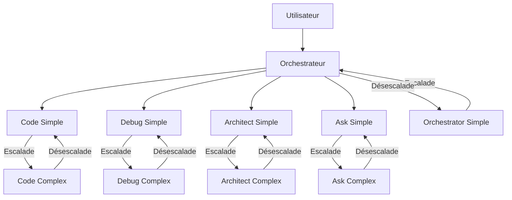

# Rapport de Synthèse Global - Équipe Agentique

## 1. Introduction

### 1.1 Contexte du projet

Ce rapport présente une synthèse globale des tests effectués pour valider la configuration de l'équipe agentique. L'équipe agentique est composée de plusieurs modes spécialisés, chacun ayant un rôle spécifique dans le traitement des tâches. Ces modes sont organisés en deux niveaux de complexité (simple et complexe) et couvrent différentes fonctionnalités (code, debug, architect, ask, orchestrator).

L'objectif principal de cette configuration est d'optimiser l'utilisation des ressources en dirigeant les tâches vers le mode le plus approprié, tout en permettant une escalade ou une désescalade selon la complexité réelle de la tâche.

### 1.2 Objectifs des tests

Les tests avaient pour objectifs de vérifier :

1. Le fonctionnement correct du mécanisme d'escalade (passage d'un mode simple à un mode complexe)
2. Le fonctionnement correct du mécanisme de désescalade (suggestion de passage d'un mode complexe à un mode simple)
3. L'utilisation correcte des MCPs (Model Context Protocol) et des commandes PowerShell
4. Le comportement de l'orchestrateur complexe dans la gestion des tâches nécessitant plusieurs modes spécialisés

## 2. Résumé des tests effectués

### 2.1 Test d'escalade (code-simple vers code-complex)

Le test d'escalade visait à vérifier que le mode code-simple détecte correctement les tâches complexes et demande une escalade vers le mode code-complex.

**Procédure :**
1. Création d'un fichier de test `test-escalade-code.js` contenant une fonction complexe nécessitant une refactorisation majeure
2. Demande au mode code-simple de refactoriser cette fonction
3. Observation du comportement d'escalade
4. Vérification du format d'escalade

**Résultats :**
- Le mode code-simple a correctement détecté que la tâche dépassait ses capacités
- Il a demandé une escalade vers le mode code-complex avec le format approprié
- Le mode code-complex a effectué une refactorisation majeure qui a considérablement amélioré la qualité, la lisibilité et la maintenabilité du code

### 2.2 Test de désescalade (code-complex vers code-simple)

Le test de désescalade visait à vérifier que le mode code-complex suggère correctement une désescalade vers code-simple lorsqu'il détecte une tâche simple.

**Procédure :**
1. Création d'un fichier de test `test-desescalade-code.js` contenant des fonctions simples
2. Demande de modification mineure sur ces fonctions
3. Observation du comportement du mode code-complex

**Résultats :**
- Le mode code-complex a correctement détecté que la tâche était simple
- Il a suggéré une désescalade vers code-simple avec le format attendu
- Malgré la suggestion de désescalade, les modifications ont été effectuées pour compléter le test

### 2.3 Test des MCPs et commandes PowerShell

Ce test visait à vérifier l'implémentation correcte de l'utilisation des MCPs et des commandes PowerShell.

**Procédure :**
1. Création d'un script PowerShell (`test-mcp-powershell.ps1`) utilisant la syntaxe PowerShell correcte
2. Création d'un fichier JavaScript (`test-mcp.js`) avec des exemples d'utilisation des MCPs
3. Vérification de la reconnaissance et de l'utilisation correcte des MCPs
4. Vérification de l'utilisation correcte de la syntaxe PowerShell

**Résultats :**
- Le mode code-complex reconnaît et utilise correctement les MCPs disponibles (quickfiles et jinavigator)
- La syntaxe PowerShell est correctement utilisée dans les commandes
- Les erreurs courantes de syntaxe sont évitées
- Les tests des MCPs ont été réalisés avec succès

### 2.4 Test de l'orchestrateur complexe

Ce test visait à évaluer les capacités de l'orchestrateur complexe à gérer des tâches nécessitant l'intervention de plusieurs modes spécialisés.

**Procédure :**
1. Définition de scénarios de test complexes (analyse de performance d'une application web e-commerce, modernisation d'une application legacy)
2. Soumission des scénarios à l'orchestrateur complexe
3. Observation et documentation du comportement à chaque étape

**Résultats :**
- L'orchestrateur complexe a démontré une capacité remarquable à décomposer les problèmes complexes en sous-tâches logiques et indépendantes
- Il a systématiquement privilégié la délégation aux modes simples par défaut
- Il a fourni des instructions contextuelles détaillées pour chaque sous-tâche
- Il a démontré sa capacité à suivre l'avancement des sous-tâches et à identifier les dépendances entre elles
- Il a synthétisé les résultats des différentes sous-tâches de manière cohérente

## 3. Résultats et observations clés

### 3.1 Mécanismes d'escalade et de désescalade

Les mécanismes d'escalade et de désescalade fonctionnent correctement :

- **Escalade :** Les modes simples détectent correctement les tâches complexes et demandent une escalade vers les modes complexes avec le format approprié.
- **Désescalade :** Les modes complexes détectent correctement les tâches simples et suggèrent une désescalade vers les modes simples avec le format attendu.

Ces mécanismes permettent une utilisation optimale des ressources en dirigeant les tâches vers le mode le plus approprié selon leur complexité réelle.

### 3.2 Utilisation des MCPs et commandes PowerShell

L'utilisation des MCPs et des commandes PowerShell est correctement implémentée :

- **MCPs :** Les modes reconnaissent et utilisent correctement les MCPs disponibles (quickfiles et jinavigator) pour des opérations spécifiques.
- **Commandes PowerShell :** La syntaxe PowerShell est correctement utilisée, évitant les erreurs courantes comme l'utilisation de "&&" (incompatible avec PowerShell).

Ces fonctionnalités permettent aux modes d'interagir efficacement avec l'environnement et d'exécuter des opérations complexes.

### 3.3 Comportement de l'orchestrateur

L'orchestrateur complexe remplit efficacement son rôle de coordination des tâches complexes :

- **Décomposition efficace :** Il décompose les problèmes complexes en sous-tâches logiques et indépendantes.
- **Délégation appropriée :** Il privilégie systématiquement les modes simples et fait confiance au mécanisme d'escalade.
- **Instructions contextuelles de qualité :** Les instructions fournies pour chaque sous-tâche sont complètes, précises et orientées vers des livrables concrets.
- **Respect des rôles :** Il ne tente pas de résoudre lui-même les problèmes techniques, respectant ainsi la séparation des responsabilités.
- **Synthèse cohérente :** Il est capable de synthétiser les résultats des différentes sous-tâches en un ensemble cohérent et actionnable.
- **Optimisation des ressources :** Il reconnaît quand sa complexité n'est plus nécessaire et passe le relais à orchestrator-simple.

## 4. Conformité aux spécifications

| Spécification | Statut | Observations |
|---------------|--------|--------------|
| Mécanisme d'escalade | ✅ Conforme | Le mode simple détecte correctement les tâches complexes et demande une escalade vers le mode complexe avec le format approprié. |
| Mécanisme de désescalade | ✅ Conforme | Le mode complexe détecte correctement les tâches simples et suggère une désescalade vers le mode simple avec le format attendu. |
| Utilisation des MCPs | ✅ Conforme | Les modes reconnaissent et utilisent correctement les MCPs disponibles pour des opérations spécifiques. |
| Syntaxe PowerShell | ✅ Conforme | La syntaxe PowerShell est correctement utilisée, évitant les erreurs courantes. |
| Décomposition des tâches par l'orchestrateur | ✅ Conforme | L'orchestrateur décompose efficacement les problèmes complexes en sous-tâches logiques et indépendantes. |
| Délégation aux modes appropriés | ✅ Conforme | L'orchestrateur privilégie systématiquement les modes simples et fait confiance au mécanisme d'escalade. |
| Instructions contextuelles | ✅ Conforme | Les instructions fournies pour chaque sous-tâche sont complètes, précises et orientées vers des livrables concrets. |
| Respect des rôles | ✅ Conforme | L'orchestrateur ne tente pas de résoudre lui-même les problèmes techniques, respectant ainsi la séparation des responsabilités. |
| Synthèse des résultats | ✅ Conforme | L'orchestrateur est capable de synthétiser les résultats des différentes sous-tâches en un ensemble cohérent et actionnable. |
| Optimisation des ressources | ✅ Conforme | L'orchestrateur reconnaît quand sa complexité n'est plus nécessaire et passe le relais à orchestrator-simple. |

## 5. Améliorations futures

### 5.1 Optimisations possibles

1. **Amélioration de la gestion des dépendances :** Renforcer la capacité de l'orchestrateur à identifier et gérer explicitement les dépendances entre sous-tâches, notamment en définissant des points de synchronisation.

2. **Affinement des critères de délégation :** Développer des heuristiques plus précises pour déterminer quand déléguer à un mode simple ou complexe, en fonction de la nature de la tâche et du contexte.

3. **Enrichissement des instructions contextuelles :** Inclure systématiquement des exemples concrets et des références à des ressources pertinentes dans les instructions contextuelles.

4. **Optimisation des transitions :** Affiner les critères de décision pour les transitions entre modes, en tenant compte de facteurs comme la complexité résiduelle et les risques d'escalade.

5. **Renforcement du suivi du progrès :** Développer des mécanismes plus formels pour le suivi de l'avancement des sous-tâches et la détection précoce des problèmes.

### 5.2 Nouvelles fonctionnalités à explorer

1. **Mécanisme de feedback :** Implémenter un système permettant aux modes de fournir un feedback sur la pertinence de l'escalade ou de la désescalade, afin d'améliorer les décisions futures.

2. **Apprentissage des préférences utilisateur :** Développer un mécanisme permettant d'apprendre les préférences de l'utilisateur en termes de niveau de détail, de style de communication, etc.

3. **Intégration avec des outils externes :** Explorer l'intégration avec des outils externes pour étendre les capacités des modes, notamment pour la visualisation, l'analyse de code, etc.

4. **Mode collaboratif :** Développer un mode permettant à plusieurs agents de collaborer sur une même tâche, avec des rôles complémentaires.

5. **Historique des interactions :** Implémenter un système permettant de conserver un historique des interactions et des décisions prises, pour faciliter la reprise de tâches interrompues.

### 5.3 Évolution vers 5 niveaux de modes

Une évolution possible serait de passer de 2 niveaux de modes (simple/complexe) à 5 niveaux, permettant une granularité plus fine dans l'allocation des ressources :

1. **Niveau 1 (Micro) :** Pour les tâches très simples et isolées (< 10 lignes de code, documentation basique, etc.)
2. **Niveau 2 (Mini) :** Pour les tâches simples (10-50 lignes de code, documentation standard, etc.)
3. **Niveau 3 (Medium) :** Pour les tâches de complexité moyenne (50-200 lignes de code, refactorisation partielle, etc.)
4. **Niveau 4 (Major) :** Pour les tâches complexes (200-500 lignes de code, refactorisation majeure, etc.)
5. **Niveau 5 (Mega) :** Pour les tâches très complexes (> 500 lignes de code, conception d'architecture, etc.)

Cette évolution nécessiterait :
- Une redéfinition des critères d'escalade et de désescalade
- Une adaptation des modèles utilisés pour chaque niveau
- Une mise à jour des instructions spécifiques à chaque niveau

## 6. Vision d'ensemble de l'équipe agentique

### 6.1 Architecture de l'équipe agentique

### 6.2 Flux de travail et interactions

1. **Entrée utilisateur :** L'utilisateur soumet une tâche à l'équipe agentique.
2. **Analyse initiale :** L'orchestrateur analyse la tâche et la décompose en sous-tâches.
3. **Délégation :** L'orchestrateur délègue chaque sous-tâche au mode le plus approprié (généralement un mode simple).
4. **Escalade si nécessaire :** Si un mode simple détecte que la tâche est trop complexe, il demande une escalade vers le mode complexe correspondant.
5. **Désescalade si possible :** Si un mode complexe détecte que la tâche est suffisamment simple, il suggère une désescalade vers le mode simple correspondant.
6. **Exécution des sous-tâches :** Chaque mode exécute sa sous-tâche et fournit un résultat.
7. **Synthèse :** L'orchestrateur synthétise les résultats des différentes sous-tâches en un ensemble cohérent.
8. **Présentation à l'utilisateur :** L'orchestrateur présente le résultat final à l'utilisateur.

### 6.3 Positionnement stratégique

L'équipe agentique se positionne comme une solution flexible et efficace pour le traitement de tâches de complexité variable. Ses principaux avantages sont :

1. **Optimisation des ressources :** Utilisation du mode le plus approprié selon la complexité de la tâche, permettant d'économiser des ressources.
2. **Spécialisation :** Chaque mode est spécialisé dans un domaine spécifique, permettant une expertise plus pointue.
3. **Flexibilité :** Les mécanismes d'escalade et de désescalade permettent de s'adapter à la complexité réelle de la tâche.
4. **Coordination :** L'orchestrateur assure une coordination efficace des différents modes, permettant de traiter des tâches complexes nécessitant plusieurs expertises.
5. **Évolutivité :** L'architecture est conçue pour évoluer facilement, notamment vers un système à 5 niveaux de modes.

## 7. Conclusion

Les tests effectués confirment que la configuration de l'équipe agentique répond aux spécifications définies. Les mécanismes d'escalade et de désescalade fonctionnent correctement, l'utilisation des MCPs et des commandes PowerShell est correctement implémentée, et l'orchestrateur remplit efficacement son rôle de coordination des tâches complexes.

Cette configuration permet une utilisation optimale des ressources en dirigeant les tâches vers le mode le plus approprié selon leur complexité réelle. Elle offre également une grande flexibilité grâce aux mécanismes d'escalade et de désescalade, qui permettent de s'adapter à la complexité réelle de la tâche.

Les améliorations futures proposées permettront d'optimiser encore davantage cette configuration, notamment en affinant les critères de délégation, en enrichissant les instructions contextuelles, et en explorant de nouvelles fonctionnalités comme le mécanisme de feedback ou l'apprentissage des préférences utilisateur.

L'évolution vers 5 niveaux de modes offrira une granularité plus fine dans l'allocation des ressources, permettant une optimisation encore plus poussée.

En résumé, l'équipe agentique constitue une solution robuste et évolutive pour le traitement de tâches de complexité variable, offrant un équilibre optimal entre spécialisation, flexibilité et efficacité.