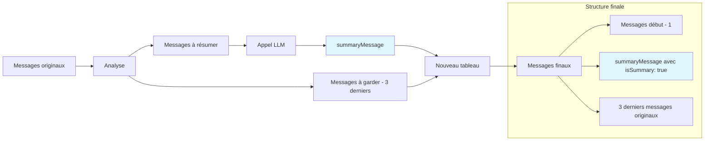

# Analyse du Mécanisme de Condensation de Contexte - Roo-Code

**Date :** 8 janvier 2025  
**Objectif :** Cartographier et documenter le mécanisme de condensation de contexte de roo-code  
**Méthodologie :** Semantic Documentation Driven Design (SDDD)

## 🎯 Résumé Exécutif

Cette analyse détaille le mécanisme de condensation de contexte de roo-code, une fonctionnalité critique qui gère automatiquement la taille des conversations pour respecter les limites de tokens des modèles LLM. Le système implémente une approche hybride combinant :

1. **Condensation intelligente** via LLM (prioritaire)
2. **Troncature par fenêtre glissante** (fallback)

## 📋 Plan d'Analyse

### Phase 1 - Grounding Sémantique ✅
- [x] Recherche sémantique triangulée : "context condensation", "token limit management", "sliding window implementation"
- [x] Identification des fichiers clés : [`src/core/sliding-window/index.ts`](../roo-code/src/core/sliding-window/index.ts), [`src/core/condense/index.ts`](../roo-code/src/core/condense/index.ts)
- [x] Immersion dans le code source

### Phase 2 - Analyse Technique 🔄
- [ ] Cartographier le flux de condensation
- [ ] Identifier les composants clés
- [ ] Identifier les points d'interception potentiels

### Phase 3 - Validation 🔄
- [ ] Validation sémantique du document
- [ ] Test de découvrabilité

### Phase 4 - Rapport de Mission 🔄
- [ ] Rapport d'activité complet
- [ ] Synthèse pour grounding orchestrateur

## 🔍 Découvertes Initiales

### Fichiers Clés Identifiés

1. **[`src/core/sliding-window/index.ts`](../roo-code/src/core/sliding-window/index.ts)** - Module principal de gestion de la fenêtre glissante
2. **[`src/core/condense/index.ts`](../roo-code/src/core/condense/index.ts)** - Module de condensation intelligente via LLM
3. **[`src/core/task/Task.ts`](../roo-code/src/core/task/Task.ts)** - Point d'intégration dans les tâches
4. **Interface utilisateur** - Composants React pour l'affichage des condensations

### Architecture Générale

Le système fonctionne selon une logique de **priorité cascadée** :

```
Déclenchement → Condensation LLM → Fallback Troncature → Pas d'action
     ↓               ↓                    ↓              ↓
   Seuil atteint   Succès ?           Échec LLM      Contexte OK
```

## 📊 Analyse Technique Détaillée

### 1. Point d'Entrée Principal

**Fonction :** [`truncateConversationIfNeeded()`](../roo-code/src/core/sliding-window/index.ts:91)

**Responsabilité :** Orchestrateur principal qui décide si une action est nécessaire

**Paramètres clés :**
- `messages: ApiMessage[]` - Historique de conversation
- `totalTokens: number` - Tokens actuels (sans dernier message)
- `contextWindow: number` - Taille de fenêtre du modèle
- `autoCondenseContext: boolean` - Active/désactive la condensation LLM
- `autoCondenseContextPercent: number` - Seuil de déclenchement global
- `profileThresholds: Record<string, number>` - Seuils par profil

### 2. Logique de Déclenchement

**Calcul des tokens effectifs :**
```typescript
const prevContextTokens = totalTokens + lastMessageTokens
const allowedTokens = contextWindow * (1 - TOKEN_BUFFER_PERCENTAGE) - reservedTokens
```

**Constantes importantes :**
- `TOKEN_BUFFER_PERCENTAGE = 0.1` (10% de buffer)
- `ANTHROPIC_DEFAULT_MAX_TOKENS` - Tokens réservés pour la réponse

**Conditions de déclenchement :**
1. `contextPercent >= effectiveThreshold` OU
2. `prevContextTokens > allowedTokens`

### 3. Gestion des Seuils par Profil

Le système supporte des seuils personnalisés par profil :

```typescript
let effectiveThreshold = autoCondenseContextPercent
const profileThreshold = profileThresholds[currentProfileId]

if (profileThreshold !== undefined) {
    if (profileThreshold === -1) {
        // Hérite du paramètre global
        effectiveThreshold = autoCondenseContextPercent
    } else if (profileThreshold >= MIN_CONDENSE_THRESHOLD && profileThreshold <= MAX_CONDENSE_THRESHOLD) {
        // Seuil personnalisé valide
        effectiveThreshold = profileThreshold
    }
}
```

### 4. Condensation Intelligente (Prioritaire)

**Fonction :** [`summarizeConversation()`](../roo-code/src/core/condense/index.ts:85)

**Mécanisme :**
1. Garde les `N_MESSAGES_TO_KEEP = 3` derniers messages
2. Résume les messages précédents via LLM
3. Remplace l'historique par un message de résumé

**Prompt de résumé :** Structure détaillée en 6 sections :
1. Previous Conversation
2. Current Work  
3. Key Technical Concepts
4. Relevant Files and Code
5. Problem Solving
6. Pending Tasks and Next Steps

**Validation de qualité :**
- Vérifie que le résumé n'est pas vide
- S'assure que le nouveau contexte est plus petit : `newContextTokens < prevContextTokens`

### 5. Troncature par Fenêtre Glissante (Fallback)

**Fonction :** [`truncateConversation()`](../roo-code/src/core/sliding-window/index.ts:41)

**Mécanisme :**
- Garde toujours le premier message (système)
- Supprime 50% des messages intermédiaires (`fracToRemove = 0.5`)
- Arrondit à un nombre pair de messages supprimés
- Garde les messages récents

**Télémétrie :** Capture l'événement `SLIDING_WINDOW_TRUNCATION`

## 🔧 Points d'Interception Identifiés

### Points de Personnalisation Potentiels

1. **Seuils de déclenchement**
   - Modification de `TOKEN_BUFFER_PERCENTAGE`
   - Personnalisation des seuils par profil
   - Ajout de conditions de déclenchement personnalisées

2. **Stratégie de condensation**
   - Remplacement du prompt de résumé (`SUMMARY_PROMPT`)
   - Utilisation d'un `customCondensingPrompt`
   - Utilisation d'un `condensingApiHandler` différent

3. **Stratégie de troncature**
   - Modification de `fracToRemove` (actuellement 0.5)
   - Changement de `N_MESSAGES_TO_KEEP` (actuellement 3)
   - Logique de sélection des messages à conserver

4. **Validation et contrôle qualité**
   - Ajout de métriques de qualité du résumé
   - Validation sémantique du contenu condensé
   - Mécanismes de rollback en cas d'échec

### Architecture d'Extension

Le système est conçu avec des points d'injection clairs :

```typescript
// Point d'injection pour stratégies personnalisées
interface CondensationStrategy {
    shouldCondense(context: CondensationContext): boolean
    condense(messages: ApiMessage[]): Promise<SummarizeResponse>
}

// Point d'injection pour validation personnalisée  
interface CondensationValidator {
    validate(original: ApiMessage[], condensed: ApiMessage[]): ValidationResult
}
```

## 🎯 Prochaines Étapes

1. **Cartographie complète du flux** - Diagrammes Mermaid
2. **Identification des dépendances** - Modules connexes
3. **Points d'interception détaillés** - Interfaces et hooks
4. **Validation sémantique** - Test de découvrabilité

## 🗺️ Cartographie du Flux de Condensation

### Flux Principal - Vue d'Ensemble

```mermaid
flowchart TD
    A[Nouvelle requête utilisateur] --> B[truncateConversationIfNeeded()]
    B --> C{Calcul tokens effectifs}
    C --> D[prevContextTokens = totalTokens + lastMessageTokens]
    D --> E[allowedTokens = contextWindow * 0.9 - reservedTokens]
    E --> F{Seuil atteint ?}
    
    F -->|Non| Z[Pas d'action - Retour messages originaux]
    F -->|Oui| G{autoCondenseContext activé ?}
    
    G -->|Non| P[Troncature directe par fenêtre glissante]
    G -->|Oui| H[Tentative condensation LLM]
    
    H --> I{Condensation réussie ?}
    I -->|Oui| J[Retour messages condensés]
    I -->|Non| K{Tokens > allowedTokens ?}
    
    K -->|Non| L[Retour messages originaux avec erreur]
    K -->|Oui| P
    
    P --> M[truncateConversation - Suppression 50% messages]
    M --> N[Télémétrie SLIDING_WINDOW_TRUNCATION]
    N --> O[Retour messages tronqués]
    
    style H fill:#e1f5fe
    style P fill:#fff3e0
    style J fill:#e8f5e8
    style O fill:#fff3e0
```

### Flux de Condensation LLM - Détail

```mermaid
flowchart TD
    A[summarizeConversation()] --> B[Télémétrie captureContextCondensed]
    B --> C[getMessagesSinceLastSummary()]
    C --> D{Messages à résumer > 1 ?}
    
    D -->|Non| E[Erreur: Pas assez de messages]
    D -->|Oui| F[Garde les N_MESSAGES_TO_KEEP derniers]
    
    F --> G{Résumé récent existe ?}
    G -->|Oui| H[Erreur: Condensé récemment]
    G -->|Non| I[Préparation requête LLM]
    
    I --> J[Sélection API Handler]
    J --> K{customCondensingPrompt fourni ?}
    K -->|Oui| L[Utilise prompt personnalisé]
    K -->|Non| M[Utilise SUMMARY_PROMPT par défaut]
    
    L --> N[Appel LLM via createMessage()]
    M --> N
    
    N --> O[Streaming de la réponse]
    O --> P{Résumé non vide ?}
    
    P -->|Non| Q[Erreur: Condensation échouée]
    P -->|Oui| R[Création summaryMessage]
    
    R --> S[Calcul newContextTokens]
    S --> T{newContextTokens < prevContextTokens ?}
    
    T -->|Non| U[Erreur: Contexte a grandi]
    T -->|Oui| V[Succès - Retour messages condensés]
    
    style N fill:#e1f5fe
    style V fill:#e8f5e8
    style E fill:#ffebee
    style H fill:#ffebee
    style Q fill:#ffebee
    style U fill:#ffebee
```

### Gestion des Seuils par Profil

```mermaid
flowchart TD
    A[Détermination seuil effectif] --> B[effectiveThreshold = autoCondenseContextPercent]
    B --> C{profileThresholds[currentProfileId] existe ?}
    
    C -->|Non| D[Utilise seuil global]
    C -->|Oui| E{profileThreshold === -1 ?}
    
    E -->|Oui| F[Hérite du seuil global]
    E -->|Non| G{MIN_CONDENSE_THRESHOLD ≤ profileThreshold ≤ MAX_CONDENSE_THRESHOLD ?}
    
    G -->|Oui| H[Utilise seuil personnalisé]
    G -->|Non| I[Warning + Fallback seuil global]
    
    D --> J[effectiveThreshold défini]
    F --> J
    H --> J
    I --> J
    
    J --> K[Comparaison avec contextPercent]
    
    style H fill:#e8f5e8
    style I fill:#fff3e0
```

### Structure des Messages Après Condensation



## 🔧 Composants Clés Détaillés

### 1. Constantes de Configuration

| Constante | Valeur | Rôle | Point d'interception |
|-----------|--------|------|---------------------|
| `TOKEN_BUFFER_PERCENTAGE` | 0.1 (10%) | Buffer de sécurité | ✅ Modifiable |
| `N_MESSAGES_TO_KEEP` | 3 | Messages récents préservés | ✅ Modifiable |
| `MIN_CONDENSE_THRESHOLD` | 5% | Seuil minimum | ✅ Modifiable |
| `MAX_CONDENSE_THRESHOLD` | 100% | Seuil maximum | ✅ Modifiable |
| `ANTHROPIC_DEFAULT_MAX_TOKENS` | Variable | Tokens réservés réponse | ⚠️ Dépendant du modèle |

### 2. Interfaces Clés

```typescript
// Structure de réponse unifiée
type TruncateResponse = SummarizeResponse & {
    prevContextTokens: number
}

// Options de troncature
type TruncateOptions = {
    messages: ApiMessage[]
    totalTokens: number
    contextWindow: number
    maxTokens?: number | null
    apiHandler: ApiHandler
    autoCondenseContext: boolean
    autoCondenseContextPercent: number
    systemPrompt: string
    taskId: string
    customCondensingPrompt?: string        // 🎯 Point d'injection
    condensingApiHandler?: ApiHandler      // 🎯 Point d'injection
    profileThresholds: Record<string, number>  // 🎯 Point d'injection
    currentProfileId: string
}

// Réponse de condensation
type SummarizeResponse = {
    messages: ApiMessage[]     // Messages après traitement
    summary: string           // Texte du résumé (vide si pas de résumé)
    cost: number             // Coût de l'opération
    newContextTokens?: number // Tokens dans le nouveau contexte
    error?: string           // Message d'erreur si échec
}
```

### 3. Points d'Injection Identifiés

#### A. Stratégies de Condensation Personnalisées

```typescript
// Point d'injection dans truncateConversationIfNeeded()
interface CustomCondensationStrategy {
    shouldTrigger(context: CondensationContext): boolean
    condense(messages: ApiMessage[], options: CondensationOptions): Promise<SummarizeResponse>
}

// Utilisation via customCondensingPrompt et condensingApiHandler
const customStrategy = {
    prompt: "Votre prompt personnalisé...",
    handler: new CustomApiHandler()
}
```

#### B. Validation et Contrôle Qualité

```typescript
// Point d'injection après condensation
interface CondensationValidator {
    validate(
        original: ApiMessage[],
        condensed: ApiMessage[],
        summary: string
    ): ValidationResult
}

// Exemple d'implémentation
const qualityValidator = {
    validate: (original, condensed, summary) => {
        // Vérifications sémantiques
        // Métriques de qualité
        // Détection de perte d'information critique
        return { isValid: boolean, issues: string[], score: number }
    }
}
```

#### C. Métriques et Télémétrie Personnalisées

```typescript
// Extension du système de télémétrie
interface CustomTelemetryCollector {
    onCondensationStart(context: CondensationContext): void
    onCondensationSuccess(result: CondensationResult): void
    onCondensationFailure(error: CondensationError): void
    onFallbackToTruncation(reason: string): void
}
```

### 4. Hooks et Points d'Extension

#### A. Hooks de Lifecycle

```typescript
// Hook avant condensation
interface PreCondensationHook {
    beforeCondensation(
        messages: ApiMessage[],
        context: CondensationContext
    ): Promise<PreCondensationResult>
}

// Hook après condensation
interface PostCondensationHook {
    afterCondensation(
        original: ApiMessage[],
        result: SummarizeResponse,
        context: CondensationContext
    ): Promise<PostCondensationResult>
}

// Hook de sélection de stratégie
interface StrategySelectionHook {
    selectStrategy(context: CondensationContext): CondensationStrategy
}
```

#### B. Architecture de Plugins

```typescript
// Plugin de condensation personnalisé
interface CondensationPlugin {
    name: string
    priority: number
    
    // Détermine si le plugin doit s'activer
    shouldActivate(context: CondensationContext): boolean
    
    // Logique de condensation
    condense(messages: ApiMessage[], options: CondensationOptions): Promise<SummarizeResponse>
    
    // Validation des résultats
    validate?(result: SummarizeResponse): ValidationResult
}

// Registry de plugins
class CondensationPluginRegistry {
    private plugins: CondensationPlugin[] = []
    
    register(plugin: CondensationPlugin): void
    unregister(pluginName: string): void
    findBestPlugin(context: CondensationContext): CondensationPlugin | null
}
```

## 🎯 Points d'Interception Critiques

### 1. Interception au Niveau des Seuils

**Emplacement :** [`truncateConversationIfNeeded()`](../roo-code/src/core/sliding-window/index.ts:125-142)

```typescript
// AVANT (Code actuel)
let effectiveThreshold = autoCondenseContextPercent
const profileThreshold = profileThresholds[currentProfileId]

// APRÈS (Interception possible)
let effectiveThreshold = await customThresholdResolver.resolve({
    globalThreshold: autoCondenseContextPercent,
    profileThreshold: profileThresholds[currentProfileId],
    context: { messages, totalTokens, contextWindow, taskId }
})
```

**Applications :**
- Seuils adaptatifs basés sur le contenu
- Seuils spécifiques par type de tâche
- ML pour optimiser les seuils automatiquement

### 2. Interception du Prompt de Condensation

**Emplacement :** [`summarizeConversation()`](../roo-code/src/core/condense/index.ts:133)

```typescript
// AVANT (Code actuel)
const promptToUse = customCondensingPrompt?.trim() ? customCondensingPrompt.trim() : SUMMARY_PROMPT

// APRÈS (Interception possible)
const promptToUse = await promptGenerator.generatePrompt({
    messages: messagesToSummarize,
    context: { taskType, userPreferences, conversationMetadata },
    fallback: customCondensingPrompt?.trim() || SUMMARY_PROMPT
})
```

**Applications :**
- Prompts adaptatifs selon le domaine
- Prompts multilingues
- Optimisation continue des prompts

### 3. Interception de la Validation Post-Condensation

**Emplacement :** [`summarizeConversation()`](../roo-code/src/core/condense/index.ts:202-205)

```typescript
// AVANT (Code actuel)
if (newContextTokens >= prevContextTokens) {
    const error = t("common:errors.condense_context_grew")
    return { ...response, cost, error }
}

// APRÈS (Interception possible)
const validationResult = await condensationValidator.validate({
    originalMessages: messages,
    condensedMessages: newMessages,
    summary,
    tokenReduction: prevContextTokens - newContextTokens,
    context: { taskId, conversationMetadata }
})

if (!validationResult.isValid) {
    return { ...response, cost, error: validationResult.errorMessage }
}
```

**Applications :**
- Validation sémantique de qualité
- Détection de perte d'information critique
- Métriques de fidélité du résumé

### 4. Interception de la Stratégie de Troncature

**Emplacement :** [`truncateConversation()`](../roo-code/src/core/sliding-window/index.ts:41-50)

```typescript
// AVANT (Code actuel)
const rawMessagesToRemove = Math.floor((messages.length - 1) * fracToRemove)
const messagesToRemove = rawMessagesToRemove - (rawMessagesToRemove % 2)

// APRÈS (Interception possible)
const truncationStrategy = await truncationStrategySelector.select({
    messages,
    fracToRemove,
    context: { taskType, conversationFlow, criticalityMap }
})

const messagesToRemove = truncationStrategy.selectMessagesToRemove(messages)
```

**Applications :**
- Troncature intelligente préservant les messages critiques
- Stratégies spécifiques par domaine
- Préservation des patterns de conversation importants

## 🔄 Architecture d'Extension Proposée

### 1. Interface Unifiée de Condensation

```typescript
interface UnifiedCondensationEngine {
    // Configuration
    configure(config: CondensationConfig): void
    
    // Registration de plugins
    registerPlugin(plugin: CondensationPlugin): void
    registerValidator(validator: CondensationValidator): void
    registerHook(hook: CondensationHook): void
    
    // Exécution
    condense(request: CondensationRequest): Promise<CondensationResponse>
    
    // Métriques et monitoring
    getMetrics(): CondensationMetrics
    getHistory(): CondensationHistory[]
}
```

### 2. Configuration Centralisée

```typescript
interface CondensationConfig {
    // Seuils
    thresholds: {
        global: number
        profiles: Record<string, number>
        adaptive: boolean
    }
    
    // Stratégies
    strategies: {
        primary: 'llm' | 'truncation' | 'hybrid'
        fallback: 'truncation' | 'error'
        customPrompts: Record<string, string>
    }
    
    // Validation
    validation: {
        enabled: boolean
        rules: ValidationRule[]
        metrics: MetricConfig[]
    }
    
    // Monitoring
    monitoring: {
        telemetry: boolean
        logging: LogLevel
        hooks: HookConfig[]
    }
}
```

### 3. Factory Pattern pour Extensibilité

```typescript
class CondensationEngineFactory {
    static create(config: CondensationConfig): UnifiedCondensationEngine {
        const engine = new UnifiedCondensationEngine(config)
        
        // Auto-registration des plugins par défaut
        engine.registerPlugin(new LLMCondensationPlugin())
        engine.registerPlugin(new TruncationCondensationPlugin())
        
        // Auto-registration des validators par défaut
        engine.registerValidator(new TokenCountValidator())
        engine.registerValidator(new SummaryQualityValidator())
        
        return engine
    }
    
    static createCustom(
        config: CondensationConfig,
        plugins: CondensationPlugin[],
        validators: CondensationValidator[]
    ): UnifiedCondensationEngine {
        const engine = new UnifiedCondensationEngine(config)
        
        plugins.forEach(p => engine.registerPlugin(p))
        validators.forEach(v => engine.registerValidator(v))
        
        return engine
    }
}
```

## 📊 Recommandations d'Implémentation

### Phase 1 - Refactoring Sans Impact

1. **Extraction des constantes** vers fichier de configuration
2. **Création d'interfaces** pour les points d'injection identifiés
3. **Ajout de hooks** non-breaking dans le code existant

### Phase 2 - Extension Progressive

1. **Plugin system** pour stratégies personnalisées
2. **Configuration centralisée** avec backward compatibility
3. **Système de validation** extensible

### Phase 3 - Optimisation Avancée

1. **ML-driven threshold optimization**
2. **Adaptive prompting** basé sur le contexte
3. **Quality metrics** et feedback loop automatique

## 🚀 Conclusion

Le mécanisme de condensation de contexte de roo-code présente une architecture robuste avec des **points d'interception clairs** pour la personnalisation. L'approche hybride (LLM + troncature) offre une excellente balance entre qualité et fiabilité.

**Points clés pour l'extensibilité :**
- ✅ **Architecture modulaire** facilement extensible
- ✅ **Points d'injection bien définis** dans le flux
- ✅ **Système de configuration** déjà partiellement en place
- ✅ **Télémétrie intégrée** pour le monitoring

**Opportunités d'amélioration identifiées :**
- 🎯 Plugin system pour stratégies personnalisées
- 🎯 Validation sémantique de qualité
- 🎯 Seuils adaptatifs basés sur ML
- 🎯 Métriques de fidélité automatisées

---

*Analyse complète - Phases 1 et 2 finalisées*