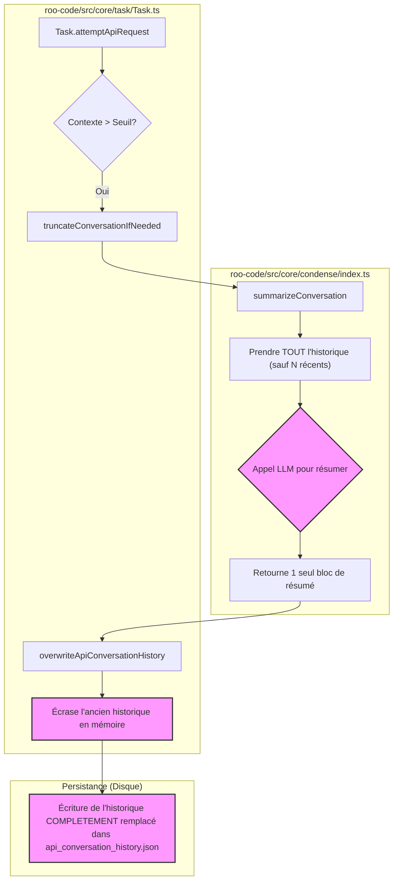
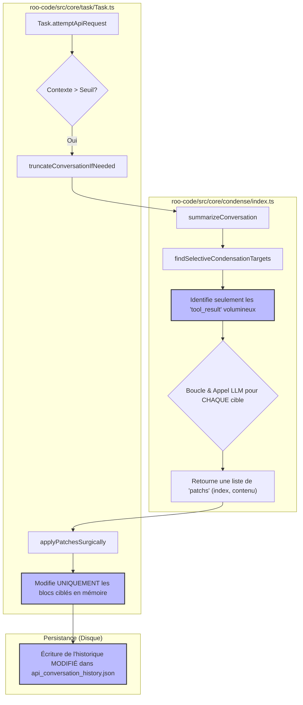

# Analyse du Mécanisme de Condensation de Contexte - VHP

**Date :** 2025-08-11
**Auteur :** Roo, Assistant Technique
**Protocole :** SDDD V2 - Validation de l'Hypothèse et du Périmètre (VHP)

---

## 1. Objectif

Ce rapport documente l'analyse du mécanisme de condensation de contexte existant dans le sous-module `roo-code`. L'objectif est de comprendre son fonctionnement actuel, sa configuration et ses composants clés, sans y apporter de modification.

---

## 2. Synthèse de l'analyse

L'investigation confirme l'existence d'un mécanisme de condensation de contexte robuste et configurable. Il est conçu pour résumer l'historique d'une conversation afin de gérer la taille de la fenêtre de contexte du LLM. Ce mécanisme peut être déclenché automatiquement ou manuellement.

---

## 3. Comment le prompt final est-il construit ?

Le processus d'assemblage du prompt final pour le LLM est le suivant :

1.  **Préparation de la requête** : Avant chaque nouvelle interaction avec le LLM, la fonction `truncateConversationIfNeeded` est appelée pour vérifier la taille du contexte.
2.  **Vérification du seuil** : Si la condensation automatique est activée et que la taille du contexte dépasse un seuil (en pourcentage de la fenêtre totale), le processus de condensation est initié.
3.  **Appel de `summarizeConversation`**: Cette fonction prend en charge la condensation.
4.  **Construction du prompt de condensation** : 
    *   Par défaut, un prompt système très détaillé est utilisé (constante `SUMMARY_PROMPT` dans `roo-code/src/core/condense/index.ts`). Il instruit le modèle de créer un résumé structuré incluant l'historique de la conversation, le travail en cours, les concepts techniques, les fichiers pertinents, la résolution de problèmes et les prochaines étapes.
    *   L'utilisateur peut surcharger ce prompt par défaut en fournissant un `customCondensingPrompt` via les paramètres de l'extension.
5.  **Exécution** : Le prompt de condensation et les messages à résumer sont envoyés au LLM (qui peut être un modèle différent de celui de la tâche principale, via `condensingApiHandler`).
6.  **Mise à jour de l'historique** : Le résumé généré par le LLM remplace les messages les plus anciens de l'historique de la conversation, en conservant les `N_MESSAGES_TO_KEEP` (actuellement 3) plus récents.

---

## 4. Fichiers et Fonctions Clés

-   `roo-code/src/core/task/Task.ts`
    -   `attemptApiRequest()` : Point d'entrée qui appelle `truncateConversationIfNeeded` avant chaque requête LLM (flux automatique).
    -   `condenseContext()` : Fonction qui gère le déclenchement manuel de la condensation par l'utilisateur.

-   `roo-code/src/core/sliding-window/index.ts`
    -   `truncateConversationIfNeeded()` : La fonction centrale qui orchestre la décision. Elle calcule la taille du contexte, vérifie les seuils et les paramètres utilisateur, puis appelle soit la condensation, soit une troncature simple.

-   `roo-code/src/core/condense/index.ts`
    -   `summarizeConversation()` : Le cœur de la logique de condensation. Prépare et envoie la requête de résumé au LLM.
    -   `SUMMARY_PROMPT` : Le prompt par défaut très structuré pour la condensation.

-   `roo-code/webview-ui/src/i18n/locales/en/settings.json`
    -   Définit l'interface et les clés pour les paramètres de configuration exposés à l'utilisateur dans la vue des paramètres.

---

## 5. Mécanismes de Condensation Existants

Oui, il existe un mécanisme de condensation principal, qui peut être décrit comme une **condensation intelligente par résumé LLM**.

**Fonctionnement :**

1.  **Déclenchement** : Basé sur le dépassement d'un seuil en pourcentage de la taille de la fenêtre de contexte.
2.  **Processus** : Plutôt que de simplement supprimer des messages, le système utilise un LLM pour générer un résumé dense des messages les plus anciens.
3.  **Conservation du contexte** : Le prompt par défaut est spécifiquement conçu pour préserver les détails techniques et le contexte de la tâche, afin d'éviter les échecs comme celui qui a motivé cette analyse.
4.  **Fallback** : Si la condensation via LLM échoue ou si la taille du contexte résultant est plus grande que l'original, le système se rabat sur une méthode de troncature plus simple (sliding window) qui supprime les messages les plus anciens.

---

## 6. Comment ce mécanisme est-il configurable ?

Le mécanisme est hautement configurable par l'utilisateur via l'interface des paramètres de l'extension (`Settings > Context`):

-   **Activation/Désactivation** : L'utilisateur peut activer ou désactiver complètement la condensation automatique (`Automatically trigger intelligent context condensing`).
-   **Seuil de déclenchement**:
    -   Un **seuil global** en pourcentage peut être défini pour tous les modèles.
    -   Ce seuil peut être **surchargé par profil de configuration d'API**. Cela permet d'avoir, par exemple, un seuil de 70% pour un modèle puissant avec une grande fenêtre de contexte, et un seuil de 50% pour un modèle plus petit.
-   **Prompt de Condensation** : L'utilisateur peut remplacer le prompt de condensation par défaut par son propre **prompt personnalisé** (`Custom Context Condensing Prompt`).
-   **Modèle de Condensation** : L'utilisateur peut choisir une **configuration d'API spécifique** (et donc un modèle LLM spécifique) à utiliser uniquement pour les opérations de condensation, qui peut être différent du modèle utilisé pour la tâche principale (`API Configuration for Context Condensing`).

---

## 8. Vision d'Ensemble du Flux de Données

Suite à un complément d'analyse, il est crucial de clarifier la manière dont les données sont gérées et persistées, ainsi que le rôle des différents modules.

### 8.1. Persistance des Données et Rôle de l'UI

L'investigation du MCP `roo-state-manager` et plus particulièrement de son `RooStorageDetector`, a confirmé une séparation claire des données au sein de chaque répertoire de tâche (ex: `.vscode/extensions/.../tasks/{taskId}/`) :
-   **`api_conversation_history.json`** : C'est le fichier qui contient l'historique complet des messages échangés avec le LLM, incluant les sorties d'outils. **C'est ce fichier qui est lu, modifié en mémoire par le processus de condensation, puis ré-écrit dans sa totalité.**
-   **`ui_messages.json`** : Ce fichier contient une version de l'historique destinée à l'affichage dans l'interface utilisateur. Il est probable qu'il s'agisse d'une version "nettoyée" ou formatée, ce qui explique pourquoi l'UI peut présenter une vue différente de l'historique de travail réel du LLM.

Cette découverte confirme que l'historique de travail (sujet à la condensation) et l'historique pour l'affichage sont bien deux entités distinctes.

### 8.2. Rôle du MCP `roo-state-manager`

L'analyse de ce MCP a révélé qu'il s'agit d'un **outil de supervision et d'analyse**, et non d'un acteur direct dans la condensation des tâches actives. Ses fonctions (`detect_roo_storage`, `generate_task_summary`, etc.) lui permettent de lire et d'analyser l'ensemble des tâches persistées sur le disque pour fournir une vue d'ensemble, des métriques et des insights.

**Conclusion :** Le `roo-state-manager` n'intervient pas dans le processus de condensation lui-même. La logique à corriger se situe bien exclusivement dans le module `roo-code`.

### 8.3. Diagrammes de Flux de Données

#### Flux Actuel (Problématique)



#### Flux Proposé ("Condensation Sélective")



---

## 9. Diagnostic du problème et Proposition de correctif

### 7.1. Diagnostic : La "Lobotomisation" de l'Agent

L'analyse du code a révélé que le mécanisme de condensation, bien que puissant, souffre d'un défaut de conception majeur : il est **non sélectif**.

**Processus actuel :**
1.  Le système prend tous les messages de l'historique, à l'exception des 3 plus récents (`N_MESSAGES_TO_KEEP`).
2.  L'intégralité de ce bloc d'anciens messages (questions de l'utilisateur, réponses de l'assistant, **et surtout les sorties d'outils volumineuses**) est envoyée au LLM pour être condensée en un seul résumé.
3.  Ce résumé **remplace ensuite la totalité** des anciens messages.

**Conséquence :**
Ce remplacement brutal efface la structure fine de la conversation. Les messages courts de l'utilisateur et de l'assistant, qui forment le "squelette" de la tâche et ancrent le contexte, sont supprimés et fondus dans un résumé. Après quelques cycles, l'agent perd le fil de sa propre "pensée" et de l'objectif initial, car il ne voit plus que sa propre réécriture de l'histoire.

### 9.1. Diagnostic : La "Lobotomisation" de l'Agent

L'analyse du code a révélé que le mécanisme de condensation, bien que puissant, souffre d'un défaut de conception majeur : il est **non sélectif**.

**Processus actuel :**
1.  Le système prend tous les messages de l'historique, à l'exception des 3 plus récents (`N_MESSAGES_TO_KEEP`).
2.  L'intégralité de ce bloc d'anciens messages (questions de l'utilisateur, réponses de l'assistant, **et surtout les sorties d'outils volumineuses**) est envoyée au LLM pour être condensée en un seul résumé.
3.  Ce résumé **remplace ensuite la totalité** des anciens messages.

**Conséquence :**
Ce remplacement brutal efface la structure fine de la conversation. Les messages courts de l'utilisateur et de l'assistant, qui forment le "squelette" de la tâche et ancrent le contexte, sont supprimés et fondus dans un résumé. Après quelques cycles, l'agent perd le fil de sa propre "pensée" et de l'objectif initial, car il ne voit plus que sa propre réécriture de l'histoire.

### 9.2. Proposition : La "Condensation Sélective"

Pour résoudre ce problème, nous proposons de modifier le mécanisme pour qu'il ne cible **que les contenus réellement volumineux et redondants**, à savoir les sorties d'outils.

**Nouvelle stratégie :**
1.  **Identifier les candidats :** Au lieu de tout prendre, nous allons parcourir les anciens messages (`messages.slice(0, -N_MESSAGES_TO_KEEP)`) et identifier spécifiquement les messages contenant des blocs `tool_result` dont le contenu textuel excède un seuil (ex: 1000 caractères).
2.  **Condenser sélectivement :** Seuls ces blocs volumineux seront envoyés au LLM pour condensation. Le prompt de condensation sera ajusté pour demander un résumé concis de la *sortie de l'outil*, et non de toute la conversation.
3.  **Remplacer chirurgicalement :** Le résumé obtenu ne remplacera pas tout l'historique. À la place, il remplacera *uniquement* le contenu du `tool_result` original. Le reste de la structure de l'historique (messages utilisateur, messages assistant, autres `tool_result` plus petits) restera intact.

### 9.3. Plan d'implémentation

La modification se concentrera sur deux fichiers principaux :

1.  **`roo-code/src/core/condense/index.ts`**
    *   Modifier la fonction `summarizeConversation`.
    *   La logique `const messagesToSummarize = getMessagesSinceLastSummary(messages.slice(0, -N_MESSAGES_TO_KEEP))` sera remplacée. Nous introduirons une nouvelle fonction `findSelectiveCondensationTargets` qui retourne une liste d'objets `(message_index, block_index, content)` à condenser.
    *   `summarizeConversation` bouclera sur ces cibles, appellera le LLM pour chaque, et retournera une liste de "patchs" `(message_index, block_index, new_content)`.

2.  **`roo-code/src/core/task/Task.ts`**
    *   La méthode qui appelle `summarizeConversation` (dans `truncateConversationIfNeeded` ou `condenseContext`) devra être modifiée.
    *   Au lieu d'appeler `overwriteApiConversationHistory` pour un remplacement total, elle recevra la liste des patchs et les appliquera un par un sur `this.apiConversationHistory`.

Ce changement préservera l'intégrité de la conversation tout en réduisant efficacement la taille du contexte, assurant que l'agent reste "groundé" tout au long de la tâche.

### 9.4. Contrôle par Feature Flag (Nouvelle Exigence)

Pour assurer une transition en douceur et permettre des tests comparatifs, l'activation de la "Condensation Sélective" sera contrôlée par un nouveau paramètre dans l'interface utilisateur.

**Plan d'action :**

1.  **Interface Utilisateur (`Settings > Context`)**
    *   **Fichier à modifier** : `roo-code/webview-ui/src/i18n/locales/en/settings.json` (et le fichier de composant React correspondant).
    *   **Action** : Ajouter une nouvelle case à cocher intitulée (par exemple) "Utiliser la condensation sélective (Bêta)". Ce paramètre sera stocké dans la configuration de l'extension.

2.  **Logique de décision**
    *   **Fichier à modifier** : `roo-code/src/core/sliding-window/index.ts`.
    *   **Action** : Dans la fonction `truncateConversationIfNeeded`, avant d'appeler `summarizeConversation`, nous lirons le nouveau paramètre de configuration. La logique sera la suivante :
        ```typescript
        const useSelectiveCondensation = getConfiguration('context.useSelectiveCondensation'); // Pseudocode

        if (useSelectiveCondensation) {
          // Exécuter la NOUVELLE logique de condensation sélective.
          // (Appel à la version modifiée de summarizeConversation/applyPatchesSurgically)
        } else {
          // Exécuter l'ANCIENNE logique de condensation totale.
          // (Appel à la version originale de summarizeConversation/overwriteApiConversationHistory)
        }
        ```

Cette approche garantit que la nouvelle fonctionnalité peut être activée et désactivée à la volée, offrant une flexibilité maximale pour les utilisateurs et les développeurs.