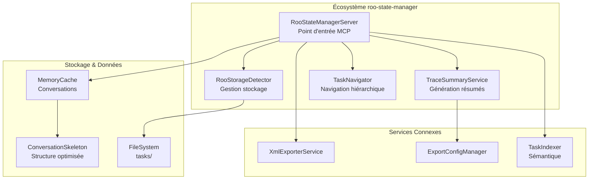
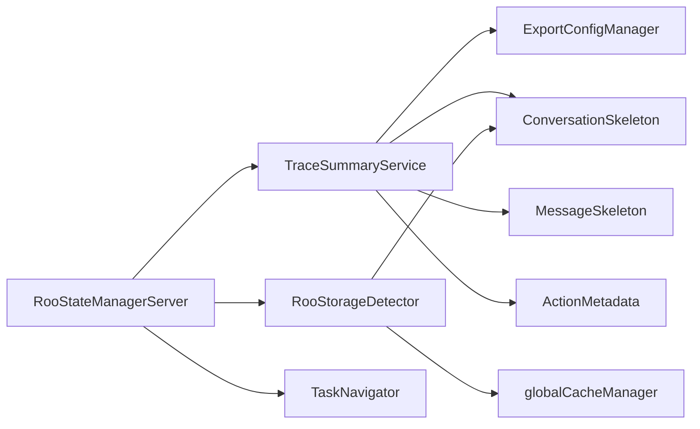

# ANALYSE ARCHITECTURE ACTUELLE - GRAPPES DE TÂCHES
*Phase 2 du SDDD - Semantic-Documentation-Driven-Design*

---

## MÉTADONNÉES DU DOCUMENT

| **Attribut** | **Valeur** |
|--------------|------------|
| **Mission SDDD** | Extension TraceSummaryService pour support grappes de tâches |
| **Phase** | 2 - Analyse Architecture Actuelle |
| **Date d'analyse** | 2025-09-12 |
| **Analyste technique** | Roo Code |
| **Statut** | ✅ Analyse complète |

---

## RÉSUMÉ EXÉCUTIF

L'architecture actuelle du **TraceSummaryService** et de l'écosystème **roo-state-manager** présente des **fondations solides** pour l'extension vers les **grappes de tâches**. L'analyse révèle une architecture **déjà sophistiquée** avec :

- ✅ **Hiérarchie de tâches native** (`parentTaskId`)
- ✅ **Architecture modulaire extensible** 
- ✅ **Vue cluster déjà implémentée** (`view_conversation_tree`)
- ✅ **Structures de données optimisées** (`ConversationSkeleton`)
- ✅ **Pipeline de statistiques intégré**

**Recommandation :** L'extension est **techniquement viable** avec un impact architectural **minimal**.

---

## ARCHITECTURE GLOBALE ACTUELLE

### 🏗️ Vue d'Ensemble du Système



### 📊 Points d'Extension Identifiés

| **Composant** | **Étendu** | **Effort** | **Justification** |
|---------------|------------|------------|-------------------|
| `TraceSummaryService` | ✅ | **Moyen** | Ajout logique grappes + templates |
| `ConversationSkeleton` | ❌ | **Minimal** | Structure déjà hiérarchique |
| `RooStateManagerServer` | ✅ | **Faible** | Nouveaux outils MCP |
| `RooStorageDetector` | ❌ | **Aucun** | Déjà compatible |

---

## TRACESUMMARYSERVICE - ANALYSE DÉTAILLÉE

### 🎯 Architecture Modulaire Actuelle

Le **TraceSummaryService** (987 lignes) présente une architecture **exceptionnellement modulaire** :

```typescript
export class TraceSummaryService {
    // 🔧 Pipeline de génération modulaire
    async generateSummary(conversation, options) {
        const classifiedContent = this.classifyConversationContent(conversation);
        const statistics = this.calculateStatistics(classifiedContent);
        const content = await this.renderSummary(conversation, classifiedContent, statistics, options);
    }
    
    // 🎨 Rendu modulaire par sections
    private async renderSummary() {
        parts.push(this.generateHeader());           // En-tête
        parts.push(this.generateMetadata());         // Métadonnées  
        parts.push(this.generateStatistics());       // Statistiques
        parts.push(this.generateTableOfContents());  // TOC
        parts.push(this.renderConversationContent()); // Contenu
    }
}
```

### ✨ Fonctionnalités Clés Existantes

#### 1. **Niveaux de Détail Avancés**
```typescript
export interface SummaryOptions {
    detailLevel: 'Full' | 'NoTools' | 'NoResults' | 'Messages' | 'Summary' | 'UserOnly';
    truncationChars: number;
    compactStats: boolean;
    includeCss: boolean;
    generateToc: boolean;
    outputFormat: 'markdown' | 'html';
}
```

#### 2. **Progressive Disclosure Intégré**
- Blocs `<details>/<summary>` pour les sections techniques
- Troncature intelligente des contenus volumineux
- Navigation back-to-toc automatique

#### 3. **Statistiques Détaillées**
```typescript
export interface SummaryStatistics {
    totalSections: number;
    userMessages: number;
    assistantMessages: number;
    toolResults: number;
    userContentSize: number;
    assistantContentSize: number;
    toolResultsSize: number;
    totalContentSize: number;
    compressionRatio?: number;
}
```

#### 4. **Classification de Contenu Sophistiquée**
```typescript
export interface ClassifiedContent {
    type: 'User' | 'Assistant';
    subType: 'UserMessage' | 'ToolResult' | 'ToolCall' | 'Completion';
    content: string;
    index: number;
    toolType?: string;
    resultType?: string;
}
```

### 🔍 Points d'Extension pour Grappes

**Extensions nécessaires identifiées :**

1. **`SummaryOptions` étendu :**
   ```typescript
   export interface ClusterSummaryOptions extends SummaryOptions {
       clusterMode?: 'aggregated' | 'detailed' | 'comparative';
       includeClusterStats?: boolean;
       crossTaskAnalysis?: boolean;
   }
   ```

2. **Nouvelle méthode de rendu :**
   ```typescript
   async generateClusterSummary(
       rootTask: ConversationSkeleton,
       childTasks: ConversationSkeleton[],
       options: ClusterSummaryOptions
   ): Promise<SummaryResult>
   ```

3. **Statistiques de grappe :**
   ```typescript
   export interface ClusterStatistics extends SummaryStatistics {
       totalTasks: number;
       taskDistribution: Record<string, number>;
       clusterDepth: number;
       averageTaskSize: number;
   }
   ```

---

## GESTION HIÉRARCHIQUE EXISTANTE

### 🌳 Structure ConversationSkeleton

La structure de données **ConversationSkeleton** est **déjà optimisée** pour la hiérarchie :

```typescript
export interface ConversationSkeleton {
    taskId: string;
    parentTaskId?: string;  // 🎯 CLÉ POUR LES GRAPPES
    metadata: {
        title?: string;
        lastActivity: string;
        createdAt: string;
        mode?: string;
        messageCount: number;
        actionCount: number;
        totalSize: number;
    };
    sequence: (MessageSkeleton | ActionMetadata)[];
}
```

**Points forts :**
- ✅ Relation parent-enfant native
- ✅ Métadonnées riches pour les statistiques
- ✅ Séquence hybride messages/actions
- ✅ Structure optimisée mémoire

### 🎯 Navigation Existante - view_conversation_tree

Le système **RooStateManagerServer** implémente déjà **3 modes de vue** :

```typescript
handleViewConversationTree(args: { 
    view_mode?: 'single' | 'chain' | 'cluster' 
}) {
    switch (view_mode) {
        case 'single':   // Vue tâche isolée
        case 'chain':    // Vue chaîne hiérarchique  
        case 'cluster':  // 🎯 VUE GRAPPE EXISTANTE !
    }
}
```

**Analyse du mode `cluster` existant :**
```typescript
case 'cluster':
    const chain = getTaskChain(task_id);
    if (chain.length > 0) {
        const directParentId = chain[chain.length - 1].parentTaskId;
        if (directParentId) {
            const siblings = skeletons.filter(s => s.parentTaskId === directParentId);
            // Affiche parent + tous ses enfants (frères/sœurs + cible)
            const parentTask = skeletonMap.get(directParentId);
            if(parentTask) tasksToDisplay.push(parentTask);
            tasksToDisplay.push(...siblings);
        }
    }
```

**🚀 Opportunité :** Cette logique peut être **directement réutilisée** pour `TraceSummaryService` !

---

## ÉCOSYSTÈME DE SERVICES

### 🛠️ RooStateManagerServer - Hub Central

Le serveur MCP expose **37 outils** incluant :

**Outils de navigation existants :**
- `get_task_tree` - Arbre hiérarchique
- `view_conversation_tree` - Vue avec modes cluster  
- `search_tasks_semantic` - Recherche sémantique
- `list_conversations` - Liste avec tri/filtres

**Outils de génération :**
- `generate_trace_summary` - **Point d'intégration principal**
- `export_tasks_xml` - Export individuel
- `export_conversation_xml` - Export conversationnel

### 📊 RooStorageDetector - Gestion du Stockage

**Fonctionnalités clés :**
- Détection automatique emplacements stockage
- Cache intelligent avec TTL
- Statistiques agrégées
- Analyse conversations par `parentTaskId`

**Méthodes pertinentes pour grappes :**
```typescript
static async scanConversationsMetadata(
    storagePath: string,
    options: { limit: number; offset: number; sortBy: string; sortOrder: 'asc'|'desc' }
): Promise<ConversationSummary[]>

static async findConversationById(taskId: string): Promise<ConversationSummary | null>
```

### 🎨 Services Connexes

**ExportConfigManager** : Configuration centralisée pour les exports
**XmlExporterService** : Templates XML réutilisables  
**TaskIndexer** : Indexation sémantique Qdrant

---

## PATTERNS ARCHITECTURAUX IDENTIFICIÉS

### 1. **📐 Strategy Pattern** 
```typescript
// Niveaux de détail comme stratégies
shouldIncludeMessageType(messageType: 'user' | 'assistant' | 'tool', detailLevel: string): boolean
shouldShowDetailedResults(detailLevel: string): boolean
shouldShowTools(detailLevel: string): boolean
```

### 2. **🏗️ Builder Pattern**
```typescript
// Construction modulaire des résumés
private async renderSummary() {
    const parts: string[] = [];
    parts.push(this.generateHeader());
    parts.push(this.generateMetadata()); 
    parts.push(this.generateStatistics());
    // ...
    return parts.join('\n\n');
}
```

### 3. **📊 Template Method Pattern**
```typescript
// Pipeline de génération standardisé
async generateSummary() {
    const classifiedContent = this.classifyConversationContent();
    const statistics = this.calculateStatistics();
    const content = await this.renderSummary();
}
```

### 4. **🔍 Factory Pattern**
```typescript
// Classification dynamique du contenu
private classifyConversationContent(): ClassifiedContent[] {
    // Factory pour différents types de contenu
}
```

---

## ANALYSE DES DÉPENDANCES

### 📦 Dépendances Internes



### 🔗 Points d'Intégration pour Grappes

| **Composant** | **Interface d'extension** | **Impact** |
|---------------|---------------------------|------------|
| `TraceSummaryService.generateSummary()` | Nouvelle méthode `generateClusterSummary()` | **Moyen** |
| `RooStateManagerServer` | Nouvel outil MCP `generate_cluster_summary` | **Faible** |
| `SummaryOptions` | Extension interface avec options cluster | **Minimal** |
| `SummaryStatistics` | Extension interface avec métriques cluster | **Minimal** |

---

## CONTRAINTES TECHNIQUES IDENTIFIÉES

### ⚡ Performance
- **Cache mémoire** : Conversations chargées en `conversationCache`
- **Limite sortie** : `MAX_OUTPUT_LENGTH = 100000` caractères
- **Troncature intelligente** basée sur la taille estimée

### 🛡️ Stabilité
- **Gestion d'erreurs** robuste avec `try/catch` systématique
- **Validation** des entrées avant traitement
- **Fallbacks** pour la recherche sémantique

### 📊 Scalabilité
- **Architecture stateless** pour `TraceSummaryService`
- **Pipeline modulaire** extensible
- **Configuration externalisée** via `ExportConfigManager`

---

## OPPORTUNITÉS D'EXTENSION

### 🎯 Extensions Prioritaires Identifiées

#### 1. **Réutilisation de la logique cluster existante**
```typescript
// Dans view_conversation_tree - RÉUTILISABLE !
const siblings = skeletons.filter(s => s.parentTaskId === directParentId);
const parentTask = skeletonMap.get(directParentId);
```

#### 2. **Extension des statistiques**
```typescript
// Pipeline statistiques déjà modulaire
private calculateStatistics() // -> Extension pour grappes
private generateStatistics() // -> Templates pour clusters
```

#### 3. **Progressive Disclosure pour grappes**
```typescript
// Système <details>/<summary> déjà implémenté
// Extensible pour sections de grappes
```

### 🚀 Nouvelles Fonctionnalités Identifiées

1. **Vue comparative** entre tâches d'une grappe
2. **Métriques de dispersion** dans les grappes
3. **Timeline unifiée** pour les grappes
4. **Export cluster XML** réutilisant `XmlExporterService`

---

## RECOMMANDATIONS ARCHITECTURALES

### ✅ Points Forts à Préserver
1. **Architecture modulaire** : Maintenir la séparation des responsabilités
2. **Progressive Disclosure** : Étendre le pattern aux grappes
3. **Configuration centralisée** : Utiliser `ExportConfigManager`
4. **Pipeline statistiques** : Réutiliser pour métriques cluster

### ⚠️ Risques Identifiés
1. **Complexité croissante** des options de configuration
2. **Performance** avec grappes importantes (>50 tâches)
3. **Cohérence** des statistiques cross-task

### 🎯 Stratégie d'Extension Recommandée
1. **Phase 1** : Extension `SummaryOptions` et `SummaryStatistics`
2. **Phase 2** : Nouvelle méthode `generateClusterSummary()`
3. **Phase 3** : Intégration MCP avec `generate_cluster_summary`
4. **Phase 4** : Optimisations performance et UI

---

## CONCLUSION DE L'ANALYSE

### 🎯 Synthèse Technique

L'architecture actuelle du **TraceSummaryService** et de l'écosystème **roo-state-manager** est **exceptionnellement bien préparée** pour l'extension vers les grappes de tâches :

**Forces majeures :**
- ✅ **Hiérarchie native** avec `parentTaskId`
- ✅ **Vue cluster** déjà implémentée dans `view_conversation_tree`
- ✅ **Architecture modulaire** extensible
- ✅ **Pipeline statistiques** sophistiqué
- ✅ **Progressive Disclosure** intégré

**Complexité d'implémentation : 🟢 FAIBLE À MOYENNE**

### 📊 Estimation d'Effort

| **Composant** | **Effort** | **Justification** |
|---------------|------------|-------------------|
| **TraceSummaryService** | **3-4 jours** | Extension interfaces + nouvelle méthode |
| **RooStateManagerServer** | **1 jour** | Nouvel outil MCP |
| **Tests & Documentation** | **2-3 jours** | Couverture complète |
| **Total estimé** | **6-8 jours** | **Impact architectural minimal** |

### 🚀 Faisabilité

**VERDICT : ✅ TOTALEMENT FAISABLE**

L'extension pour les grappes de tâches est **techniquement viable** avec un **excellent rapport bénéfice/coût**. L'architecture existante fournit **tous les fondements nécessaires**.

---

*Document généré le 2025-09-12 dans le cadre de la Phase 2 SDDD*  
*Prochaine étape : Phase 3 - Spécification des Extensions*