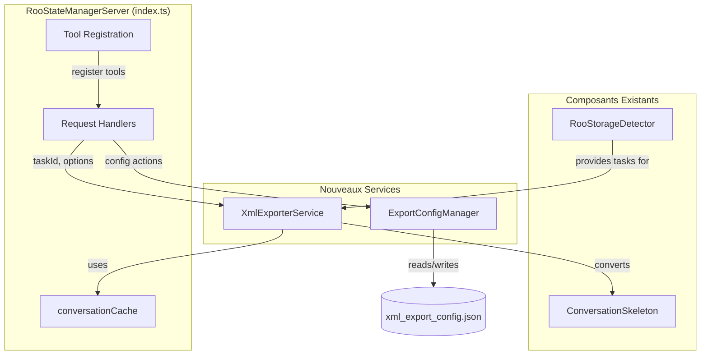

# Spécification Technique - Export XML pour roo-state-manager

**Auteur :** Roo Architecte
**Date :** 9 septembre 2025
**Mission :** Définir les schémas et l'architecture pour les fonctionnalités d'export XML dans `roo-state-manager`.

---

## 4. Matrices de Compatibilité et Contraintes

### 4.1 Matrice de Compatibilité

| Composant                 | Version Minimale | Notes                                                                                      |
| ------------------------- | ---------------- | ------------------------------------------------------------------------------------------ |
| **Roo VSCode Extension**  | `v3.17.0+`       | Nécessite une version supportant la découverte dynamique des outils MCP.                   |
| **`roo-state-manager`**   | `(self)`         | Les outils seront intégrés dans une nouvelle version de ce MCP.                            |
| **Format de Données**     | `ConversationSkeleton` | L'export dépend de la structure de `ConversationSkeleton`. Toute évolution de cette interface devra être répercutée dans les schémas XML.                             |
| **Node.js (pour le MCP)** | `18.x`           | En ligne avec les dépendances actuelles de l'écosystème Roo.                                |

### 4.2 Contraintes Techniques et Points de Vigilance

1.  **Performance :**
    *   L'outil `export_project_xml` pourrait être lent sur des projets contenant des milliers de conversations. Une optimisation sera nécessaire (ex: streaming, pagination interne).
    *   La construction du XML en mémoire pour de très larges conversations (`export_conversation_xml`) pourrait consommer beaucoup de RAM.

2.  **Sécurité des Chemins de Fichiers :**
    *   Les paramètres `filePath` des outils d'export doivent être validés et nettoyés pour éviter les attaques de type "Path Traversal". L'accès devrait être limité au workspace du projet ou à un répertoire de sortie désigné.

3.  **Dépendances Externes :**
    *   L'ajout d'une bibliothèque de construction XML (ex: `xmlbuilder2`) introduit une nouvelle dépendance au projet `roo-state-manager`. Elle devra être auditée et maintenue à jour.

4.  **Synchronisation du Cache :**
    *   La fiabilité des exports dépend de la fraîcheur du `conversationCache`. Un export lancé juste après une nouvelle activité non encore cachée pourrait produire des résultats incomplets. Le mécanisme de mise à jour du cache est donc critique.

---

## 1. Vue d'ensemble

**Auteur :** Roo Architecte
**Date :** 9 septembre 2025
**Mission :** Définir les schémas et l'architecture pour les fonctionnalités d'export XML dans `roo-state-manager`.

---

## 1. Vue d'ensemble

Ce document détaille les spécifications techniques pour quatre nouveaux outils MCP destinés à exporter les données des tâches et conversations Roo au format XML. Ces spécifications sont basées sur l'analyse de la structure de données existante, notamment l'interface `ConversationSkeleton`.

## 3. Architecture d'Intégration

L'intégration des fonctionnalités d'export XML dans `roo-state-manager` suivra une approche modulaire pour assurer la maintenabilité et la séparation des préoccupations.

### Diagramme des Composants



### 3.1 Nouveaux Modules et Classes

1.  **`services/XmlExporterService.ts`**
    *   **Responsabilité :** Contenir toute la logique de transformation des données (`ConversationSkeleton`) en chaînes XML.
    *   **Classe :** `XmlExporterService`
    *   **Méthodes :**
        *   `generateTaskXml(skeleton: ConversationSkeleton, options): string`
        *   `generateConversationXml(rootSkeleton: ConversationSkeleton, children: ConversationSkeleton[], options): string`
        *   `generateProjectXml(skeletons: ConversationSkeleton[], projectPath: string, options): string`
    *   **Dépendance :** Une bibliothèque robuste de construction XML comme `xmlbuilder2` sera utilisée pour éviter les injections et garantir un XML bien formé.

2.  **`services/ExportConfigManager.ts`**
    *   **Responsabilité :** Gérer la lecture, l'écriture et la mise en cache de la configuration d'export (`xml_export_config.json`).
    *   **Classe :** `ExportConfigManager`
    *   **Méthodes :**
        *   `getConfig(): Promise<ExportConfig>`
        *   `updateConfig(partialConfig: Partial<ExportConfig>): Promise<void>`
        *   `resetConfig(): Promise<void>`

### 3.2 Modifications du `RooStateManagerServer` (`index.ts`)

La classe principale du serveur sera modifiée pour orchestrer les nouvelles fonctionnalités :

1.  **Initialisation :** Le constructeur de `RooStateManagerServer` instanciera `XmlExporterService` and `ExportConfigManager`.
2.  **Enregistrement des Outils :** Les quatre nouveaux outils (`export_tasks_xml`, `export_conversation_xml`, etc.) seront ajoutés à la liste des outils retournée par le handler `ListToolsRequestSchema`.
3.  **Implémentation des Handlers :** De nouvelles méthodes `private` seront ajoutées pour gérer les appels à chaque outil.
    *   `handleExportTaskXml(args): Promise<CallToolResult>` :
        *   Récupère le `ConversationSkeleton` depuis `this.conversationCache` en utilisant le `taskId`.
        *   Appelle `this.xmlExporterService.generateTaskXml()`.
        *   Retourne le XML dans la réponse ou l'écrit dans un fichier.
    *   Implémentations similaires pour `handleExportConversationXml` et `handleExportProjectXml`.
    *   `handleConfigureXmlExport(args): Promise<CallToolResult>` :
        *   Appelle la méthode correspondante de `this.exportConfigManager` (`getConfig`, `updateConfig`, etc.) en fonction de l' `action` reçue.
        *   Retourne un message de succès ou la configuration.

### 3.3 Interfaces avec les Composants Existants

*   **`ConversationSkeleton`**: C'est la structure de données source principale. Le `XmlExporterService` sera conçu pour mapper directement les champs de cette interface vers les balises XML.
*   **`conversationCache`**: Le cache sera la source de lecture prioritaire pour tous les exports afin de garantir des performances élevées et de minimiser les accès disque.
*   **`RooStorageDetector`**:
    *   Sera utilisé par `handleExportProjectXml` pour trouver toutes les tâches associées à un `projectPath`.
    *   Sera également utilisé par `ExportConfigManager` pour localiser le bon répertoire de stockage où placer le fichier `xml_export_config.json`.

### 3.4 Gestion des Erreurs et Validation

*   Des classes d'erreurs personnalisées seront créées (ex: `TaskNotFoundForExportError`, `XmlGenerationError`).
*   Les handlers dans `RooStateManagerServer` devront implémenter des blocs `try...catch` pour intercepter ces erreurs et retourner des `CallToolResult` formatés en erreur au client.
*   La validation des paramètres d'entrée des outils se fera au niveau des handlers avant d'appeler les services.

## 2. Spécification des Outils MCP

**Auteur :** Roo Architecte
**Date :** 9 septembre 2025
**Mission :** Définir les schémas et l'architecture pour les fonctionnalités d'export XML dans `roo-state-manager`.

---

## 1. Vue d'ensemble

Ce document détaille les spécifications techniques pour quatre nouveaux outils MCP destinés à exporter les données des tâches et conversations Roo au format XML. Ces spécifications sont basées sur l'analyse de la structure de données existante, notamment l'interface `ConversationSkeleton`.

## 2. Spécification des Outils MCP

### A. `export_tasks_xml` (Tâche individuelle)

Cet outil exporte une tâche unique (représentée par un `ConversationSkeleton`) dans un fichier XML autonome.

#### Paramètres d'Entrée

| Paramètre        | Type    | Obligatoire | Description                                                                 |
| ---------------- | ------- | ----------- | --------------------------------------------------------------------------- |
| `taskId`         | string  | Oui         | L'identifiant unique de la tâche à exporter.                                |
| `filePath`       | string  | Non         | Chemin de sortie pour le fichier XML. Si non fourni, le contenu est retourné.|
| `includeContent` | boolean | Non         | Si `true`, inclut le contenu complet des messages (`false` par défaut).      |
| `prettyPrint`    | boolean | Non         | Si `true`, indente le XML pour une meilleure lisibilité (`true` par défaut). |

---

#### Schéma XML (`task.xsd`)

Le schéma suivant définit la structure d'un fichier XML de tâche. Il est basé sur la structure de `ConversationSkeleton`.

```xml
<?xml version="1.0" encoding="UTF-8"?>
<xs:schema xmlns:xs="http://www.w3.org/2001/XMLSchema">

  <!-- Élément racine pour une tâche -->
  <xs:element name="task" type="TaskType"/>

  <!-- Définition du type complexe pour une tâche -->
  <xs:complexType name="TaskType">
    <xs:sequence>
      <xs:element name="metadata" type="MetadataType"/>
      <xs:element name="sequence" type="SequenceType"/>
    </xs:sequence>
    <xs:attribute name="taskId" type="xs:string" use="required"/>
    <xs:attribute name="parentTaskId" type="xs:string" use="optional"/>
  </xs:complexType>

  <!-- Métadonnées de la tâche -->
  <xs:complexType name="MetadataType">
    <xs:sequence>
      <xs:element name="title" type="xs:string" minOccurs="0"/>
      <xs:element name="lastActivity" type="xs:dateTime"/>
      <xs:element name="createdAt" type="xs:dateTime"/>
      <xs:element name="mode" type="xs:string" minOccurs="0"/>
      <xs:element name="messageCount" type="xs:integer"/>
      <xs:element name="actionCount" type="xs:integer"/>
      <xs:element name="totalSize" type="xs:integer"/>
    </xs:sequence>
  </xs:complexType>

  <!-- Séquence d'événements -->
  <xs:complexType name="SequenceType">
    <xs:choice maxOccurs="unbounded">
      <xs:element name="message" type="MessageType"/>
      <xs:element name="action" type="ActionType"/>
    </xs:choice>
  </xs:complexType>

  <!-- Type pour un message -->
  <xs:complexType name="MessageType">
    <xs:simpleContent>
      <xs:extension base="xs:string">
        <xs:attribute name="role" use="required">
          <xs:simpleType>
            <xs:restriction base="xs:string">
              <xs:enumeration value="user"/>
              <xs:enumeration value="assistant"/>
            </xs:restriction>
          </xs:simpleType>
        </xs:attribute>
        <xs:attribute name="timestamp" type="xs:dateTime" use="required"/>
        <xs:attribute name="isTruncated" type="xs:boolean" use="optional" default="false"/>
      </xs:extension>
    </xs:simpleContent>
  </xs:complexType>

  <!-- Type pour une action/outil -->
  <xs:complexType name="ActionType">
     <xs:sequence>
        <xs:element name="parameters" type="xs:string" minOccurs="0"/>
     </xs:sequence>
    <xs:attribute name="type" use="required">
       <xs:simpleType>
          <xs:restriction base="xs:string">
             <xs:enumeration value="tool"/>
             <xs:enumeration value="command"/>
          </xs:restriction>
       </xs:simpleType>
    </xs:attribute>
    <xs:attribute name="name" type="xs:string" use="required"/>
    <xs:attribute name="status" use="required">
      <xs:simpleType>
        <xs:restriction base="xs:string">
          <xs:enumeration value="success"/>
          <xs:enumeration value="failure"/>
          <xs:enumeration value="in_progress"/>
        </xs:restriction>
      </xs:simpleType>
    </xs:attribute>
    <xs:attribute name="timestamp" type="xs:dateTime" use="required"/>
    <xs:attribute name="filePath" type="xs:string" use="optional"/>
    <xs:attribute name="lineCount" type="xs:integer" use="optional"/>
    <xs:attribute name="contentSize" type="xs:integer" use="optional"/>
  </xs:complexType>

</xs:schema>
```

#### Exemple de Fichier XML

Voici un exemple de ce à quoi ressemblerait un fichier XML généré.

```xml
<?xml version="1.0" encoding="UTF-8"?>
<task taskId="task-12345-abcde" parentTaskId="task-12344-fghij">
  <metadata>
    <title>Refactor the authentication module</title>
    <lastActivity>2025-09-09T12:00:00Z</lastActivity>
    <createdAt>2025-09-09T10:30:00Z</createdAt>
    <mode>code-complex</mode>
    <messageCount>2</messageCount>
    <actionCount>1</actionCount>
    <totalSize>15360</totalSize>
  </metadata>
  <sequence>
    <message role="user" timestamp="2025-09-09T10:30:05Z">
      Please refactor the main authentication logic in `auth.py`.
    </message>
    <action type="tool" name="read_file" status="success" timestamp="2025-09-09T10:31:00Z" filePath="src/auth.py">
        <parameters>{"path": "src/auth.py"}</parameters>
    </action>
    <message role="assistant" timestamp="2025-09-09T10:35:15Z" isTruncated="true">
       I have read the file. I will now apply the changes...
       [...]
    </message>
  </sequence>
</task>
```

---
### B. `export_conversation_xml` (Conversation complète)

Cet outil exporte une conversation entière, c'est-à-dire une tâche racine et tous ses descendants, dans un unique fichier XML.

#### Paramètres d'Entrée

| Paramètre         | Type    | Obligatoire | Description                                                                         |
| ----------------- | ------- | ----------- | ----------------------------------------------------------------------------------- |
| `conversationId`  | string  | Oui         | L'identifiant de la tâche racine de la conversation à exporter.                       |
| `filePath`        | string  | Non         | Chemin de sortie pour le fichier XML. Si non fourni, le contenu est retourné.       |
| `maxDepth`        | integer | Non         | Profondeur maximale de l'arbre de tâches à inclure.                                 |
| `includeContent`  | boolean | Non         | Si `true`, inclut le contenu complet des messages (`false` par défaut).               |
| `prettyPrint`     | boolean | Non         | Si `true`, indente le XML pour une meilleure lisibilité (`true` par défaut).          |

---

#### Schéma XML (`conversation.xsd`)

Ce schéma s'appuie sur le `TaskType` défini précédemment et introduit une structure de conversation hiérarchique.

```xml
<?xml version="1.0" encoding="UTF-8"?>
<xs:schema xmlns:xs="http://www.w3.org/2001/XMLSchema">
  
  <!-- Importation du schéma de tâche si dans un fichier séparé -->
  <!-- <xs:include schemaLocation="task.xsd"/> -->
  
  <!-- Définition de TaskType (copié ici pour l'exemple) -->
  <xs:complexType name="TaskType">
    <xs:sequence>
      <xs:element name="metadata" type="MetadataType"/>
      <xs:element name="sequence" type="SequenceType"/>
      <xs:element name="children" type="ChildrenType" minOccurs="0"/>
    </xs:sequence>
    <xs:attribute name="taskId" type="xs:string" use="required"/>
    <xs:attribute name="parentTaskId" type="xs:string" use="optional"/>
  </xs:complexType>
  
  <xs:complexType name="ChildrenType">
      <xs:sequence>
          <xs:element name="task" type="TaskType" maxOccurs="unbounded"/>
      </xs:sequence>
  </xs:complexType>

  <!-- TODO: Copier les autres types (MetadataType, etc.) depuis le schéma de tâche -->

  <!-- Élément racine pour une conversation -->
  <xs:element name="conversation">
    <xs:complexType>
      <xs:sequence>
        <xs:element name="rootTask" type="TaskType"/>
      </xs:sequence>
      <xs:attribute name="conversationId" type="xs:string" use="required"/>
      <xs:attribute name="exportTimestamp" type="xs:dateTime" use="required"/>
    </xs:complexType>
  </xs:element>

</xs:schema>
```

#### Exemple de Fichier XML

```xml
<?xml version="1.0" encoding="UTF-8"?>
<conversation conversationId="task-12344-fghij" exportTimestamp="2025-09-09T13:00:00Z">
  <rootTask taskId="task-12344-fghij">
    <metadata>
      <title>Authentication Feature</title>
      ...
    </metadata>
    <sequence>
       <message role="user" timestamp="2025-09-09T10:25:10Z">
          Let's start working on the new auth module.
       </message>
    </sequence>
    <children>
      <!-- Ici est imbriquée la tâche de l'exemple précédent -->
      <task taskId="task-12345-abcde" parentTaskId="task-12344-fghij">
        <metadata>
          <title>Refactor the authentication module</title>
          ...
        </metadata>
        <sequence>
          ...
        </sequence>
      </task>
      <!-- D'autres tâches enfants pourraient suivre -->
    </children>
  </rootTask>
</conversation>
```

---
### C. `export_project_xml` (Projet complet)

Cet outil est conçu pour exporter un aperçu de haut niveau d'un projet entier, défini par son chemin sur le système de fichiers. Il agrège les métadonnées de toutes les conversations associées à ce projet.

#### Paramètres d'Entrée

| Paramètre         | Type    | Obligatoire | Description                                                                         |
| ----------------- | ------- | ----------- | ----------------------------------------------------------------------------------- |
| `projectPath`     | string  | Oui         | Le chemin du workspace/projet à analyser.                                           |
| `filePath`        | string  | Non         | Chemin de sortie pour le fichier XML. Si non fourni, le contenu est retourné.       |
| `startDate`       | string  | Non         | Date de début (ISO 8601) pour filtrer les conversations.                             |
| `endDate`         | string  | Non         | Date de fin (ISO 8601) pour filtrer les conversations.                               |
| `prettyPrint`     | boolean | Non         | Si `true`, indente le XML pour une meilleure lisibilité (`true` par défaut).          |

---

#### Schéma XML (`project.xsd`)

Le schéma se concentre sur l'agrégation et la synthèse, réutilisant une version allégée de `ConversationType` pour la clarté.

```xml
<?xml version="1.0" encoding="UTF-8"?>
<xs:schema xmlns:xs="http://www.w3.org/2001/XMLSchema">

  <!-- Élément racine -->
  <xs:element name="projectExport" type="ProjectType"/>

  <xs:complexType name="ProjectType">
    <xs:sequence>
      <xs:element name="summary" type="SummaryType"/>
      <xs:element name="conversations" type="ConversationListType"/>
    </xs:sequence>
  </xs:complexType>

  <!-- Section de résumé -->
  <xs:complexType name="SummaryType">
    <xs:sequence>
      <xs:element name="projectPath" type="xs:string"/>
      <xs:element name="exportTimestamp" type="xs:dateTime"/>
      <xs:element name="conversationCount" type="xs:integer"/>
      <xs:element name="totalTasks" type="xs:integer"/>
      <xs:element name="totalSize" type="xs:long" comment="Taille totale en octets"/>
      <xs:element name="dateRange">
        <xs:complexType>
          <xs:attribute name="start" type="xs:dateTime"/>
          <xs:attribute name="end" type="xs:dateTime"/>
        </xs:complexType>
      </xs:element>
    </xs:sequence>
  </xs:complexType>

  <!-- Liste des conversations -->
  <xs:complexType name="ConversationListType">
    <xs:sequence>
      <xs:element name="conversation" type="ConversationSummaryType" minOccurs="0" maxOccurs="unbounded"/>
    </xs:sequence>
  </xs:complexType>

  <!-- Type résumé pour une conversation -->
  <xs:complexType name="ConversationSummaryType">
    <xs:attribute name="rootTaskId" type="xs:string" use="required"/>
    <xs:attribute name="title" type="xs:string" use="optional"/>
    <xs:attribute name="taskCount" type="xs:integer" use="required"/>
    <xs:attribute name="lastActivity" type="xs:dateTime" use="required"/>
  </xs:complexType>

</xs:schema>
```

#### Exemple de Fichier XML

```xml
<?xml version="1.0" encoding="UTF-8"?>
<projectExport>
  <summary>
    <projectPath>d:/dev/roo-extensions</projectPath>
    <exportTimestamp>2025-09-09T14:00:00Z</exportTimestamp>
    <conversationCount>42</conversationCount>
    <totalTasks>128</totalTasks>
    <totalSize>5432100</totalSize>
    <dateRange start="2025-01-01T00:00:00Z" end="2025-09-09T13:59:59Z"/>
  </summary>
  <conversations>
    <conversation rootTaskId="task-12344-fghij" title="Authentication Feature" taskCount="5" lastActivity="2025-09-09T12:00:00Z"/>
    <conversation rootTaskId="task-56789-klmno" title="Database Schema Update" taskCount="3" lastActivity="2025-09-08T18:00:00Z"/>
    <!-- ... autres conversations ... -->
  </conversations>
</projectExport>
```

---
### D. `configure_xml_export` (Configuration)

Cet outil gère les paramètres de configuration des exports XML, permettant aux utilisateurs de personnaliser les sorties selon leurs besoins. La configuration est persistée dans un fichier `xml_export_config.json` à la racine du stockage Roo.

#### Paramètres d'Entrée

L'outil fonctionne avec une action et des paramètres associés.

| Paramètre | Type   | Obligatoire | Description                                                               |
| --------- | ------ | ----------- | ------------------------------------------------------------------------- |
| `action`  | string | Oui         | L'opération à effectuer : `get`, `set`, `reset`.                          |
| `config`  | object | Non         | L'objet de configuration à appliquer pour l'action `set`.                   |

---

#### Structure du Fichier de Configuration (`xml_export_config.json`)

Le fichier de configuration est un simple JSON qui structure les préférences de l'utilisateur.

```json
{
  "defaults": {
    "prettyPrint": true,
    "includeContent": false,
    "compression": "none"
  },
  "templates": {
    "jira_export": {
      "format": "simplified",
      "fields": ["taskId", "title", "user_messages_only"]
    }
  },
  "filters": {
    "last_week_bugs": {
      "startDate": "now-7d",
      "mode": "debug-complex"
    }
  }
}
```

#### Comportement des Actions

*   **`get`**: Retourne le contenu actuel du fichier `xml_export_config.json`.
*   **`set`**: Met à jour le fichier de configuration. Accepte un objet `config` partiel et le fusionne avec la configuration existante.
    *   Exemple de `config` : `{ "defaults": { "compression": "zip" } }`
*   **`reset`**: Restaure la configuration par défaut.

#### Exemple d'Utilisation (via MCP)

Pour définir la compression par défaut à `zip` :
```json
{
  "tool_name": "configure_xml_export",
  "arguments": {
    "action": "set",
    "config": {
      "defaults": {
        "compression": "zip"
      }
    }
  }
}
```

La sortie de l'outil sera un message de confirmation :
```json
{
  "content": [{
    "type": "text",
    "text": "Configuration updated successfully."
  }]
}
```