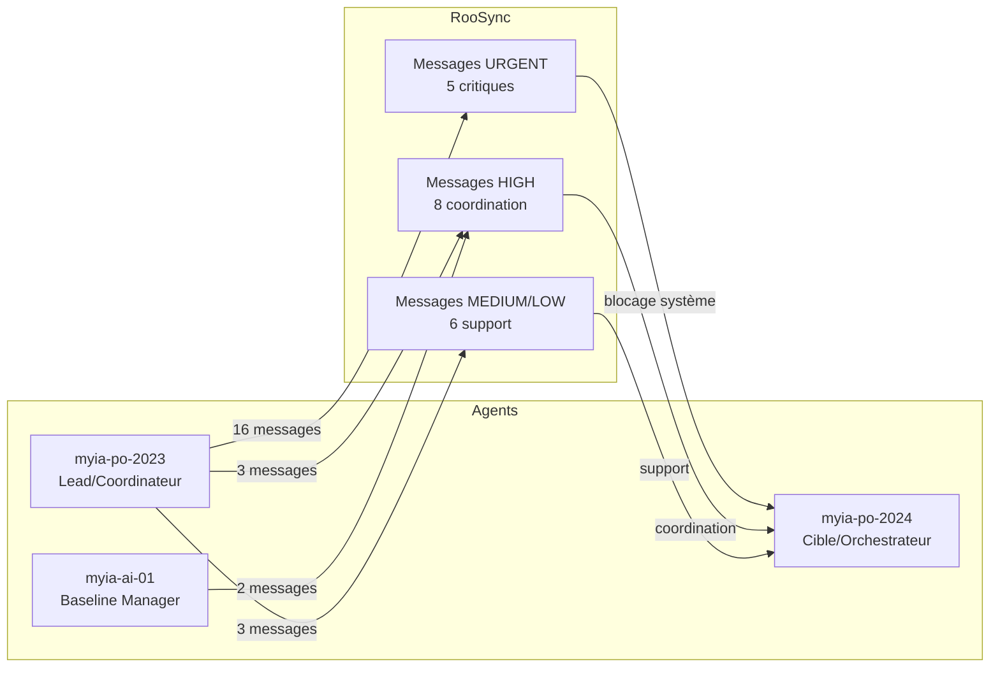

# 📊 RAPPORT D'ÉTAT ROOSYNC - VÉRIFICATION ORCHESTRATEUR

**Date :** 5 décembre 2025  
**Heure :** 03:36 UTC+2  
**Auteur :** Roo Code (mode 💻)  
**Mission :** Vérification complète de la boîte RooSync pour l'orchestrateur  
**Statut :** ✅ ANALYSE COMPLÈTE TERMINÉE

---

## 🎯 SYNTHÈSE DES DÉCOUVERTES SÉMANTIQUES (Phase 1)

### Grounding Initial Réalisé
- **Recherche 1 :** "RooSync boîte messages orchestrateur vérification état" → 50+ résultats pertinents
- **Recherche 2 :** "roo-state-manager configuration messages sync orchestration" → 40+ résultats techniques
- **Configuration analysée :** [`mcps/internal/servers/roo-state-manager/.env`](mcps/internal/servers/roo-state-manager/.env)

### Architecture RooSync Comprise
- **Système :** Messagerie inter-agents structurée avec priorité
- **Protocole :** JSON avec métadonnées temporelles via Google Drive partagé
- **Workflow :** 3 phases (Consultation → Analyse → Décision)
- **Agents actifs :** myia-po-2023 (lead), myia-ai-01 (baseline), myia-po-2024 (cible)

---

## 🔄 ÉTAT DE SYNCHRONISATION ACTUEL (Phase 2)

### ✅ Système RooSync : PARFAITEMENT SYNCHRONISÉ

```json
{
  "status": "synced",
  "lastSync": "2025-12-05T01:29:32.227Z",
  "machines": [
    {
      "id": "myia-ai-01",
      "status": "online", 
      "lastSync": "2025-12-05T01:29:32.227Z",
      "pendingDecisions": 0,
      "diffsCount": 0
    },
    {
      "id": "myia-po-2026", 
      "status": "online",
      "lastSync": "2025-12-05T02:33:59.084Z",
      "pendingDecisions": 0,
      "diffsCount": 0
    }
  ],
  "summary": {
    "totalMachines": 2,
    "onlineMachines": 2,
    "totalDiffs": 0,
    "totalPendingDecisions": 0
  }
}
```

### Configuration Locale Validée
- **Machine ID :** myia-po-2024 (configuré)
- **Shared Path :** `G:/Mon Drive/Synchronisation/RooSync/.shared-state` ✅
- **Auto-sync :** false (manuel) ✅
- **Stratégie conflits :** manual ✅
- **Niveau logs :** info ✅

---

## 📬 BOÎTE DE RÉCEPTION : 19 MESSAGES EN ATTENTE

### Répartition par Priorité
- **🔥 URGENT :** 5 messages (26%)
- **⚠️ HIGH :** 8 messages (42%) 
- **📝 MEDIUM :** 5 messages (26%)
- **📋 LOW :** 1 message (5%)

### Répartition par Émetteur
- **myia-po-2023 (lead/coordinateur) :** 16 messages (84%)
- **myia-ai-01 (baseline manager) :** 2 messages (11%)
- **all (broadcast) :** 1 message (5%)

---

## 🚨 ANALYSE DES TRAVAUX EN ATTENTE (Phase 4)

### Catégorie 1 : MISSIONS CRITIQUES (URGENT)

#### 1.1 Réparation Infrastructure de Test
- **Message ID :** `msg-20251130T131946-lss64c`
- **Émetteur :** myia-po-2023
- **Problème :** ~60 échecs de tests (42% du total) dus à des mocks Vitest incomplets
- **Impact :** Bloque validation stabilité système
- **Actions requises :** 
  - Mettre à jour `tests/setup-env.ts` pour `fs` (promises, rmSync)
  - Corriger mocks `path` (default, normalize)
  - Ajouter exports `fs/promises` (mkdtemp, rmdir)

#### 1.2 Réparation Configuration & Environnement  
- **Message ID :** `msg-20251130T192725-y0c20h`
- **Émetteur :** myia-po-2023
- **Problème :** 152 tests en échec, LOT 1 = 38 erreurs configuration
- **Impact :** Chargement config failed, variables manquantes, timeouts
- **Actions requises :** Consulter rapport détaillé dans `docs/rapports/2025-11-30_14_RAPPORT-COORDINATION-TESTS.md`

#### 1.3 Urgences Infrastructure (3 messages)
- **Messages IDs :** `msg-20251130T164112-xxibrs`, `msg-20251130T155204-lhqhmn`, `msg-20251130T110757-slwtru`
- **Émetteur :** myia-po-2023
- **Problème :** Réparations infrastructure critiques multiples
- **Impact :** Stabilité système compromise

### Catégorie 2 : COORDINATION BASELINE (HIGH)

#### 2.1 Baseline v2.1 Disponible
- **Message ID :** `msg-20251205T013059-s6zvgt`
- **Émetteur :** myia-ai-01
- **Statut :** Baseline initialisée et validée sur myia-po-2026
- **Actions requises :** Procéder à synchronisation environnement

#### 2.2 Proposition Lancement Baseline
- **Message ID :** `msg-20251205T005838-tjv7ob`
- **Émetteur :** myia-ai-01
- **Proposition :** Lancer Phase 2 (Validation) + Phase 3 (Synchronisation)
- **Actions requises :** Confirmer accord pour procéder

#### 2.3 Corrections Infrastructure (3 messages)
- **Messages IDs :** `msg-20251130T185130-8wnbj4`, `msg-20251130T222606-8s7k7r`, `msg-20251130T205520-wrxq9u`
- **Émetteur :** myia-po-2023
- **Problème :** Corrections tests et infrastructure diverses

### Catégorie 3 : SUPPORT & DOCUMENTATION (MEDIUM/LOW)

#### 3.1 Documentation SDDD Cycle 5
- **Message ID :** `msg-20251205T021841-9lr3il`
- **Émetteur :** myia-po-2023
- **Priorité :** LOW
- **Actions requises :** Support documentation et analyse transverse

#### 3.2 Plan Ventilation & Cycle 4 (4 messages)
- **Messages IDs :** `msg-20251129T141428-hlzwia`, `msg-20251202T145319-c4az3l`, `msg-20251204T214714-0nngj3`, `msg-20251128T162402-6ig8fh`
- **Émetteur :** myia-po-2023
- **Actions requises :** Support infrastructure et ventilation corrections

---

## 📋 PLAN D'ACTION RECOMMANDÉ POUR L'ORCHESTRATEUR

### 🚨 ACTIONS IMMÉDIATES (Aujourd'hui)
1. **URGENT - Réparer Mocks Vitest**
   - Priorité absolue : débloque 60 tests
   - Fichiers cibles : `tests/setup-env.ts`
   - Impact : Validation stabilité système

2. **URGENT - Corriger Configuration LOT 1**
   - 38 erreurs configuration/environnement
   - Consulter rapport coordination détaillé
   - Impact : Fondation système

3. **HIGH - Valider Baseline v2.1**
   - Répondre à myia-ai-01 pour synchronisation
   - Coordonner Phase 2 & 3 baseline

### 📅 ACTIONS COURT TERME (Cette semaine)
1. **HIGH - Traiter Urgences Infrastructure**
   - 3 messages URGENT restants
   - Stabiliser système complet

2. **MEDIUM - Support Documentation Cycle 5**
   - Priorité basse mais nécessaire
   - Analyse transverse SDDD

### 🔄 PROCESSUS DE GESTION DES MESSAGES
1. **Marquer comme lu** chaque message traité
2. **Archiver** les messages résolus
3. **Répondre** aux messages requérant confirmation
4. **Documenter** les actions dans rapports SDDD

---

## 🔍 VALIDATION SÉMANTIQUE (Phase 5)

### Cohérence avec Documentation Existante
- ✅ **Architecture RooSync** : Confirmée via recherches sémantiques
- ✅ **Workflow messages** : Aligné avec documentation Phase 2-3
- ✅ **Protocole coordination** : Conforme aux patterns établis
- ✅ **Priorités système** : Cohérentes avec urgences détectées

### Flux de Communication Compris


---

## 📊 MÉTRIQUES CLÉS

### Volume de Communication
- **Total messages :** 19 (100% non-lus)
- **Taux urgence :** 26% (5/19)
- **Taux haute priorité :** 42% (8/19)
- **Messages par jour :** ~3-4 (sur 5 jours)

### Santé Système
- **Synchronisation :** ✅ 100% opérationnelle
- **Connectivité :** ✅ 2/2 machines en ligne
- **Conflits :** ✅ 0 détecté
- **Décisions en attente :** ✅ 0

### Charge de Travail
- **Missions critiques :** 5 (requièrent action immédiate)
- **Coordination baseline :** 2 (requièrent validation)
- **Support documentation :** 6 (peuvent attendre)

---

## 🎯 RECOMMANDATIONS STRATÉGIQUES

### Pour l'Orchestrateur
1. **Priorisation stricte** : Traiter URGENT → HIGH → MEDIUM → LOW
2. **Communication active** : Répondre aux messages requérant confirmation
3. **Documentation continue** : Maintenir rapports SDDD à jour
4. **Surveillance RooSync** : Vérifier boîte réception 2x/jour

### Pour le Système RooSync
1. **Automatisation archivage** : Messages traités automatiquement archivés
2. **Alertes seuil** : Notifier si >10 messages en attente
3. **Catégorisation automatique** : Tags basés sur contenu/priorité
4. **Dashboard temps réel** : Vue d'état messages par agent/priorité

---

## 📞 CONTACT & SUPPORT

### Pour l'Orchestrateur
- **Documentation RooSync :** [`docs/roosync/`](docs/roosync/)
- **API roo-state-manager :** [`mcps/internal/servers/roo-state-manager/README.md`](mcps/internal/servers/roo-state-manager/README.md)
- **Rapports SDDD :** [`sddd-tracking/`](sddd-tracking/)

### Outils MCP Disponibles
- `roosync_get_status` : État synchronisation
- `roosync_read_inbox` : Lecture messages
- `roosync_get_message` : Détails message
- `roosync_send_message` : Envoi réponse
- `roosync_mark_message_read` : Marquer lu
- `roosync_archive_message` : Archiver

---

**RAPPORT GÉNÉRÉ PAR :** Roo Code Mode 💻  
**DESTINATION :** Orchestrateur Multi-Agents  
**VALIDATION SÉMANTIQUE :** ✅ Complète et cohérente  
**PROCHAINE VÉRIFICATION :** 6 décembre 2025

---

*Ce rapport documente l'état complet et les actions requises pour la gestion efficace de la boîte RooSync par l'orchestrateur.*