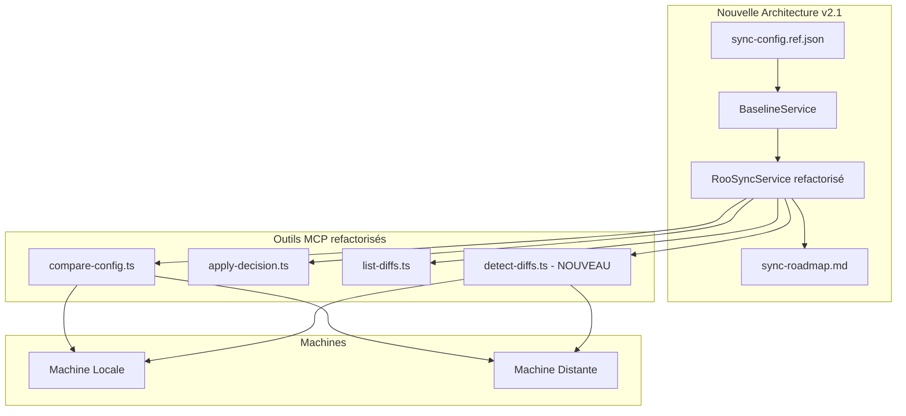
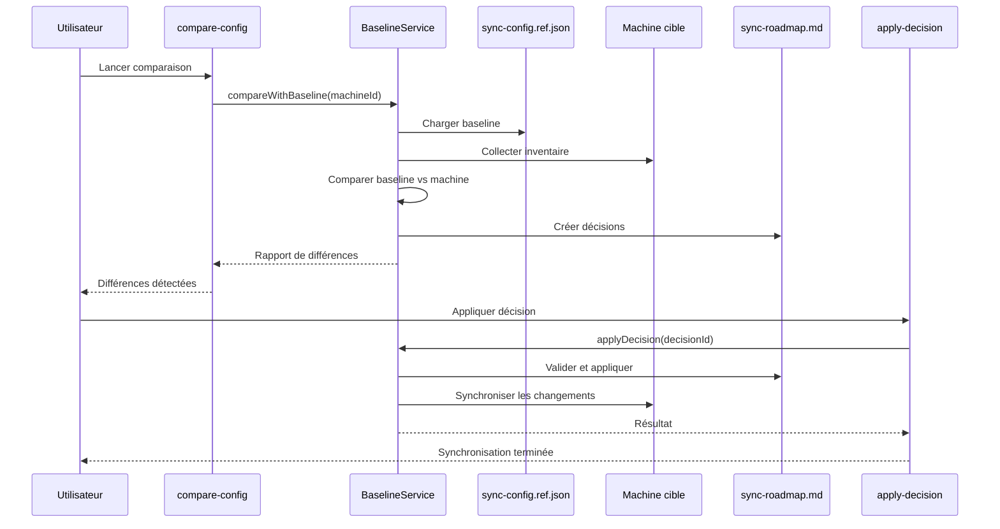
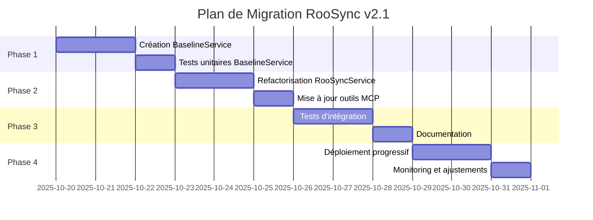

# RooSync v2.1 - Architecture Baseline-Driven - Spécifications Techniques

**Date** : 2025-10-20  
**Version** : 2.1.0  
**Auteur** : Architecte SDDD  
**Statut** : Spécifications techniques complètes

---

## 1. Résumé Exécutif

Ce document présente l'architecture technique complète de RooSync v2.1, qui restaure les principes baseline-driven de RooSync v1 en corrigeant les défauts fondamentaux de RooSync v2.

### 1.1 Problèmes identifiés dans v2.0
- **Modèle machine-à-machine** : Comparaison directe entre machines sans baseline de référence
- **Absence de source de vérité** : `sync-config.ref.json` n'est pas utilisé comme baseline
- **Workflow incorrect** : Pas de validation humaine structurée avant application des décisions

### 1.2 Solution v2.1
- **Architecture baseline-driven** : `sync-config.ref.json` comme source de vérité unique
- **Workflow restauré** : Compare-Config → Validation → Apply-Decisions
- **Service dédié** : `BaselineService` pour gérer la baseline et les comparaisons

---

## 2. Architecture Technique

### 2.1 Vue d'ensemble du système



### 2.2 Flux baseline-driven restauré



---

## 3. Spécifications du Service BaselineService

### 3.1 Interface TypeScript

```typescript
// src/services/BaselineService.ts
export interface BaselineConfig {
  machineId: string;
  config: {
    roo: {
      modes: string[];
      mcpSettings: Record<string, any>;
      userSettings: Record<string, any>;
    };
    hardware: {
      cpu: string;
      ram: string;
      disks: Array<{name: string; size: string}>;
      gpu?: string;
    };
    software: {
      powershell: string;
      node: string;
      python: string;
    };
    system: {
      os: string;
      architecture: string;
    };
  };
  lastUpdated: string;
  version: string;
}

export interface BaselineDifference {
  category: 'config' | 'hardware' | 'software' | 'system';
  severity: 'CRITICAL' | 'IMPORTANT' | 'WARNING' | 'INFO';
  path: string;
  description: string;
  baselineValue: any;
  actualValue: any;
  recommendedAction: string;
}

export interface BaselineComparisonReport {
  baselineMachine: string;
  targetMachine: string;
  baselineVersion: string;
  differences: BaselineDifference[];
  summary: {
    total: number;
    critical: number;
    important: number;
    warning: number;
    info: number;
  };
  generatedAt: string;
}

export interface SyncDecision {
  id: string;
  machineId: string;
  differenceId: string;
  category: string;
  description: string;
  baselineValue: any;
  targetValue: any;
  action: 'sync_to_baseline' | 'keep_target' | 'manual_review';
  severity: string;
  status: 'pending' | 'approved' | 'rejected' | 'applied';
  createdAt: string;
  approvedBy?: string;
  approvedAt?: string;
  appliedAt?: string;
  notes?: string;
}
```

### 3.2 Classe BaselineService

```typescript
export class BaselineService {
  private baselinePath: string;
  private roadmapPath: string;
  private inventoryCollector: InventoryCollector;
  private diffDetector: DiffDetector;
  
  constructor(
    @inject('ConfigService') private configService: ConfigService,
    @inject('InventoryCollector') inventoryCollector: InventoryCollector,
    @inject('DiffDetector') diffDetector: DiffDetector
  ) {
    this.baselinePath = path.join(configService.getSharedStatePath(), 'sync-config.ref.json');
    this.roadmapPath = path.join(configService.getSharedStatePath(), 'sync-roadmap.md');
    this.inventoryCollector = inventoryCollector;
    this.diffDetector = diffDetector;
  }
  
  /**
   * Charge la configuration baseline depuis sync-config.ref.json
   */
  public async loadBaseline(): Promise<BaselineConfig | null> {
    try {
      if (!await fs.pathExists(this.baselinePath)) {
        console.warn(`[BaselineService] ⚠️ Fichier baseline non trouvé: ${this.baselinePath}`);
        return null;
      }
      
      const content = await fs.readFile(this.baselinePath, 'utf-8');
      const baseline = JSON.parse(content) as BaselineConfig;
      
      console.log(`[BaselineService] ✅ Baseline chargée: ${baseline.machineId} v${baseline.version}`);
      return baseline;
    } catch (error) {
      console.error(`[BaselineService] ❌ Erreur chargement baseline:`, error);
      return null;
    }
  }
  
  /**
   * Compare une machine avec la configuration baseline
   */
  public async compareWithBaseline(
    targetMachineId: string,
    forceRefresh = false
  ): Promise<BaselineComparisonReport | null> {
    console.log(`[BaselineService] 🔍 Comparaison baseline vs ${targetMachineId}`);
    
    // Charger la baseline
    const baseline = await this.loadBaseline();
    if (!baseline) {
      throw new Error('Configuration baseline non disponible');
    }
    
    // Collecter inventaire de la machine cible
    const targetInventory = await this.inventoryCollector.collectInventory(targetMachineId, forceRefresh);
    if (!targetInventory) {
      throw new Error(`Échec collecte inventaire pour ${targetMachineId}`);
    }
    
    // Comparer baseline avec machine cible
    const differences = await this.diffDetector.compareBaselineWithMachine(baseline, targetInventory);
    
    const report: BaselineComparisonReport = {
      baselineMachine: baseline.machineId,
      targetMachine: targetMachineId,
      baselineVersion: baseline.version,
      differences,
      summary: this.calculateSummary(differences),
      generatedAt: new Date().toISOString()
    };
    
    console.log(`[BaselineService] ✅ Comparaison terminée: ${report.summary.total} différences`);
    return report;
  }
  
  /**
   * Crée des décisions de synchronisation à partir des différences détectées
   */
  public async createSyncDecisions(
    report: BaselineComparisonReport,
    severityThreshold: 'CRITICAL' | 'IMPORTANT' | 'WARNING' | 'INFO' = 'IMPORTANT'
  ): Promise<SyncDecision[]> {
    console.log(`[BaselineService] 📝 Création décisions (seuil: ${severityThreshold})`);
    
    // Filtrer les différences selon le seuil de sévérité
    const filteredDifferences = report.differences.filter(diff => 
      this.isSeverityAtLeast(diff.severity, severityThreshold)
    );
    
    const decisions: SyncDecision[] = filteredDifferences.map((diff, index) => ({
      id: `decision-${Date.now()}-${index}`,
      machineId: report.targetMachine,
      differenceId: `${diff.category}-${diff.path}`,
      category: diff.category,
      description: diff.description,
      baselineValue: diff.baselineValue,
      targetValue: diff.actualValue,
      action: this.recommendAction(diff),
      severity: diff.severity,
      status: 'pending',
      createdAt: new Date().toISOString()
    }));
    
    // Ajouter les décisions au roadmap
    await this.addDecisionsToRoadmap(decisions);
    
    console.log(`[BaselineService] ✅ ${decisions.length} décisions créées`);
    return decisions;
  }
  
  /**
   * Applique une décision de synchronisation approuvée
   */
  public async applyDecision(decisionId: string): Promise<boolean> {
    console.log(`[BaselineService] 🔄 Application décision: ${decisionId}`);
    
    // Charger les décisions depuis le roadmap
    const decisions = await this.loadDecisionsFromRoadmap();
    const decision = decisions.find(d => d.id === decisionId);
    
    if (!decision) {
      throw new Error(`Décision ${decisionId} non trouvée`);
    }
    
    if (decision.status !== 'approved') {
      throw new Error(`Décision ${decisionId} n'est pas approuvée`);
    }
    
    try {
      // Appliquer les changements sur la machine cible
      const success = await this.applyChangesToMachine(decision);
      
      if (success) {
        // Mettre à jour le statut de la décision
        decision.status = 'applied';
        decision.appliedAt = new Date().toISOString();
        await this.updateDecisionInRoadmap(decision);
        
        console.log(`[BaselineService] ✅ Décision ${decisionId} appliquée avec succès`);
        return true;
      } else {
        console.error(`[BaselineService] ❌ Échec application décision ${decisionId}`);
        return false;
      }
    } catch (error) {
      console.error(`[BaselineService] ❌ Erreur application décision ${decisionId}:`, error);
      return false;
    }
  }
  
  /**
   * Met à jour la configuration baseline (pour maintenance)
   */
  public async updateBaseline(newBaseline: BaselineConfig): Promise<boolean> {
    try {
      // Validation de la nouvelle baseline
      if (!this.validateBaselineConfig(newBaseline)) {
        throw new Error('Configuration baseline invalide');
      }
      
      // Sauvegarder l'ancienne baseline
      if (await fs.pathExists(this.baselinePath)) {
        const backupPath = `${this.baselinePath}.backup.${Date.now()}`;
        await fs.copy(this.baselinePath, backupPath);
        console.log(`[BaselineService] 💾 Ancienne baseline sauvegardée: ${backupPath}`);
      }
      
      // Écrire la nouvelle baseline
      await fs.writeFile(this.baselinePath, JSON.stringify(newBaseline, null, 2));
      
      console.log(`[BaselineService] ✅ Baseline mise à jour: ${newBaseline.machineId} v${newBaseline.version}`);
      return true;
    } catch (error) {
      console.error(`[BaselineService] ❌ Erreur mise à jour baseline:`, error);
      return false;
    }
  }
  
  // Méthodes privées
  private calculateSummary(differences: BaselineDifference[]) {
    return differences.reduce((acc, diff) => {
      acc.total++;
      acc[diff.severity.toLowerCase()]++;
      return acc;
    }, { total: 0, critical: 0, important: 0, warning: 0, info: 0 });
  }
  
  private isSeverityAtLeast(severity: string, threshold: string): boolean {
    const levels = { 'CRITICAL': 4, 'IMPORTANT': 3, 'WARNING': 2, 'INFO': 1 };
    return levels[severity] >= levels[threshold];
  }
  
  private recommendAction(diff: BaselineDifference): 'sync_to_baseline' | 'keep_target' | 'manual_review' {
    if (diff.severity === 'CRITICAL') return 'sync_to_baseline';
    if (diff.category === 'config') return 'sync_to_baseline';
    if (diff.category === 'hardware') return 'keep_target';
    return 'manual_review';
  }
  
  private async addDecisionsToRoadmap(decisions: SyncDecision[]): Promise<void> {
    // Implémentation de l'ajout des décisions au fichier sync-roadmap.md
    // Format markdown structuré pour validation humaine
  }
  
  private async loadDecisionsFromRoadmap(): Promise<SyncDecision[]> {
    // Implémentation du chargement des décisions depuis sync-roadmap.md
    return [];
  }
  
  private async updateDecisionInRoadmap(decision: SyncDecision): Promise<void> {
    // Implémentation de la mise à jour d'une décision dans sync-roadmap.md
  }
  
  private async applyChangesToMachine(decision: SyncDecision): Promise<boolean> {
    // Implémentation de l'application des changements sur la machine cible
    // Utilise les scripts PowerShell appropriés selon la catégorie
    return true;
  }
  
  private validateBaselineConfig(baseline: BaselineConfig): boolean {
    // Validation de la structure et du contenu de la baseline
    return baseline.machineId && baseline.config && baseline.version;
  }
}
```

---

## 4. Refactorisation de RooSyncService

### 4.1 Intégration de BaselineService

```typescript
// src/services/RooSyncService.ts (modifications)
export class RooSyncService {
  constructor(
    @inject('ConfigService') private configService: ConfigService,
    @inject('BaselineService') private baselineService: BaselineService, // NOUVEAU
    @inject('InventoryCollector') private inventoryCollector: InventoryCollector,
    @inject('DiffDetector') private diffDetector: DiffDetector,
    @inject('MessageService') private messageService: MessageService
  ) {}
  
  /**
   * Compare une machine avec la baseline (NOUVEAU - remplace compareRealConfigurations)
   */
  public async compareMachineWithBaseline(
    targetMachineId: string,
    forceRefresh = false
  ): Promise<BaselineComparisonReport | null> {
    return this.baselineService.compareWithBaseline(targetMachineId, forceRefresh);
  }
  
  /**
   * Détecte et crée les décisions de synchronisation (NOUVEAU)
   */
  public async detectAndCreateDecisions(
    targetMachineId: string,
    severityThreshold: 'CRITICAL' | 'IMPORTANT' | 'WARNING' | 'INFO' = 'IMPORTANT',
    forceRefresh = false
  ): Promise<SyncDecision[]> {
    const report = await this.compareMachineWithBaseline(targetMachineId, forceRefresh);
    if (!report) {
      throw new Error('Échec de la comparaison avec la baseline');
    }
    
    return this.baselineService.createSyncDecisions(report, severityThreshold);
  }
  
  /**
   * Applique une décision de synchronisation (NOUVEAU)
   */
  public async applySyncDecision(decisionId: string): Promise<boolean> {
    return this.baselineService.applyDecision(decisionId);
  }
  
  /**
   * @deprecated Utiliser compareMachineWithBaseline à la place
   */
  public async compareRealConfigurations(
    sourceMachineId: string,
    targetMachineId: string,
    forceRefresh = false
  ): Promise<ComparisonReport | null> {
    console.warn('[RooSyncService] ⚠️ compareRealConfigurations est déprécié. Utiliser compareMachineWithBaseline');
    // Implémentation conservée pour compatibilité mais dépréciée
    // ...
  }
}
```

---

## 5. Outils MCP Refactorisés

### 5.1 compare-config.ts (refactorisé)

```typescript
// src/tools/roosync/compare-config.ts (refactorisé)
export const CompareConfigArgsSchema = z.object({
  target: z.string().optional()
    .describe('ID de la machine cible à comparer avec la baseline'),
  force_refresh: z.boolean().optional()
    .describe('Forcer la collecte d\'inventaire même si cache valide (défaut: false)'),
  create_decisions: z.boolean().optional()
    .describe('Créer automatiquement les décisions de synchronisation (défaut: true)'),
  severity_threshold: z.enum(['CRITICAL', 'IMPORTANT', 'WARNING', 'INFO']).optional()
    .describe('Seuil de sévérité pour créer des décisions (défaut: IMPORTANT)')
});

export async function roosyncCompareConfig(args: CompareConfigArgs): Promise<CompareConfigResult> {
  try {
    const service = getRooSyncService();
    const config = service.getConfig();
    
    // Déterminer la machine cible
    const targetMachineId = args.target || await getDefaultTargetMachine(service);
    
    // Comparer avec la baseline (NOUVEAU)
    const report = await service.compareMachineWithBaseline(
      targetMachineId,
      args.force_refresh || false
    );

    if (!report) {
      throw new RooSyncServiceError(
        'Échec de la comparaison avec la baseline',
        'BASELINE_COMPARISON_FAILED'
      );
    }

    // Créer les décisions si demandé
    if (args.create_decisions !== false) {
      await service.detectAndCreateDecisions(
        targetMachineId,
        args.severity_threshold || 'IMPORTANT',
        args.force_refresh || false
      );
    }

    // Formatter le rapport pour l'affichage
    return formatBaselineComparisonReport(report);
    
  } catch (error) {
    if (error instanceof RooSyncServiceError) {
      throw error;
    }
    
    throw new RooSyncServiceError(
      `Erreur lors de la comparaison: ${(error as Error).message}`,
      'ROOSYNC_COMPARE_ERROR'
    );
  }
}

function formatBaselineComparisonReport(report: BaselineComparisonReport): CompareConfigResult {
  return {
    source: report.baselineMachine, // La baseline est maintenant la source
    target: report.targetMachine,
    differences: report.differences.map(diff => ({
      category: diff.category,
      severity: diff.severity,
      path: diff.path,
      description: diff.description,
      action: diff.recommendedAction
    })),
    summary: report.summary
  };
}
```

### 5.2 Nouvel outil detect-diffs.ts

```typescript
// src/tools/roosync/detect-diffs.ts (NOUVEAU)
export const DetectDiffsArgsSchema = z.object({
  target_machine: z.string().optional()
    .describe('ID de la machine cible (optionnel, défaut: première machine disponible)'),
  severity_threshold: z.enum(['CRITICAL', 'IMPORTANT', 'WARNING', 'INFO']).optional()
    .default('IMPORTANT')
    .describe('Seuil de sévérité pour créer des décisions (défaut: IMPORTANT)'),
  force_refresh: z.boolean().optional()
    .default(false)
    .describe('Forcer la collecte d\'inventaire même si cache valide (défaut: false)')
});

export async function roosyncDetectDiffs(args: DetectDiffsArgs): Promise<DetectDiffsResult> {
  try {
    const service = getRooSyncService();
    
    // Déterminer la machine cible
    const targetMachineId = args.target_machine || await getDefaultTargetMachine(service);
    
    // Détecter et créer les décisions
    const decisions = await service.detectAndCreateDecisions(
      targetMachineId,
      args.severity_threshold,
      args.force_refresh
    );
    
    return {
      targetMachine: targetMachineId,
      decisionsCreated: decisions.length,
      severityThreshold: args.severity_threshold,
      decisions: decisions.map(d => ({
        id: d.id,
        category: d.category,
        description: d.description,
        severity: d.severity,
        action: d.action,
        status: d.status
      }))
    };
    
  } catch (error) {
    throw new RooSyncServiceError(
      `Erreur lors de la détection: ${(error as Error).message}`,
      'ROOSYNC_DETECT_ERROR'
    );
  }
}
```

---

## 6. Architecture de Validation Humaine

### 6.1 Format sync-roadmap.md amélioré

```markdown
# RooSync Roadmap - Validation Humaine

## Statut Global
- **Dernière mise à jour** : 2025-10-20T17:30:00Z
- **Décisions en attente** : 5
- **Décisions approuvées** : 12
- **Décisions rejetées** : 2
- **Décisions appliquées** : 8

## Décisions en Attente de Validation

### 🔄 CRITICAL - Configuration
**Decision ID**: decision-1729456800000-0  
**Machine**: myia-ai-02  
**Catégorie**: config  
**Description**: Mode 'architect' manquant sur la machine cible  
**Valeur baseline**: ["ask", "code", "architect", "debug", "orchestrator"]  
**Valeur actuelle**: ["ask", "code", "debug", "orchestrator"]  
**Action recommandée**: sync_to_baseline  
**Créée le**: 2025-10-20T17:30:00Z  

[✅ Approuver] [❌ Rejeter] [📝 Notes]

---

### ⚠️ IMPORTANT - Configuration
**Decision ID**: decision-1729456800000-1  
**Machine**: myia-ai-02  
**Catégorie**: config  
**Description**: MCP 'quickfiles' non configuré  
**Valeur baseline**: {"enabled": true, "timeout": 30000}  
**Valeur actuelle**: {"enabled": false, "timeout": 30000}  
**Action recommandée**: sync_to_baseline  
**Créée le**: 2025-10-20T17:30:00Z  

[✅ Approuver] [❌ Rejeter] [📝 Notes]

---

## Décisions Approuvées (en attente d'application)

### ✅ CRITICAL - Configuration
**Decision ID**: decision-1729456700000-0  
**Machine**: myia-ai-02  
**Approuvé par**: user@domain.com  
**Approuvé le**: 2025-10-20T17:25:00Z  
**Statut**: Prêt pour application  

[🔄 Appliquer maintenant]

---

## Historique des Applications

### ✅ Appliqué avec succès
**Decision ID**: decision-1729456600000-2  
**Machine**: myia-ai-02  
**Appliqué le**: 2025-10-20T17:20:00Z  
**Durée**: 2.3s  
**Résultat**: Mode 'architect' ajouté avec succès  

---

## Instructions de Validation

1. **Examiner chaque décision** : Vérifiez les différences entre la baseline et la configuration actuelle
2. **Approuver ou rejeter** : Cliquez sur les liens pour valider votre décision
3. **Ajouter des notes** : Documentez vos raisons si nécessaire
4. **Application** : Les décisions approuvées peuvent être appliquées individuellement ou en lot

### Critères de Validation

- **CRITICAL** : Doit généralement être synchronisé avec la baseline
- **IMPORTANT** : Évaluer l'impact métier avant de synchroniser
- **WARNING** : Peut nécessiter une révision manuelle
- **INFO** : Informationnel, aucune action requise
```

### 6.2 Service de Validation Humaine

```typescript
// src/services/HumanValidationService.ts
export class HumanValidationService {
  private roadmapPath: string;
  
  constructor(@inject('ConfigService') private configService: ConfigService) {
    this.roadmapPath = path.join(configService.getSharedStatePath(), 'sync-roadmap.md');
  }
  
  /**
   * Approuve une décision de synchronisation
   */
  public async approveDecision(decisionId: string, approvedBy: string, notes?: string): Promise<boolean> {
    const decisions = await this.loadDecisions();
    const decision = decisions.find(d => d.id === decisionId);
    
    if (!decision) {
      throw new Error(`Décision ${decisionId} non trouvée`);
    }
    
    decision.status = 'approved';
    decision.approvedBy = approvedBy;
    decision.approvedAt = new Date().toISOString();
    decision.notes = notes;
    
    await this.saveDecisions(decisions);
    return true;
  }
  
  /**
   * Rejette une décision de synchronisation
   */
  public async rejectDecision(decisionId: string, reason: string): Promise<boolean> {
    const decisions = await this.loadDecisions();
    const decision = decisions.find(d => d.id === decisionId);
    
    if (!decision) {
      throw new Error(`Décision ${decisionId} non trouvée`);
    }
    
    decision.status = 'rejected';
    decision.notes = reason;
    
    await this.saveDecisions(decisions);
    return true;
  }
  
  /**
   * Génère le rapport de validation humaine
   */
  public async generateValidationReport(): Promise<ValidationReport> {
    const decisions = await this.loadDecisions();
    
    return {
      total: decisions.length,
      pending: decisions.filter(d => d.status === 'pending').length,
      approved: decisions.filter(d => d.status === 'approved').length,
      rejected: decisions.filter(d => d.status === 'rejected').length,
      applied: decisions.filter(d => d.status === 'applied').length,
      byCategory: this.groupByCategory(decisions),
      bySeverity: this.groupBySeverity(decisions),
      lastUpdated: new Date().toISOString()
    };
  }
  
  // Méthodes privées pour la gestion du fichier markdown
  private async loadDecisions(): Promise<SyncDecision[]> {
    // Parser le fichier sync-roadmap.md
    return [];
  }
  
  private async saveDecisions(decisions: SyncDecision[]): Promise<void> {
    // Générer le fichier sync-roadmap.md
  }
}
```

---

## 7. Stratégie d'Intégration

### 7.1 Plan de Migration



### 7.2 Compatibilité Ascendante

```typescript
// src/services/CompatibilityService.ts
export class CompatibilityService {
  /**
   * Convertit les anciens rapports de comparaison vers le nouveau format baseline
   */
  public convertLegacyComparisonReport(legacyReport: ComparisonReport): BaselineComparisonReport {
    // Logique de conversion pour maintenir la compatibilité
    return {
      baselineMachine: 'legacy-baseline',
      targetMachine: legacyReport.targetMachine,
      baselineVersion: '1.0.0',
      differences: legacyReport.differences.map(diff => ({
        ...diff,
        baselineValue: null, // À déterminer
        actualValue: null   // À déterminer
      })),
      summary: legacyReport.summary,
      generatedAt: new Date().toISOString()
    };
  }
  
  /**
   * Migre les anciennes décisions vers le nouveau format
   */
  public async migrateLegacyDecisions(): Promise<void> {
    // Logique de migration des décisions existantes
  }
}
```

---

## 8. Tests et Validation

### 8.1 Tests Unitaires BaselineService

```typescript
// tests/services/BaselineService.test.ts
describe('BaselineService', () => {
  let baselineService: BaselineService;
  let mockConfigService: jest.Mocked<ConfigService>;
  let mockInventoryCollector: jest.Mocked<InventoryCollector>;
  let mockDiffDetector: jest.Mocked<DiffDetector>;
  
  beforeEach(() => {
    // Setup des mocks
  });
  
  describe('loadBaseline', () => {
    it('devrait charger la baseline depuis sync-config.ref.json', async () => {
      // Test de chargement
    });
    
    it('devrait retourner null si le fichier n\'existe pas', async () => {
      // Test d'absence de fichier
    });
  });
  
  describe('compareWithBaseline', () => {
    it('devrait comparer une machine avec la baseline', async () => {
      // Test de comparaison
    });
    
    it('devrait lever une erreur si la baseline n\'est pas disponible', async () => {
      // Test d'erreur
    });
  });
  
  describe('createSyncDecisions', () => {
    it('devrait créer des décisions selon le seuil de sévérité', async () => {
      // Test de création de décisions
    });
  });
});
```

### 8.2 Tests d'Intégration

```typescript
// tests/integration/roosync-baseline-workflow.test.ts
describe('RooSync Baseline Workflow Integration', () => {
  it('devrait exécuter le workflow complet baseline-driven', async () => {
    // 1. Comparer avec la baseline
    const comparisonResult = await roosyncCompareConfig({
      target: 'test-machine',
      create_decisions: true
    });
    
    expect(comparisonResult.differences).toBeDefined();
    
    // 2. Approuver une décision
    const decisions = await listPendingDecisions();
    const firstDecision = decisions[0];
    
    await approveDecision(firstDecision.id, 'test-user');
    
    // 3. Appliquer la décision
    const applyResult = await roosyncApplyDecision({
      decisionId: firstDecision.id
    });
    
    expect(applyResult.success).toBe(true);
  });
});
```

---

## 9. Monitoring et Observabilité

### 9.1 Métriques de Performance

```typescript
// src/monitoring/RooSyncMetrics.ts
export class RooSyncMetrics {
  private metrics: Map<string, number> = new Map();
  
  public recordComparisonDuration(machineId: string, duration: number): void {
    this.metrics.set(`comparison.${machineId}.duration`, duration);
  }
  
  public recordDecisionCount(severity: string, count: number): void {
    this.metrics.set(`decisions.${severity}.count`, count);
  }
  
  public recordApplicationSuccess(decisionId: string): void {
    this.metrics.set(`application.${decisionId}.success`, 1);
  }
  
  public getMetrics(): Record<string, number> {
    return Object.fromEntries(this.metrics);
  }
}
```

### 9.2 Logging Structuré

```typescript
// src/logging/RooSyncLogger.ts
export class RooSyncLogger {
  public logComparison(machineId: string, baselineVersion: string, differencesCount: number): void {
    console.log(JSON.stringify({
      timestamp: new Date().toISOString(),
      event: 'baseline_comparison',
      machineId,
      baselineVersion,
      differencesCount,
      level: 'INFO'
    }));
  }
  
  public logDecisionCreated(decisionId: string, severity: string, category: string): void {
    console.log(JSON.stringify({
      timestamp: new Date().toISOString(),
      event: 'decision_created',
      decisionId,
      severity,
      category,
      level: 'INFO'
    }));
  }
}
```

---

## 10. Conclusion

Cette architecture baseline-driven pour RooSync v2.1 restaure les principes fondamentaux de v1 tout en améliorant :

1. **Clarté** : Une source de vérité unique avec `sync-config.ref.json`
2. **Sécurité** : Validation humaine obligatoire avant application
3. **Traçabilité** : Historique complet des décisions et applications
4. **Performance** : Comparaisons optimisées avec la baseline
5. **Maintenabilité** : Architecture modulaire et testable

La migration progressive garantit une transition en douceur tout en maintenant la compatibilité avec les processus existants.

---

**Prochaine étape** : Implémentation de BaselineService et début des tests unitaires