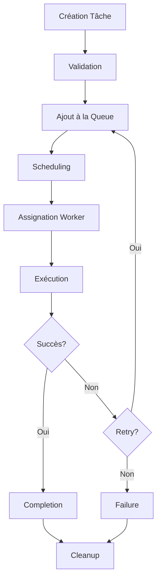

# Roo Scheduler - Architecture Technique

## Vue d'ensemble de l'Architecture

Le Roo Scheduler est conçu selon une architecture modulaire et événementielle qui privilégie la séparation des responsabilités, la scalabilité et la maintenabilité. Cette architecture permet une intégration fluide avec l'écosystème Roo Extensions tout en maintenant une flexibilité maximale.

## Principes Architecturaux

### 1. Architecture Modulaire
- **Séparation des responsabilités** : Chaque module a une fonction spécifique
- **Faible couplage** : Les modules communiquent via des interfaces bien définies
- **Haute cohésion** : Fonctionnalités liées regroupées dans le même module
- **Extensibilité** : Nouveaux modules ajoutables sans modification du core

### 2. Configuration Driven
- **Configuration centralisée** : Tous les paramètres dans des fichiers JSON
- **Multi-environnements** : Configurations spécifiques par environnement
- **Rechargement à chaud** : Modification de configuration sans redémarrage
- **Validation** : Vérification automatique de la cohérence des configurations

### 3. Observabilité Intégrée
- **Logging structuré** : Logs JSON avec métadonnées enrichies
- **Métriques temps réel** : Collecte et exposition de métriques
- **Tracing distribué** : Suivi des requêtes à travers les modules
- **Health checks** : Vérifications automatiques de l'état du système

## Architecture des Modules

### Couche Core (Noyau)

#### Task Manager
```
┌─────────────────────────────────────┐
│           Task Manager              │
├─────────────────────────────────────┤
│ • Création et gestion des tâches    │
│ • Cycle de vie des tâches           │
│ • Persistance des états             │
│ • Gestion des priorités             │
│ • Retry et error handling           │
└─────────────────────────────────────┘
```

**Responsabilités :**
- Création, modification et suppression des tâches
- Gestion du cycle de vie (pending → running → completed/failed)
- Persistance des métadonnées et états
- Gestion des priorités et dépendances
- Mécanismes de retry automatique

#### Queue Manager
```
┌─────────────────────────────────────┐
│          Queue Manager              │
├─────────────────────────────────────┤
│ • Gestion des files d'attente       │
│ • Algorithmes de scheduling         │
│ • Load balancing                    │
│ • Backpressure handling             │
│ • Queue persistence                 │
└─────────────────────────────────────┘
```

**Responsabilités :**
- Gestion de multiples files d'attente (priorité, FIFO, délai)
- Algorithmes de scheduling (round-robin, weighted, priority-based)
- Équilibrage de charge entre workers
- Gestion de la contre-pression (backpressure)
- Persistance des files d'attente

#### Execution Engine
```
┌─────────────────────────────────────┐
│         Execution Engine            │
├─────────────────────────────────────┤
│ • Pool de workers                   │
│ • Isolation des exécutions          │
│ • Resource management               │
│ • Timeout handling                  │
│ • Result collection                 │
└─────────────────────────────────────┘
```

**Responsabilités :**
- Gestion d'un pool de workers dynamique
- Isolation des exécutions (sandboxing)
- Gestion des ressources (CPU, mémoire)
- Gestion des timeouts et interruptions
- Collecte et agrégation des résultats

### Couche Utilitaires

#### Logger
```
┌─────────────────────────────────────┐
│             Logger                  │
├─────────────────────────────────────┤
│ • Logging structuré                 │
│ • Multiple appenders                │
│ • Log rotation                      │
│ • Filtering et sampling             │
│ • Correlation IDs                   │
└─────────────────────────────────────┘
```

#### Metrics
```
┌─────────────────────────────────────┐
│            Metrics                  │
├─────────────────────────────────────┤
│ • Collecte de métriques             │
│ • Agrégation temporelle             │
│ • Export vers systèmes externes     │
│ • Alerting basé sur seuils          │
│ • Dashboards intégrés               │
└─────────────────────────────────────┘
```

#### Health Check
```
┌─────────────────────────────────────┐
│          Health Check               │
├─────────────────────────────────────┤
│ • Vérifications périodiques         │
│ • Dependency checks                 │
│ • Resource monitoring               │
│ • Auto-healing                      │
│ • Status reporting                  │
└─────────────────────────────────────┘
```

### Couche Intégrations

#### Roo Modes Integration
```
┌─────────────────────────────────────┐
│        Roo Modes Integration        │
├─────────────────────────────────────┤
│ • Auto-discovery des modes          │
│ • Validation des configurations     │
│ • Proxy vers modes                  │
│ • State synchronization             │
│ • Error propagation                 │
└─────────────────────────────────────┘
```

#### MCP Servers Integration
```
┌─────────────────────────────────────┐
│      MCP Servers Integration        │
├─────────────────────────────────────┤
│ • Connection management             │
│ • Protocol handling                 │
│ • Service discovery                 │
│ • Load balancing                    │
│ • Circuit breaker                   │
└─────────────────────────────────────┘
```

## Flux de Données

### Cycle de Vie d'une Tâche



### Architecture de Communication

```
┌─────────────┐    Events    ┌─────────────┐
│   Module A  │ ──────────► │   Module B  │
└─────────────┘              └─────────────┘
       │                            │
       │         ┌─────────────┐    │
       └────────►│ Event Bus   │◄───┘
                 └─────────────┘
                       │
                 ┌─────────────┐
                 │   Logger    │
                 └─────────────┘
```

## Patterns de Conception Utilisés

### 1. Observer Pattern
- **Usage** : Communication inter-modules via événements
- **Avantages** : Découplage, extensibilité
- **Implémentation** : Event Bus centralisé

### 2. Strategy Pattern
- **Usage** : Algorithmes de scheduling interchangeables
- **Avantages** : Flexibilité, testabilité
- **Implémentation** : Interface commune pour schedulers

### 3. Factory Pattern
- **Usage** : Création de workers et tâches
- **Avantages** : Centralisation de la logique de création
- **Implémentation** : Factory pour chaque type d'objet

### 4. Circuit Breaker Pattern
- **Usage** : Protection contre les défaillances externes
- **Avantages** : Résilience, fail-fast
- **Implémentation** : Wrapper autour des appels externes

### 5. Bulkhead Pattern
- **Usage** : Isolation des ressources par type de tâche
- **Avantages** : Prévention de la propagation des pannes
- **Implémentation** : Pools de workers séparés

## Configuration Multi-Environnements

### Structure de Configuration

```json
{
  "environments": {
    "development": {
      "scheduler": { "debug": true, "maxConcurrentTasks": 2 },
      "storage": { "persistentStorage": false },
      "security": { "enableAuthentication": false }
    },
    "production": {
      "scheduler": { "debug": false, "maxConcurrentTasks": 10 },
      "storage": { "persistentStorage": true },
      "security": { "enableAuthentication": true }
    }
  }
}
```

### Héritage de Configuration

```
Base Config
    ↓
Environment Config
    ↓
Runtime Overrides
    ↓
Final Configuration
```

## Sécurité

### Modèle de Sécurité

1. **Authentification** : Basée sur tokens JWT (optionnelle)
2. **Autorisation** : RBAC (Role-Based Access Control)
3. **Chiffrement** : TLS pour communications externes
4. **Audit** : Logging de toutes les actions sensibles
5. **Isolation** : Sandboxing des exécutions de tâches

### Zones de Sécurité

```
┌─────────────────────────────────────┐
│           DMZ (Public)              │
│  ┌─────────────────────────────┐    │
│  │      API Gateway            │    │
│  └─────────────────────────────┘    │
└─────────────────────────────────────┘
┌─────────────────────────────────────┐
│        Internal Network             │
│  ┌─────────────┐ ┌─────────────┐    │
│  │ Scheduler   │ │   Storage   │    │
│  │   Core      │ │             │    │
│  └─────────────┘ └─────────────┘    │
└─────────────────────────────────────┘
┌─────────────────────────────────────┐
│       Execution Sandbox             │
│  ┌─────────────┐ ┌─────────────┐    │
│  │   Worker    │ │   Worker    │    │
│  │     Pool    │ │     Pool    │    │
│  └─────────────┘ └─────────────┘    │
└─────────────────────────────────────┘
```

## Performance et Scalabilité

### Métriques de Performance

| Métrique | Cible | Seuil Critique |
|----------|-------|----------------|
| Latence moyenne | < 100ms | > 1s |
| Throughput | > 1000 tâches/min | < 100 tâches/min |
| Taux d'erreur | < 1% | > 5% |
| Utilisation CPU | < 70% | > 90% |
| Utilisation mémoire | < 80% | > 95% |

### Stratégies d'Optimisation

1. **Connection Pooling** : Réutilisation des connexions
2. **Caching** : Cache en mémoire avec TTL
3. **Batch Processing** : Traitement par lots
4. **Lazy Loading** : Chargement à la demande
5. **Compression** : Compression des données en transit

### Scalabilité Horizontale

```
Load Balancer
      │
   ┌──┴──┐
   │     │
Scheduler Scheduler
Instance  Instance
   A        B
   │        │
   └────┬───┘
        │
  Shared Storage
```

## Monitoring et Observabilité

### Stack de Monitoring

```
Application
     │
  ┌──┴──┐
  │ Logs │ ──► Log Aggregator ──► Dashboard
  └─────┘
     │
  ┌──┴──┐
  │Metrics│ ──► Time Series DB ──► Alerting
  └─────┘
     │
  ┌──┴──┐
  │Traces│ ──► Tracing System ──► Analysis
  └─────┘
```

### Métriques Collectées

#### Métriques Business
- Nombre de tâches créées/complétées/échouées
- Temps de traitement moyen par type de tâche
- Taille des files d'attente
- Taux de retry

#### Métriques Techniques
- Utilisation CPU/mémoire
- Latence réseau
- Nombre de connexions actives
- Taux d'erreur par endpoint

#### Métriques Infrastructure
- Espace disque disponible
- Charge système
- Statut des services externes
- Santé des dépendances

## Déploiement et Opérations

### Stratégie de Déploiement

1. **Blue-Green Deployment** : Déploiement sans interruption
2. **Rolling Updates** : Mise à jour progressive
3. **Canary Releases** : Déploiement progressif avec validation
4. **Feature Flags** : Activation/désactivation de fonctionnalités

### Procédures Opérationnelles

#### Démarrage
1. Validation de la configuration
2. Initialisation des modules core
3. Chargement des modules utilitaires
4. Activation des intégrations
5. Vérification de santé globale

#### Arrêt Gracieux
1. Arrêt de l'acceptation de nouvelles tâches
2. Attente de completion des tâches en cours
3. Sauvegarde de l'état
4. Arrêt des modules dans l'ordre inverse
5. Nettoyage des ressources

#### Récupération d'Erreur
1. Détection automatique des pannes
2. Tentatives de récupération automatique
3. Escalade vers les opérateurs si nécessaire
4. Procédures de rollback
5. Post-mortem et amélioration

## Évolution et Roadmap

### Version Actuelle (1.0.0)
- Architecture de base
- Modules core implémentés
- Configuration multi-environnements
- Monitoring de base

### Prochaines Versions

#### v1.1.0 - Intégrations Avancées
- Intégration complète avec Roo Modes
- Support des serveurs MCP
- API REST complète

#### v1.2.0 - Scalabilité
- Support multi-instance
- Load balancing automatique
- Persistance distribuée

#### v1.3.0 - Intelligence
- Scheduling intelligent basé sur ML
- Auto-scaling adaptatif
- Prédiction de charge

---

**Version** : 1.0.0  
**Dernière mise à jour** : 26 mai 2025  
**Auteurs** : Équipe Architecture Roo Extensions