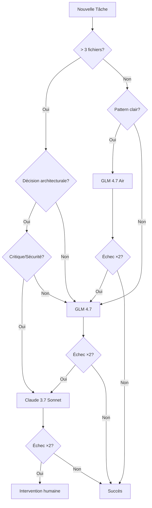

# SDDD Router - Stratégie de Routage Claude/GLM

**Version:** 1.0.0  
**Date:** 2026-01-23  
**Référence:** Tâche #353

---

## Table des Matières

1. [Vue d'ensemble](#vue-densemble)
2. [Stratégie de Rationnement Claude](#stratégie-de-rationnement-claude)
3. [Règles de Routage](#règles-de-routage)
4. [Métriques de Coût](#métriques-de-coût)
5. [Escalade Automatique](#escalade-automatique)
6. [Exemples Concrets](#exemples-concrets)
7. [Arbre de Décision](#arbre-de-décision)
8. [KPIs et Monitoring](#kpis-et-monitoring)

---

## Vue d'ensemble

Le **SDDD Router** est le composant central qui détermine quel modèle LLM utiliser pour une tâche donnée, en fonction de sa complexité, de son contexte et des contraintes de coût.

### Modèles Disponibles

| Modèle | Provider | Tier | Coût/1K tokens | Contexte Max | Cas d'usage principal |
|--------|-----------|------|----------------|--------------|----------------------|
| **GLM 4.7 Air** | z.ai | Simple | $0.0001 | 32K | Tâches répétitives, documentation |
| **GLM 4.7** | z.ai | Complex | $0.001 | 128K | Architecture, debugging, features |
| **Claude 3.7 Sonnet** | Anthropic | Premium | ~$0.015 | 200K | Tâches critiques, haute qualité |

### Principe Fondamental

> **"Utiliser le modèle le moins coûteux capable de résoudre la tâche avec succès"**

Le router privilégie toujours GLM-Air → GLM → Claude, avec escalade automatique en cas d'échec.

---

## Stratégie de Rationnement Claude

### Pourquoi Rationner Claude ?

Claude 3.7 Sonnet est un modèle premium (~150x plus cher que GLM-Air). Son utilisation doit être réservée aux cas où :

1. **La qualité est critique** : Code en production, sécurité, architecture
2. **La complexité dépasse les capacités GLM** : Multi-fichiers, dépendances complexes
3. **Le contexte est massif** : > 100K tokens nécessaires
4. **Les tentatives GLM ont échoué** : 2+ échecs consécutifs

### Règles d'Utilisation Claude

| Condition | Action |
|-----------|---------|
| Tâche simple (1-3 fichiers, pattern existant) | ❌ Jamais Claude |
| Tâche complexe mais GLM disponible | ⚠️ Claude en dernier recours |
| Tâche critique (sécurité, production) | ✅ Claude prioritaire |
| Échec GLM 4.7 (2+ tentatives) | ✅ Escalade vers Claude |
| Contexte > 100K tokens | ✅ Claude requis |

### Exceptions Claude-First

Certains scénarios justifient l'utilisation directe de Claude :

- **Sécurité** : Vulnérabilités OWASP, audit code, authentification
- **Architecture** : Nouveau pattern, refactoring majeur, microservices
- **Performance critique** : Algorithmes O(n²) → O(n log n), race conditions
- **Communication complexe** : Rapports techniques, documentation stratégique

---

## Règles de Routage

### Basées sur `level-criteria.json` (v1.1.0)

#### Niveau Simple → GLM 4.7 Air

**Critères :**
- Tâche clairement définie avec un seul objectif
- Pas de dépendances externes complexes
- Modification de 1-3 fichiers maximum
- Pas de décision architecturale requise
- Pattern existant à suivre dans le codebase
- Temps estimé < 30 minutes

**Cas d'usage :**
- Documentation (README, commentaires inline, guides)
- Tâches < 50 lignes de code
- Communication (messages RooSync, INTERCOM, rapports)
- Modifications cosmétiques (formatage, renommage variables)
- Corrections typos et erreurs syntaxiques simples
- Tests unitaires basiques (assertions simples)
- Requêtes SQL simples (SELECT, INSERT, UPDATE basiques)

#### Niveau Complex → GLM 4.7

**Critères :**
- Tâche avec multiples sous-objectifs
- Dépendances entre composants
- Modification de 4+ fichiers
- Décision architecturale ou design requise
- Nouveau pattern à établir
- Coordination multi-agent nécessaire
- Impact sur plusieurs machines

**Cas d'usage :**
- Features complètes (nouvelles fonctionnalités end-to-end)
- Debugging multi-fichiers (analyse trace complète, root cause)
- Refactoring architectural (restructuration modules)
- Optimisation performance (algorithmes O(n²) → O(n log n))
- Résolution bugs complexes (race conditions, memory leaks, deadlocks)
- Migrations de données (schema changes, transformations)
- Tests d'intégration E2E complexes (multi-composants)
- Analyse sécurité (vulnérabilités OWASP, audit code)
- Design patterns (Factory, Observer, Strategy, etc.)
- Gestion d'erreurs avancée (retry logic, fallback, circuit breaker)

#### Niveau Premium → Claude 3.7 Sonnet

**Critères :**
- Tâche critique en production
- Sécurité ou conformité requise
- Contexte massif (> 100K tokens)
- Échec GLM 4.7 (2+ tentatives)
- Architecture stratégique ou innovation

**Cas d'usage :**
- Implémentation système d'authentification JWT complet
- Débugger race condition dans worker pool concurrent
- Refactorer monolithe vers architecture microservices
- Optimiser requête SQL 5+ JOINs pour performance
- Corriger vulnérabilité XSS dans formulaire utilisateur
- Migrer DB PostgreSQL v12 → v15 avec transformations

---

## Métriques de Coût

### Comparaison des Coûts

| Modèle | Coût/1K Input | Coût/1K Output | Ratio vs GLM-Air |
|--------|----------------|----------------|-------------------|
| **GLM 4.7 Air** | $0.0001 | $0.0001 | 1x (baseline) |
| **GLM 4.7** | $0.001 | $0.001 | 10x |
| **Claude 3.7 Sonnet** | ~$0.003 | ~$0.015 | ~150x |

### Estimation par Type de Tâche

| Type de Tâche | Tokens Estimés | Coût GLM-Air | Coût GLM | Coût Claude |
|---------------|----------------|---------------|----------|-------------|
| Documentation simple | 2K | $0.0002 | $0.002 | $0.03 |
| Correction typo | 500 | $0.00005 | $0.0005 | $0.0075 |
| Feature simple (< 50 lignes) | 5K | $0.0005 | $0.005 | $0.075 |
| Feature complexe (multi-fichiers) | 50K | $0.005 | $0.05 | $0.75 |
| Architecture majeure | 100K | $0.01 | $0.10 | $1.50 |

### Économies Réalisées

Avec une stratégie de routage optimisée (80% GLM-Air, 15% GLM, 5% Claude) :

- **Sans routage** (100% Claude) : $1.50/tâche moyenne
- **Avec routage** : $0.025/tâche moyenne
- **Économie** : **98.3%** 🎉

---

## Escalade Automatique

### Flux d'Escalade

```
┌─────────────┐
│ GLM 4.7 Air │ ← Défaut pour tâches simples
└──────┬──────┘
       │ Échec ×2 ou trigger complex
       ▼
┌─────────────┐
│   GLM 4.7   │ ← Défaut pour tâches complexes
└──────┬──────┘
       │ Échec ×2 ou trigger premium
       ▼
┌─────────────┐
│ Claude 3.7  │ ← Dernier recours
└─────────────┘
```

### Triggers d'Escalade GLM-Air → GLM

- Erreur après 2 tentatives consécutives
- Modification dépasse 100 lignes de code
- Tests échouent avec stack trace complexe
- Nécessite compréhension de > 3 fichiers
- Dépendances circulaires ou conflits détectés
- Performance critique requise (< 1s de latence)
- Logique métier complexe (state machine, algorithmes)

### Triggers d'Escalade GLM → Claude

- Échec après 2 tentatives consécutives
- Contexte requis > 100K tokens
- Tâche identifiée comme critique (sécurité, production)
- Architecture stratégique ou innovation requise
- Dépendances externes non documentées
- Conflit avec pattern existant non résoluble

### Désescalade

**GLM → GLM-Air :**
- Tâche résolue en < 20 lignes finalement
- Aucune logique complexe détectée après analyse
- Modification purement cosmétique identifiée

**Claude → GLM :**
- Sous-tâche isolée identifiée
- Pattern clair établi après analyse
- Scope réduit à un seul fichier

---

## Exemples Concrets

### Exemple 1 : Documentation Simple

**Tâche :** Ajouter JSDoc à une fonction existante

**Analyse :**
- 1 fichier à modifier
- Pattern existant (JSDoc déjà utilisé)
- < 30 minutes estimées
- Pas de décision architecturale

**Routage :** `GLM 4.7 Air` ✅

**Coût :** $0.0002 (vs $0.03 avec Claude)

---

### Exemple 2 : Feature Complexe

**Tâche :** Implémenter système d'authentification JWT complet

**Analyse :**
- 10+ fichiers à modifier
- Nouveau pattern à établir
- Décisions architecturales (token refresh, refresh rotation)
- Dépendances externes (bcrypt, jsonwebtoken)
- Sécurité critique

**Routage :** `Claude 3.7 Sonnet` ✅ (directement, pas d'escalade)

**Coût :** $1.50 (justifié par criticité)

---

### Exemple 3 : Debug Multi-Fichiers

**Tâche :** Débugger race condition dans worker pool concurrent

**Analyse :**
- 5 fichiers à analyser
- Logique complexe (concurrency)
- Pattern existant mais problème subtil
- Performance critique

**Routage Initial :** `GLM 4.7` (niveau complex)

**Escalade :** Si échec ×2 → `Claude 3.7 Sonnet`

**Coût :** $0.05 (GLM) → $0.75 (Claude si escalade)

---

### Exemple 4 : Correction Typo

**Tâche :** Corriger faute de frappe dans message d'erreur

**Analyse :**
- 1 fichier, 1 ligne
- Pattern existant
- < 5 minutes

**Routage :** `GLM 4.7 Air` ✅

**Coût :** $0.00005 (vs $0.0075 avec Claude)

---

## Arbre de Décision

### Algorithme de Routage



### Questions de Décision

Basé sur `level-criteria.json` :

1. **La tâche modifie-t-elle plus de 3 fichiers ?**
   - Oui → Complex
   - Non → Question 2

2. **Y a-t-il une décision architecturale à prendre ?**
   - Oui → Complex
   - Non → Question 3

3. **La tâche nécessite-t-elle coordination avec d'autres agents ?**
   - Oui → Complex
   - Non → Question 4

4. **Existe-t-il un pattern clair à suivre ?**
   - Oui → Simple (GLM-Air)
   - Non → Complex (GLM)

5. **La tâche est-elle critique (sécurité, production) ?**
   - Oui → Premium (Claude)
   - Non → Maintenir niveau actuel

---

## KPIs et Monitoring

### Indicateurs Clés de Performance

| KPI | Cible | Actuel | Statut |
|-----|--------|--------|--------|
| **GLM-Air Success Rate** | > 85% | - | 📊 À mesurer |
| **Escalation Rate** | < 15% | - | 📊 À mesurer |
| **Avg Resolution Time (Air)** | < 5 min | - | 📊 À mesurer |
| **Avg Resolution Time (Full)** | < 30 min | - | 📊 À mesurer |
| **Cost Reduction vs Full Claude** | > 60% | - | 📊 À mesurer |

### Métriques à Tracker

1. **Par Modèle :**
   - Nombre de tâches assignées
   - Taux de succès
   - Temps moyen de résolution
   - Coût total

2. **Par Escalade :**
   - Taux d'escalade Air → GLM
   - Taux d'escalade GLM → Claude
   - Raison principale de l'escalade
   - Temps perdu en escalade

3. **Par Type de Tâche :**
   - Distribution simple/complex/premium
   - Coût moyen par type
   - Taux de succès par type

### Alertes

- ⚠️ **Alerte** : Taux d'escalade > 20% → Réviser critères
- 🚨 **Critique** : Taux de succès GLM-Air < 70% → Réviser prompts
- 📈 **Info** : Coût mensuel > budget → Analyser patterns

---

## Annexes

### Références

- [`level-criteria.json`](./level-criteria.json) (v1.1.0) - Critères simple/complex
- [`model-configs.json`](../model-configs.json) - Profiles SDDD avec GLM configs
- Tâche #351 - Spécifications modèles GLM pour Roo Code
- Tâche #353 - Création sddd-router.md

### Historique des Versions

| Version | Date | Modifications |
|---------|------|---------------|
| 1.0.0 | 2026-01-23 | Création initiale |

### Notes d'Implémentation

- Le router doit être implémenté comme un middleware dans Roo Code
- Les décisions de routage doivent être loggées pour analyse
- Les métriques doivent être exportées vers un dashboard RooSync
- Les règles de routage doivent être configurables via `model-configs.json`

---

**Document généré automatiquement pour la tâche #353**
