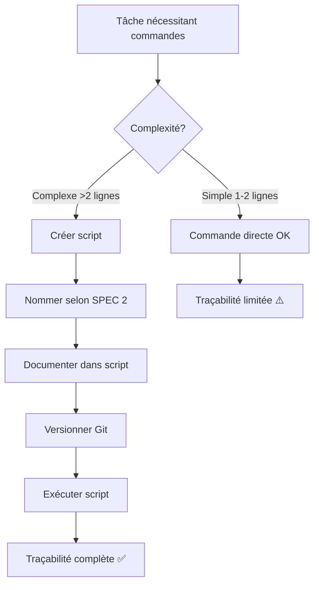

# ⚙️ Best Practices Opérationnelles - Modes Roo

**Version :** 1.0.0  
**Date :** 2 Octobre 2025  
**Architecture :** 2-Niveaux (Simple/Complex)  
**Statut :** ✅ Spécifications consolidées Mission 2.3  
**Mécanisme :** Document évolutif pour ajouts rapides de nouvelles best practices

---

## 🎯 Objectif du Document

Ce document centralise les **best practices opérationnelles critiques** pour garantir l'efficacité, la traçabilité et la maintenabilité du travail effectué par les modes Roo. Contrairement aux autres spécifications qui définissent des protocoles ou patterns, ce document fournit des **règles opérationnelles concrètes** à appliquer systématiquement.

### Principes Directeurs

1. **Workflow Non-Bloquant** : Éviter ralentissements par approbations utilisateur
2. **Traçabilité Complète** : Documenter toutes les actions pour audit et reprise
3. **Découvrabilité Maximale** : Organisation facilitant recherche et navigation
4. **Évolutivité** : Mécanisme d'ajout rapide de nouvelles pratiques

### Relation avec SDDD

Ces best practices **complètent** le protocole SDDD en établissant des règles opérationnelles qui :
- Facilitent l'**accessibilité du suivi** (SDDD Phase 2 : Documentation Continue)
- Renforcent la **découvrabilité sémantique** (SDDD Phase 1 : Grounding Initial)
- Garantissent la **traçabilité des actions** (SDDD Phase 3 : Validation Finale)

> **📖 Référence SDDD** : Voir [`sddd-protocol-4-niveaux.md`](sddd-protocol-4-niveaux.md) pour le protocole complet de grounding et documentation.

---

## 📋 Table des Matières

1. [SPEC 1 : Priorité Scripts vs Commandes Complexes](#spec-1--priorité-scripts-vs-commandes-complexes)
2. [SPEC 2 : Nomenclature et Organisation Strictes](#spec-2--nomenclature-et-organisation-strictes)
3. [Mécanisme d'Évolution du Document](#mécanisme-dévolution-du-document)

---

## SPEC 1 : Priorité Scripts vs Commandes Complexes

### 🎯 Principe Fondamental

**Les agents doivent MAJORITAIREMENT utiliser des scripts plutôt que des commandes complexes.**

### 📊 Justifications Critiques

#### 1. Workflow Non-Bloquant (PRIORITÉ 1)

**Problème** : Les commandes complexes nécessitent généralement l'approbation utilisateur, ce qui :
- ⏱️ Ralentit considérablement l'exécution des tâches
- 🔄 Alourdit l'orchestration (attente réponses utilisateur)
- 🚫 Bloque progression pendant approbations

**Solution** : Les scripts sont généralement **non-bloquants** :
- ✅ Exécution automatique sans approbation (selon configuration)
- ✅ Workflow fluide et continu
- ✅ Orchestration efficace sans interruptions

#### 2. Capacités Élargies (PRIORITÉ 2)

Scripts offrent des possibilités **bien supérieures** aux commandes CLI limitées :

| Capacité | Commande CLI | Script |
|----------|--------------|--------|
| Logique conditionnelle | ❌ Limitée | ✅ Complète |
| Boucles et itérations | ❌ Basique | ✅ Avancée |
| Gestion erreurs | ❌ Minimale | ✅ Robuste |
| Manipulation données | ❌ Restreinte | ✅ Puissante |
| Modularité | ❌ Aucune | ✅ Fonctions/Modules |
| Langages disponibles | Bash/PowerShell | Bash, Python, Node.js, .NET, etc. |

#### 3. Documentation et Traçabilité (PRIORITÉ 1 - CRITIQUE)

**Le plus important** : Les scripts permettent de **documenter et garder une trace** de tout ce qui a été effectué.

**Avantages Traçabilité** :
- 📝 **Fichier permanent** : Le script reste disponible pour audit
- 🔍 **Code lisible** : Compréhension rapide des actions effectuées
- 🗓️ **Historique versionné** : Git tracking automatique
- 🔄 **Reproductibilité** : Ré-exécution identique possible
- 🐛 **Débogage facilité** : Logs structurés et traçables
- 👥 **Partage équipe** : Documentation exécutable partageable

**Problème Commandes Complexes** :
- ❌ Trace volatile (uniquement historique terminal)
- ❌ Difficile à documenter après coup
- ❌ Contexte perdu si session fermée
- ❌ Maintenance et audit complexes

### 📁 Implications Pratiques

#### Préférer Création Script

**❌ MAUVAIS EXEMPLE** : Commande multi-lignes complexe
```bash
# Commande complexe difficile à tracer
find . -name "*.ts" -type f | xargs grep -l "export" | while read file; do sed -i 's/export /export default /g' "$file"; done
```

**✅ BON EXEMPLE** : Script documenté et traçable
```bash
# scripts/refactor/2025-10-02-add-default-exports.sh

#!/bin/bash
# Script: Ajoute 'default' aux exports TypeScript
# Date: 2025-10-02
# Auteur: Roo Code Mode
# Objectif: Standardiser exports pour refactoring architecture

echo "Début refactoring exports..."

# Recherche fichiers TypeScript avec exports
files=$(find . -name "*.ts" -type f | xargs grep -l "^export ")

# Compteur pour suivi
count=0

# Application modifications
for file in $files; do
    echo "Modification: $file"
    sed -i 's/^export /export default /g' "$file"
    ((count++))
done

echo "Refactoring terminé: $count fichiers modifiés"
```

#### Scripts Versionnés et Horodatés

Tous les scripts doivent suivre la nomenclature stricte (voir SPEC 2) :
- **Format** : `YYYY-MM-DD-[description]-[type].[ext]`
- **Exemple** : `2025-10-02-validate-modes-config.ps1`
- **Emplacement** : `scripts/[catégorie]/[nom-script]`

#### Intégration SDDD

Les scripts constituent une **documentation exécutable** qui :
1. **Phase 1 (Grounding)** : Scripts existants = contexte immédiat des actions passées
2. **Phase 2 (Documentation)** : Création scripts = documentation automatique des actions
3. **Phase 3 (Validation)** : Scripts = validation reproductibilité et correctness

### 🚀 Workflow Recommandé



### 📝 Anti-Patterns à Éviter

#### ❌ Anti-Pattern 1 : Chaîne Commandes Sans Script

```bash
# Commande complexe perdue après exécution
cd src && find . -name "*.json" | xargs jq '.version = "2.0.0"' > temp && mv temp original
```

**Problème** : Aucune trace permanente, impossible à auditer ou reproduire.

#### ❌ Anti-Pattern 2 : Script Sans Documentation

```bash
#!/bin/bash
# update.sh
find . -name "*.ts" | xargs sed -i 's/old/new/g'
```

**Problème** : Pas de contexte (pourquoi, quand, par qui, pour quoi).

#### ✅ Pattern Correct : Script Documenté

```bash
#!/bin/bash
# scripts/refactor/2025-10-02-update-imports.sh
#
# Description: Mise à jour imports suite refactoring architecture
# Auteur: Roo Code Mode
# Date: 2025-10-02
# Tâche: Mission 2.3 - Intégration Specs Opérationnelles
# Objectif: Remplacer anciens chemins imports par nouveaux
#
# AVANT: import { x } from './old/path'
# APRÈS: import { x } from './new/path'

set -e  # Arrêt si erreur

echo "=== Mise à jour imports ==="
echo "Date: $(date)"

# Compteurs pour rapport
total=0
updated=0

# Recherche fichiers TypeScript
for file in $(find src -name "*.ts"); do
    ((total++))
    
    # Vérification présence ancien pattern
    if grep -q "./old/path" "$file"; then
        echo "Modification: $file"
        sed -i "s|'./old/path'|'./new/path'|g" "$file"
        ((updated++))
    fi
done

echo "=== Rapport ==="
echo "Fichiers analysés: $total"
echo "Fichiers modifiés: $updated"
echo "Terminé avec succès ✅"
```

### 🔧 Outils et MCPs Recommandés

#### Win-CLI MCP (Privilégié)

Pour exécution scripts système via MCP :

```xml
<use_mcp_tool>
<server_name>win-cli</server_name>
<tool_name>run_command</tool_name>
<arguments>
{
  "command": "powershell -ExecutionPolicy Bypass -File scripts/deploy/deploy-modes.ps1",
  "shell": "powershell",
  "working_directory": "c:/dev/roo-extensions"
}
</arguments>
</use_mcp_tool>
```

#### Execute Command (Fallback)

Pour scripts interactifs ou long-running :

```xml
<execute_command>
<command>bash scripts/build/watch-and-rebuild.sh</command>
</execute_command>
```

---

## SPEC 2 : Nomenclature et Organisation Strictes

### 🎯 Principe Fondamental

**Utilisation SYSTÉMATIQUE de bons répertoires et noms de fichiers pour maximiser découvrabilité et maintenabilité.**

### 📂 Règles Fichiers Permanents

Les fichiers permanents (code source, configurations, ressources) doivent :

#### 1. Arborescence Logique par Nature/Fonction

**Structure organisée par rôle** :

```
projet/
├── src/                    # Code source (nature)
│   ├── core/              # Fonctionnalité fondamentale
│   ├── utils/             # Utilitaires
│   └── api/               # Interface API
├── config/                # Configurations (nature)
│   ├── production/        # Config production
│   └── development/       # Config développement
├── docs/                  # Documentation (nature)
│   ├── architecture/      # Architecture
│   └── guides/            # Guides utilisateur
└── tests/                 # Tests (nature)
    ├── unit/              # Tests unitaires
    └── integration/       # Tests intégration
```

#### 2. Structure Logique et Prévisible

**Principe** : L'emplacement d'un fichier doit être **intuitivement déductible** de sa fonction.

**✅ BON EXEMPLE** :
```
roo-extensions/
├── roo-config/           # Configuration et Modes Roo
│   ├── modes/            # Configurations modes (N2, N5)
│   ├── specifications/   # Spécifications
│   └── reports/          # Rapports
└── mcps/                 # Serveurs MCP
    ├── internal/         # MCPs internes
    └── external/         # MCPs externes
```

**❌ MAUVAIS EXEMPLE** :
```
projet/
├── stuff/                # ❌ Vague
├── misc/                 # ❌ Fourre-tout
├── temp/                 # ❌ Mélange permanent/temporaire
└── old/                  # ❌ Non archivé proprement
```

#### 3. Pas de Fichiers à la Racine Workspace

**Règle d'Or** : La racine du workspace ne doit contenir que :
- 📁 Répertoires organisés
- 📄 Fichiers configuration essentiels (`README.md`, `.gitignore`, `package.json`, etc.)

**❌ Anti-Pattern** : Fichiers de travail à la racine
```
roo-extensions/
├── test.js              # ❌ Script temporaire à la racine
├── output.log           # ❌ Log à la racine
├── backup-20251002.zip  # ❌ Backup à la racine
└── validation.ps1       # ❌ Script à la racine
```

**✅ Pattern Correct** : Organisation hiérarchique
```
roo-extensions/
├── scripts/
│   └── validation/
│       └── 2025-10-02-validate-modes.ps1
├── tests/
│   └── integration/
│       └── 2025-10-02-test-escalade.js
└── logs/
    └── 2025-10-02-deployment.log
```

### 📋 Règles Fichiers Suivi/Travail

Les fichiers de suivi, rapports, scripts temporaires (.md, .ps1, .sh, etc.) nécessitent une **discipline stricte**.

#### 1. Sous-Répertoires Distincts

**Principe** : Séparer clairement du code permanent pour éviter pollution.

**Structure Type** :
```
projet/
├── src/                   # Code permanent
├── config/                # Config permanente
├── docs/                  # Doc permanente
├── scripts/               # Scripts (suivi/temporaires)
│   ├── validation/       # Scripts validation
│   ├── deployment/       # Scripts déploiement
│   └── analysis/         # Scripts analyse
├── reports/               # Rapports (suivi)
│   ├── checkpoints/      # Checkpoints SDDD
│   └── missions/         # Rapports missions
└── logs/                  # Logs (temporaires)
    └── archived/         # Logs archivés
```

#### 2. Horodatage Systématique

**Format OBLIGATOIRE** : `YYYY-MM-DD-[description]-[type].[ext]`

**Exemples Corrects** :
```
✅ scripts/validation/2025-10-02-validate-modes-config.ps1
✅ reports/missions/2025-10-02-mission-2-3-integration-specs.md
✅ logs/2025-10-02-deployment-prod.log
✅ scripts/analysis/2025-10-02-analyze-task-complexity.js
```

**Rationale Horodatage** :
1. **Tri chronologique** : Automatique par nom fichier
2. **Contexte temporel** : Date immédiatement visible
3. **Recherche facilitée** : Pattern date reconnaissable
4. **Audit simplifié** : Timeline claire des actions
5. **Git friendly** : Évite conflits nommage

#### 3. Noms Précis et Descriptifs

**Règle** : Jamais de noms génériques sans contexte.

**❌ Anti-Patterns** :
```
❌ test.js                 # Quel test ?
❌ script.ps1             # Quel script ?
❌ rapport.md             # Quel rapport ?
❌ validation.sh          # Validation de quoi ?
❌ data.json              # Quelles données ?
❌ temp.txt               # Temporaire pour quoi ?
```

**✅ Noms Descriptifs** :
```
✅ 2025-10-02-test-escalade-mechanisms.js
✅ 2025-10-02-deploy-modes-production.ps1
✅ 2025-10-02-rapport-mission-2-3-integration.md
✅ 2025-10-02-validate-semantic-search-index.sh
✅ 2025-10-02-task-complexity-metrics.json
✅ 2025-10-02-checkpoint-50k-grounding.txt
```

### 📊 Exemples Complets

#### ✅ Exemple Correct : Organisation Exemplaire

```
roo-config/
├── specifications/                              # Specs permanentes
│   ├── sddd-protocol-4-niveaux.md
│   ├── context-economy-patterns.md
│   ├── operational-best-practices.md
│   └── reports/                                # Rapports suivi
│       ├── 2025-10-02-validation-finale.md
│       └── 2025-10-02-feedbacks-revision.md
├── modes/                                      # Configurations modes
│   ├── standard-modes.json
│   └── templates/
│       └── commons/
└── scheduler/                                  # Configuration scheduler
    ├── settings.json
    └── metrics/
        └── 2025-10-02-daily-metrics.json
```

**Avantages** :
- ✅ Hiérarchie claire (permanent vs suivi)
- ✅ Horodatage systématique (rapports/metrics)
- ✅ Noms descriptifs et contextualisés
- ✅ Structure prévisible et navigable

#### ❌ Exemple Incorrect : Organisation Chaotique

```
roo-config/
├── Specs_nouvelle_architecture.md            # ❌ Racine + nom vague
├── validation.ps1                            # ❌ Racine + sans date
├── rapport.md                                # ❌ Nom générique
├── temp/                                     # ❌ Fourre-tout
│   ├── test.json
│   ├── output.txt
│   └── old_stuff/
├── specifications/
│   ├── doc1.md                              # ❌ Nom non descriptif
│   └── test_specs.md                        # ❌ Sans horodatage
└── backup/                                   # ❌ Mélange versions
    ├── modes.json.old
    └── modes.json.backup
```

**Problèmes** :
- ❌ Fichiers racine polluent workspace
- ❌ Noms génériques sans contexte
- ❌ Pas d'horodatage → impossible tri chronologique
- ❌ Structure imprévisible → découvrabilité faible

### 🔍 Intégration SDDD et Découvrabilité

La nomenclature stricte **facilite directement** le protocole SDDD :

#### 1. Phase 1 : Grounding Sémantique

**Recherche par date** :
```xml
<codebase_search>
<query>rapport mission 2025-10-02 intégration spécifications</query>
</codebase_search>
```

**Résultat** : Fichier `2025-10-02-rapport-mission-2-3-integration.md` immédiatement identifiable.

#### 2. Phase 2 : Documentation Continue

**Création checkpoint** :
```bash
# Nomenclature systématique automatique
checkpoint_file="roo-config/reports/checkpoints/$(date +%Y-%m-%d)-checkpoint-50k-task-${TASK_ID}.md"
echo "## Checkpoint 50k Tokens" > "$checkpoint_file"
```

**Avantage** : Tous les checkpoints triés chronologiquement automatiquement.

#### 3. Phase 3 : Validation Finale

**Liste rapports mission** :
```bash
# Recherche facilitée par pattern nommage
ls -la roo-config/reports/missions/2025-10-*
```

**Résultat** : Tous rapports du mois immédiatement listés et triés.

### 📝 Checklist Nomenclature

Avant de créer/modifier un fichier, vérifier :

- [ ] **Emplacement** : Fichier dans bon répertoire selon nature/fonction ?
- [ ] **Horodatage** : Format `YYYY-MM-DD-` si fichier suivi/temporaire ?
- [ ] **Nom descriptif** : Nom explicite sans ambiguïté ?
- [ ] **Pas à la racine** : Fichier dans sous-répertoire approprié ?
- [ ] **Cohérence** : Nomenclature cohérente avec fichiers similaires ?

### 🎯 Exemples par Catégorie

#### Scripts

```
✅ scripts/validation/2025-10-02-validate-modes-config.ps1
✅ scripts/deployment/2025-10-02-deploy-production.sh
✅ scripts/analysis/2025-10-02-analyze-semantic-index.js
```

#### Rapports

```
✅ roo-config/reports/missions/2025-10-02-mission-2-3-integration-specs.md
✅ roo-config/reports/checkpoints/2025-10-02-checkpoint-50k-grounding.md
✅ roo-config/reports/validation/2025-10-02-validation-finale-mission-2-1.md
```

#### Configurations

```
✅ config/environments/production.json
✅ config/environments/development.json
✅ config/scheduler/settings.json
```

#### Documentation

```
✅ docs/architecture/modes-architecture-3-niveaux.md
✅ docs/guides/deployment-guide.md
✅ docs/specifications/operational-best-practices.md
```

#### Logs

```
✅ logs/deployment/2025-10-02-deploy-production.log
✅ logs/validation/2025-10-02-validate-semantic-search.log
✅ logs/archived/2025-09-30-deployment-staging.log
```

---

## 🔄 Mécanisme d'Évolution du Document

Ce document est conçu pour **évoluer rapidement** en intégrant de nouvelles best practices au fil des découvertes.

### 🚀 Processus d'Ajout Rapide

#### Étape 1 : Identification Nouvelle Best Practice

Lorsqu'une nouvelle pratique critique est identifiée :
1. **Valider criticité** : Impact significatif sur efficacité/qualité
2. **Documenter justification** : Pourquoi cette pratique est importante
3. **Préparer exemples** : Cas positifs et anti-patterns

#### Étape 2 : Intégration Document

**Format Standard pour Nouvelle SPEC** :

```markdown
## SPEC X : [Titre Pratique]

### 🎯 Principe Fondamental

[Énoncé clair de la règle]

### 📊 Justifications Critiques

#### 1. [Raison Principale]

[Explication détaillée]

#### 2. [Raison Secondaire]

[Explication détaillée]

### 📁 Implications Pratiques

#### [Aspect 1]

**❌ MAUVAIS EXEMPLE** :
```
[Code/Exemple incorrect]
```

**✅ BON EXEMPLE** :
```
[Code/Exemple correct]
```

### 📝 Anti-Patterns à Éviter

#### ❌ Anti-Pattern 1 : [Nom]

[Description et exemple]

#### ✅ Pattern Correct : [Nom]

[Description et exemple]

### 🔍 Intégration SDDD

[Lien avec protocole SDDD si applicable]
```

#### Étape 3 : Mise à Jour Références

1. **Table des matières** : Ajouter nouvelle SPEC
2. **README.md** : Mettre à jour description document
3. **Liens croisés** : Ajouter références dans autres specs si pertinent
4. **Version** : Incrémenter version (1.0.0 → 1.1.0 pour nouvelle SPEC)

#### Étape 4 : Validation Sémantique

```xml
<codebase_search>
<query>[mots-clés nouvelle best practice] découvrabilité validation</query>
</codebase_search>
```

Vérifier que la nouvelle SPEC est découvrable via recherche sémantique.

### 📋 Template Ajout Rapide

Pour faciliter ajouts futurs, utiliser ce template :

```markdown
---

## SPEC [N] : [Titre Best Practice]

**Ajouté** : [Date YYYY-MM-DD]  
**Auteur** : [Mode Roo]  
**Priorité** : 🔴 CRITIQUE / 🟡 IMPORTANTE / 🟢 RECOMMANDÉE

### 🎯 Principe Fondamental

[Description concise de la règle]

### 📊 Justifications

1. **[Raison 1]** : [Explication]
2. **[Raison 2]** : [Explication]
3. **[Raison 3]** : [Explication]

### 📁 Exemples

#### ❌ Anti-Pattern
```
[Exemple incorrect]
```

#### ✅ Pattern Correct
```
[Exemple correct]
```

### 🔍 Relation SDDD

[Lien avec protocole SDDD si applicable]

---
```

### 🎯 Critères Inclusion Nouvelle SPEC

Une nouvelle best practice doit satisfaire **au moins 2 des 3 critères** :

1. **Impact Workflow** : Améliore significativement fluidité/efficacité travail
2. **Impact Qualité** : Réduit erreurs ou améliore qualité livrables
3. **Impact Traçabilité** : Facilite audit, reprise, ou collaboration

### 📊 Versioning

- **Version MAJEURE** (X.0.0) : Révision fondamentale ou restructuration
- **Version MINEURE** (1.X.0) : Ajout nouvelle SPEC
- **Version PATCH** (1.0.X) : Clarifications ou corrections mineures

**Historique Versions** :
- `1.0.0` (2025-10-02) : Création document avec SPEC 1 et SPEC 2

---

## 📚 Ressources Complémentaires

### Documents Connexes

- [`sddd-protocol-4-niveaux.md`](sddd-protocol-4-niveaux.md) : Protocole SDDD complet
- [`context-economy-patterns.md`](context-economy-patterns.md) : Patterns économie contexte
- [`hierarchie-numerotee-subtasks.md`](hierarchie-numerotee-subtasks.md) : Système hiérarchie tâches
- [`mcp-integrations-priority.md`](mcp-integrations-priority.md) : Guide MCPs prioritaires

### Guides Pratiques

- [Guide Création Scripts](../../docs/guides/script-creation-guide.md) (à créer si nécessaire)
- [Guide Organisation Fichiers](../../docs/guides/file-organization-guide.md) (à créer si nécessaire)

---

## 🎓 Formation et Adoption

### Checklist Adoption

Pour garantir adoption effective de ces best practices :

- [ ] **Formation initiale** : Lecture complète document par tous modes
- [ ] **Recherche sémantique** : Test découvrabilité specs via `codebase_search`
- [ ] **Application pratique** : Appliquer sur 3-5 tâches réelles
- [ ] **Revue pairs** : Vérification respect règles par autres modes
- [ ] **Feedback continu** : Proposer améliorations si besoin

### Responsabilités par Mode

#### Tous Modes

- ✅ Respecter SPEC 1 (Scripts vs Commandes)
- ✅ Respecter SPEC 2 (Nomenclature)
- ✅ Proposer nouvelles best practices si identifiées

#### Modes Complex et Orchestrators

- ✅ Vérifier respect best practices dans sous-tâches créées
- ✅ Instruire sous-tâches avec références explicites à ce document
- ✅ Valider qualité nomenclature dans rapports finaux

#### Mode Architect

- ✅ Évaluer nouvelles best practices proposées
- ✅ Intégrer nouvelles SPECs selon processus défini
- ✅ Maintenir cohérence avec autres spécifications

---

## 📞 Contact et Contribution

### Proposer Nouvelle Best Practice

Pour proposer une nouvelle SPEC :

1. **Issue GitHub** : Créer issue avec template `best-practice-proposal`
2. **Description** : Principe, justifications, exemples
3. **Validation** : Équipe évalue criticité et pertinence
4. **Intégration** : Si validée, ajout document selon processus

### Feedback et Améliorations

Pour suggérer améliorations aux SPECs existantes :

1. **Discussion** : GitHub Discussions avec tag `best-practices`
2. **Pull Request** : Proposer modifications avec justification
3. **Validation** : Revue et merge si approuvée

---

**Version** : 1.0.0  
**Dernière Mise à Jour** : 2 Octobre 2025  
**Auteur** : Roo Architect Mode  
**Statut** : ✅ Spécifications opérationnelles validées Mission 2.3

---

## 📖 Notes Finales

### Relation avec Architecture 3-Niveaux

Ce document s'intègre dans l'**architecture 3-niveaux** des spécifications :

```
┌─────────────────────────────────────────────────────────────┐
│ NIVEAU 1 : INSTRUCTIONS GLOBALES                           │
│ • Protocole SDDD                                           │
│ • Mécaniques escalade                                      │
│ • Best Practices Opérationnelles ← CE DOCUMENT            │
│ • Patterns économie contexte                               │
└─────────────────────────────────────────────────────────────┘
                          ↓
┌─────────────────────────────────────────────────────────────┐
│ NIVEAU 2 : INSTRUCTIONS FAMILLE                            │
│ • Focus areas par famille                                  │
│ • Critères escalade spécifiques                           │
└─────────────────────────────────────────────────────────────┘
                          ↓
┌─────────────────────────────────────────────────────────────┐
│ NIVEAU 3 : INSTRUCTIONS MODE                               │
│ • Personnalisations mode-spécifiques                       │
│ • Exemples concrets                                        │
└─────────────────────────────────────────────────────────────┘
```

### Principe de Subsidiarité

Les best practices opérationnelles sont **transversales** et s'appliquent à **tous les modes**, contrairement aux patterns d'économie contexte qui peuvent varier selon la famille.

### Évolution Future

Ce document évoluera pour inclure :
- SPEC 3 : [À définir selon besoins identifiés]
- SPEC 4 : [À définir selon besoins identifiés]
- SPEC N : [Mécanisme ouvert pour futures découvertes]

**Engagement Réactivité** : Nouvelles SPECs critiques intégrées dans **<48h** après validation.