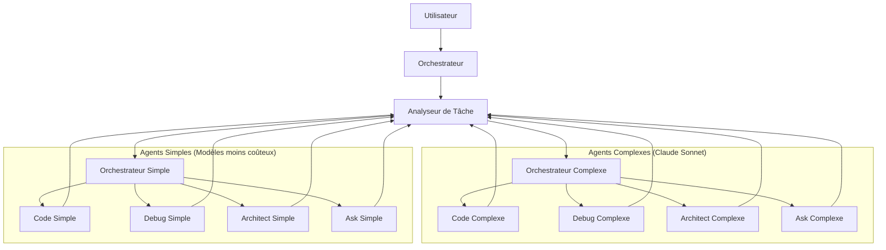

# Concept d'Architecture Optimisée des Agents Roo

## Schéma Conceptuel

## Composants Clés

### 1. Analyseur de Tâche

L'Analyseur de Tâche est un nouveau composant central qui évalue la complexité d'une tâche et détermine si elle doit être traitée par un agent simple ou complexe. Il prend en compte :

- La complexité linguistique de la demande
- Les mots-clés indiquant des tâches complexes
- L'historique des interactions précédentes
- Le contexte du projet
- Les besoins en ressources estimés

### 2. Agents Dédoublés

Chaque profil d'agent est dédoublé en deux versions :

- **Version Complexe** : Utilise Claude Sonnet pour les tâches nécessitant des capacités avancées
  - Raisonnement complexe
  - Compréhension de code sophistiqué
  - Génération de solutions créatives
  - Analyse approfondie

- **Version Simple** : Utilise des modèles moins coûteux pour les tâches basiques
  - Réponses à des questions simples
  - Modifications de code mineures
  - Tâches répétitives
  - Opérations bien définies

### 3. Mécanisme de Routage Intelligent

Le mécanisme de routage permet de :

- Rediriger dynamiquement les tâches vers l'agent approprié
- Escalader une tâche d'un agent simple vers un agent complexe si nécessaire
- Décomposer les tâches complexes en sous-tâches plus simples
- Optimiser l'utilisation des ressources en fonction de la charge de travail

## Critères de Décision Préliminaires

### Pour l'Agent Code

**Tâches simples** (modèle moins coûteux) :
- Modifications mineures de code (corrections de bugs simples, renommages)
- Génération de code à partir de modèles existants
- Formatage et nettoyage de code
- Tests unitaires simples

**Tâches complexes** (Claude Sonnet) :
- Conception d'architectures logicielles
- Refactoring majeur
- Optimisation de performances
- Implémentation d'algorithmes complexes

### Pour l'Agent Debug

**Tâches simples** :
- Erreurs de syntaxe
- Bugs évidents
- Problèmes de configuration simples
- Vérifications de base

**Tâches complexes** :
- Debugging de problèmes concurrents
- Analyse de performance
- Problèmes d'intégration complexes
- Bugs difficiles à reproduire

### Pour l'Agent Architect

**Tâches simples** :
- Documentation de base
- Diagrammes simples
- Plans pour des fonctionnalités isolées
- Révisions mineures d'architecture

**Tâches complexes** :
- Conception d'architecture système
- Planification de migrations complexes
- Optimisation d'architecture
- Conception de systèmes distribués

### Pour l'Agent Ask

**Tâches simples** :
- Questions factuelles
- Explications de concepts de base
- Recherche d'informations simples
- Résumés courts

**Tâches complexes** :
- Analyses approfondies
- Comparaisons détaillées
- Explications de concepts avancés
- Synthèse d'informations complexes

## Prochaines Étapes de Conception

1. Définir les métriques précises pour évaluer la complexité des tâches
2. Concevoir l'interface de l'Analyseur de Tâche
3. Développer les prompts optimisés pour chaque version d'agent
4. Créer un prototype de mécanisme de routage
5. Définir la stratégie de fallback en cas d'échec d'un agent simple