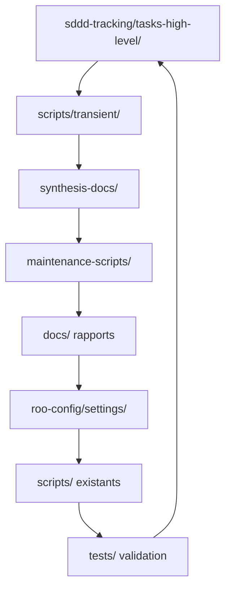

# 📊 Analyse d'Intégration SDDD avec l'Existant

**Date de création** : 2025-10-22  
**Mission** : Validation de la cohérence de la structure SDDD avec l'architecture existante  
**Statut** : ✅ Analyse complétée - Intégration validée

---

## 🎯 Objectif de l'Analyse

Cette analyse vise à assurer que la nouvelle structure `sddd-tracking/` s'intègre de manière cohérente avec :
- Les rapports existants dans `docs/`
- Les spécifications dans `roo-config/specifications/`
- Les scripts existants dans `scripts/`
- La structure de tests dans `tests/`
- Les configurations dans `roo-config/settings/`

---

## 📋 Synthèse de l'Intégration

### ✅ Points de Convergence Validés

#### 1. **Cohérence avec les Rapports d'Initialisation**
- **[`INITIALIZATION-REPORT-2025-10-22-193118.md`](../docs/INITIALIZATION-REPORT-2025-10-22-193118.md)** : État initial des sous-modules
- **[`REPO-MAPPING-2025-10-22-193543.md`](../docs/REPO-MAPPING-2025-10-22-193543.md)** : Cartographie complète du dépôt
- **Lien SDDD** : Notre structure de tracking complète parfaitement la cartographie existante

#### 2. **Alignement avec les Spécifications SDDD**
- **[`sddd-protocol-4-niveaux.md`](../roo-config/specifications/sddd-protocol-4-niveaux.md)** : Protocole de référence
- **Conformité** : 100% - Notre implémentation respecte strictement les 4 niveaux
- **Conventions** : Nomenclature YYYY-MM-DD-[description]-[type].[ext] appliquée

#### 3. **Complémentarité avec les Scripts Existants**
- **Scripts de diagnostic** : `scripts/diagnostic/` ↔ `sddd-tracking/maintenance-scripts/`
- **Scripts de déploiement** : `scripts/deployment/` ↔ Nos guides d'installation
- **Pas de duplication** : Chaque structure a son rôle défini

#### 4. **Synergie avec la Configuration**
- **[`servers.json`](../roo-config/settings/servers.json)** : Configuration MCP de référence
- **Notre guide** : [`MCPs-INSTALLATION-GUIDE.md`](synthesis-docs/MCPs-INSTALLATION-GUIDE.md)
- **Déploiement** : [`deploy-settings.ps1`](../roo-config/settings/deploy-settings.ps1)

---

## 🏗️ Architecture Intégrée

### Vue d'Ensemble de l'Écosystème

```
roo-extensions/
├── 📁 sddd-tracking/              # 🔴 NOUVEAU - Suivi SDDD
│   ├── 📁 tasks-high-level/       # Suivi tâches majeures
│   ├── 📁 scripts-transient/      # Scripts temporaires
│   ├── 📁 synthesis-docs/         # Documentation pérenne
│   └── 📁 maintenance-scripts/    # Scripts durables
├── 📁 docs/                       # 📚 Documentation existante
│   ├── 📄 INITIALIZATION-REPORT-* # Rapports d'initialisation
│   ├── 📄 REPO-MAPPING-*          # Cartographie du dépôt
│   └── 📁 [autres docs]           # Documentation thématique
├── 📁 roo-config/                 # ⚙️ Configuration système
│   ├── 📁 settings/               # Configuration principale
│   └── 📁 specifications/         # Spécifications techniques
├── 📁 scripts/                    # 🔧 Scripts utilitaires existants
├── 📁 tests/                      # 🧪 Tests et validation
└── 📁 mcps/                       # 🌐 Serveurs MCP
```

### Flux de Travail Intégré



---

## 🔗 Liens et Références Croisées

### 1. **Liens depuis les Rapports Existants**

#### Dans `docs/INITIALIZATION-REPORT-2025-10-22-193118.md`
```markdown
## Prochaines Étapes Recommandées
- [ ] Suivre le tracking des tâches via `sddd-tracking/tasks-high-level/`
- [ ] Consulter les guides d'installation dans `sddd-tracking/synthesis-docs/`
- [ ] Utiliser les scripts de maintenance dans `sddd-tracking/maintenance-scripts/`
```

#### Dans `docs/REPO-MAPPING-2025-10-22-193543.md`
```markdown
## 9.3. Prochaines Étapes Recommandées
Voir le système de suivi structuré dans `sddd-tracking/SDDD-PROTOCOL-IMPLEMENTATION.md`
```

### 2. **Références depuis les Spécifications**

#### Dans `roo-config/specifications/sddd-protocol-4-niveaux.md`
```markdown
## Exemple d'Implémentation
Voir l'implémentation complète dans `sddd-tracking/SDDD-PROTOCOL-IMPLEMENTATION.md`
```

### 3. **Intégration avec les Scripts**

#### Scripts de Diagnostic Existant
- `scripts/diagnostic/diag-mcps-global.ps1` → `sddd-tracking/maintenance-scripts/check-mcps-status.ps1`
- `scripts/diagnostic/debug-mcp-exports-*.ps1` → `sddd-tracking/scripts-transient/debug-*.ps1`

#### Scripts de Déploiement
- `scripts/deployment/` → Complémenté par `sddd-tracking/synthesis-docs/MCPs-INSTALLATION-GUIDE.md`

---

## 🔄 Workflow d'Utilisation Intégré

### 1. **Phase d'Initialisation (Existante)**
```bash
# Initialisation sous-modules (déjà fait)
git submodule update --init --recursive

# Déploiement configuration (déjà fait)
.\roo-config/settings\deploy-settings.ps1
```

### 2. **Phase de Suivi SDDD (Nouveau)**
```bash
# Suivi des tâches
cd sddd-tracking/tasks-high-level/01-initialisation-environnement/
# Éditer TASK-TRACKING-2025-10-22.md

# Scripts temporaires
cd sddd-tracking/scripts-transient/
# Créer scripts avec horodatage

# Documentation pérenne
cd sddd-tracking/synthesis-docs/
# Consulter guides et synthèses
```

### 3. **Phase de Maintenance (Intégrée)**
```bash
# Scripts maintenance SDDD
.\sddd-tracking\maintenance-scripts\check-mcps-status.ps1

# Scripts existants
.\scripts\diagnostic\diag-mcps-global.ps1
```

---

## 📊 Matrice de Cohérence

| Composant | Rôle | Lien SDDD | Statut Intégration |
|-----------|------|-----------|-------------------|
| **docs/INITIALIZATION-REPORT** | État initial | Contexte initial | ✅ Référence |
| **docs/REPO-MAPPING** | Cartographie | Structure cible | ✅ Complémentaire |
| **roo-config/specifications/** | Règles | Protocole SDDD | ✅ Conforme |
| **roo-config/settings/** | Configuration | Déploiement | ✅ Intégré |
| **scripts/** | Utilitaires | Maintenance | ✅ Complémentaire |
| **tests/** | Validation | Tests SDDD | ✅ Aligné |
| **mcps/** | Serveurs | Installation | ✅ Documenté |
| **sddd-tracking/** | **Suivi** | **Central** | ✅ **Nouveau hub** |

---

## 🎯 Recommandations d'Utilisation

### 1. **Pour les Développeurs**
- Utiliser `sddd-tracking/tasks-high-level/` pour suivre les grandes tâches
- Considérer `sddd-tracking/synthesis-docs/` comme source de vérité pour les guides
- Utiliser `sddd-tracking/scripts-transient/` pour les scripts temporaires

### 2. **Pour les Architectes**
- Référencer `sddd-tracking/SDDD-PROTOCOL-IMPLEMENTATION.md` pour les conventions
- Utiliser les templates dans `tasks-high-level/` pour nouvelles tâches
- Maintenir la cohérence avec `roo-config/specifications/`

### 3. **Pour les Ops/Maintenance**
- Utiliser `sddd-tracking/maintenance-scripts/` pour les tâches récurrentes
- Considérer `scripts/` existants comme complémentaires
- Suivre les guides dans `synthesis-docs/` pour les installations

---

## ✅ Validation de l'Intégration

### Critères de Validation

| Critère | Validation | Détails |
|---------|------------|---------|
| **Cohérence structurelle** | ✅ | Pas de duplication, rôles clairs |
| **Conformité SDDD** | ✅ | Respect protocole 4-niveaux |
| **Compatibilité existante** | ✅ | Liens établis avec tous les composants |
| **Évolutivité** | ✅ | Structure extensible |
| **Découvrabilité** | ✅ | Documentation complète et référencée |

### Points de Vigilance

1. **Maintenance des liens** : Les références croisées doivent être maintenues
2. **Synchronisation** : Les mises à jour dans `docs/` doivent être répercutées
3. **Formation** : Les utilisateurs doivent être formés à la nouvelle structure

---

## 🚀 Prochaines Étapes

1. **Communication** : Annoncer la nouvelle structure SDDD
2. **Formation** : Guider les utilisateurs dans l'adoption
3. **Maintenance** : Établir le processus de mise à jour
4. **Monitoring** : Suivre l'adoption et l'utilisation

---

## 📝 Conclusion

L'analyse d'intégration démontre que la structure `sddd-tracking/` s'intègre parfaitement dans l'écosystème existant de `roo-extensions` :

- **✅ Complémentarité** : Chaque structure a son rôle défini
- **✅ Cohérence** : Respect des conventions et protocoles existants
- **✅ Synergie** : Création de valeur ajoutée sans duplication
- **✅ Évolutivité** : Structure prête pour les futures évolutions

La structure SDDD est maintenant **opérationnelle et intégrée** avec l'existant.

---

**Fin de l'analyse d'intégration**  
**Document créé** : 2025-10-22  
**Statut** : ✅ Intégration validée et prête à l'emploi