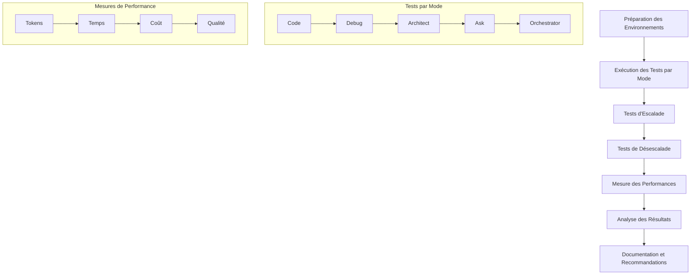

# Plan de Test Complet : Évaluation de l'Efficacité de la Configuration à Deux Niveaux

## 1. Introduction et Objectifs

Ce plan de test vise à évaluer de manière systématique et objective l'efficacité de la configuration à deux niveaux (modes simples et complexes) par rapport aux modes par défaut de Roo. Les objectifs spécifiques sont :

1. Mesurer les différences de performance entre les modes simples, complexes et par défaut
2. Évaluer l'efficacité des mécanismes d'escalade et de désescalade
3. Quantifier les économies de tokens réalisées grâce à la configuration à deux niveaux
4. Déterminer l'impact sur la qualité des résultats produits
5. Identifier les forces et faiblesses de chaque configuration

## 2. Méthodologie de Test

### 2.1 Approche Générale

La méthodologie de test repose sur une approche comparative structurée en trois phases :

1. **Phase de préparation** : Définition des scénarios de test, préparation des environnements et des jeux de données
2. **Phase d'exécution** : Exécution des tests selon les scénarios définis, collecte des données
3. **Phase d'analyse** : Analyse des données collectées, comparaison des résultats, formulation des conclusions

### 2.2 Environnements de Test

Trois environnements de test seront configurés :

1. **Environnement Standard** : Configuration Roo avec modes par défaut
2. **Environnement Simple** : Configuration Roo avec modes simples uniquement
3. **Environnement Complet** : Configuration Roo avec modes simples et complexes, incluant les mécanismes d'escalade et de désescalade
### 2.3 Critères d'Évaluation Objectifs

Les critères d'évaluation suivants seront utilisés pour comparer les différentes configurations :

#### 2.3.1 Efficacité

- **Taux de réussite** : Pourcentage de tâches accomplies avec succès
- **Qualité des résultats** : Évaluation de la qualité des livrables selon une grille d'évaluation prédéfinie
- **Temps de résolution** : Temps nécessaire pour accomplir chaque tâche

#### 2.3.2 Efficience

- **Consommation de tokens** : Nombre de tokens utilisés pour accomplir chaque tâche
- **Coût total** : Coût financier associé à l'utilisation des différents modèles
- **Ratio qualité/coût** : Rapport entre la qualité des résultats et le coût engendré

#### 2.3.3 Fiabilité

- **Taux d'escalade** : Pourcentage de tâches nécessitant une escalade
- **Taux de désescalade** : Pourcentage de tâches pouvant être rétrogradées
- **Précision de la détection** : Capacité à identifier correctement le niveau de complexité d'une tâche

### 2.4 Méthode de Collecte des Données

Les données seront collectées de manière systématique à l'aide des méthodes suivantes :

1. **Instrumentation des modes** : Ajout de code pour enregistrer les métriques pertinentes
2. **Journalisation des interactions** : Enregistrement des échanges entre l'utilisateur et les modes
3. **Extraction des métriques de l'API** : Collecte des données de consommation de tokens via l'API
4. **Évaluation manuelle** : Évaluation de la qualité des résultats par des experts

### 2.5 Outils de Mesure

Les outils suivants seront utilisés pour mesurer les performances :

1. **Compteur de tokens** : Outil intégré pour mesurer la consommation de tokens
2. **Chronomètre** : Pour mesurer le temps de résolution des tâches
3. **Grille d'évaluation** : Pour évaluer la qualité des résultats de manière objective
4. **Tableau de bord de suivi** : Pour visualiser et analyser les données collectées

## 3. Scénarios de Test par Paire de Modes

### 3.1 Code-Simple vs Code-Complex vs Code (par défaut)

#### 3.1.1 Scénario 1 : Modification Mineure (< 50 lignes)
- **Description** : Ajout de validations d'entrée à des fonctions existantes
- **Fichier de test** : `test-code-simple.js`
- **Critères de succès** : 
  - Validations correctement implémentées
  - Code fonctionnel
  - Tests unitaires passants

#### 3.1.2 Scénario 2 : Refactorisation Moyenne (50-200 lignes)
- **Description** : Refactorisation d'une classe avec extraction de méthodes
- **Fichier de test** : `test-code-medium.js`
- **Critères de succès** :
  - Structure améliorée
  - Fonctionnalité préservée
  - Réduction de la complexité cyclomatique

#### 3.1.3 Scénario 3 : Refactorisation Majeure (> 200 lignes)
- **Description** : Refactorisation complète d'un module avec changement de paradigme
- **Fichier de test** : `test-code-complex.js`
- **Critères de succès** :
  - Architecture améliorée
  - Performance optimisée
  - Maintenabilité accrue
### 3.2 Debug-Simple vs Debug-Complex vs Debug (par défaut)

#### 3.2.1 Scénario 1 : Erreur Syntaxique Simple
- **Description** : Correction d'erreurs de syntaxe dans un script
- **Fichier de test** : `test-debug-simple.js`
- **Critères de succès** :
  - Erreurs identifiées et corrigées
  - Script fonctionnel

#### 3.2.2 Scénario 2 : Bug Logique Modéré
- **Description** : Identification et correction d'un bug logique dans une fonction
- **Fichier de test** : `test-debug-medium.js`
- **Critères de succès** :
  - Bug identifié et corrigé
  - Tests unitaires passants

#### 3.2.3 Scénario 3 : Bug Complexe Multi-composants
- **Description** : Résolution d'un bug impliquant plusieurs composants et conditions de concurrence
- **Fichier de test** : `test-debug-complex.js`
- **Critères de succès** :
  - Cause racine identifiée
  - Solution robuste implémentée
  - Tests de régression passants

### 3.3 Architect-Simple vs Architect-Complex vs Architect (par défaut)

#### 3.3.1 Scénario 1 : Documentation Simple
- **Description** : Création d'une documentation pour une API simple
- **Fichier de test** : `test-architect-simple.md`
- **Critères de succès** :
  - Documentation claire et complète
  - Exemples pertinents
  - Format approprié

#### 3.3.2 Scénario 2 : Conception de Module
- **Description** : Conception d'un module avec diagrammes et spécifications
- **Fichier de test** : `test-architect-medium.md`
- **Critères de succès** :
  - Architecture cohérente
  - Diagrammes clairs
  - Spécifications détaillées

#### 3.3.3 Scénario 3 : Architecture Système Complète
- **Description** : Conception d'une architecture système complète avec microservices
- **Fichier de test** : `test-architect-complex.md`
- **Critères de succès** :
  - Architecture évolutive
  - Considérations de sécurité
  - Plan de déploiement
  - Analyse des compromis

### 3.4 Ask-Simple vs Ask-Complex vs Ask (par défaut)

#### 3.4.1 Scénario 1 : Question Factuelle Simple
- **Description** : Réponse à une question technique factuelle
- **Question de test** : "Quelle est la différence entre let et const en JavaScript?"
- **Critères de succès** :
  - Réponse précise
  - Explication concise
  - Exemple pertinent

#### 3.4.2 Scénario 2 : Explication Technique Modérée
- **Description** : Explication d'un concept technique avec exemples
- **Question de test** : "Comment fonctionne le garbage collector en JavaScript?"
- **Critères de succès** :
  - Explication claire
  - Exemples illustratifs
  - Considérations pratiques

#### 3.4.3 Scénario 3 : Analyse Approfondie
- **Description** : Analyse comparative de technologies ou approches
- **Question de test** : "Quels sont les avantages et inconvénients des architectures monolithiques vs microservices pour une application e-commerce à forte charge?"
- **Critères de succès** :
  - Analyse nuancée
  - Considération de multiples facteurs
  - Recommandations contextuelles
### 3.5 Orchestrator-Simple vs Orchestrator-Complex vs Orchestrator (par défaut)

#### 3.5.1 Scénario 1 : Coordination Simple
- **Description** : Coordination de 2-3 tâches simples et indépendantes
- **Tâche de test** : "Créer une page web simple avec HTML/CSS et valider son accessibilité"
- **Critères de succès** :
  - Décomposition appropriée
  - Délégation efficace
  - Synthèse cohérente

#### 3.5.2 Scénario 2 : Coordination Moyenne
- **Description** : Coordination de 4-6 tâches avec quelques dépendances
- **Tâche de test** : "Développer une application CRUD simple avec frontend et backend"
- **Critères de succès** :
  - Gestion des dépendances
  - Instructions contextuelles
  - Intégration des résultats

#### 3.5.3 Scénario 3 : Coordination Complexe
- **Description** : Coordination d'un projet complet avec multiples composants interdépendants
- **Tâche de test** : "Moderniser une application legacy avec nouvelle architecture, frontend, backend et tests"
- **Critères de succès** :
  - Décomposition stratégique
  - Gestion des risques
  - Plan d'exécution cohérent
  - Synthèse globale

## 4. Tests des Mécanismes d'Escalade

### 4.1 Méthodologie de Test d'Escalade

1. **Préparation** : Créer des tâches spécifiquement conçues pour déclencher une escalade
2. **Exécution** : Soumettre ces tâches aux modes simples
3. **Observation** : Enregistrer si et quand une escalade est demandée
4. **Validation** : Vérifier que l'escalade est appropriée et que le format est correct

### 4.2 Scénarios de Test d'Escalade

#### 4.2.1 Code-Simple vers Code-Complex
- **Tâche** : Refactorisation d'une fonction complexe de 55+ lignes avec optimisations de performance
- **Déclencheur attendu** : Taille du code > 50 lignes, complexité cyclomatique élevée
- **Format attendu** : Utilisation correcte de `<switch_mode>` avec raison appropriée

#### 4.2.2 Debug-Simple vers Debug-Complex
- **Tâche** : Débogage d'un problème de concurrence dans une application multi-thread
- **Déclencheur attendu** : Problème impliquant plusieurs composants, concurrence
- **Format attendu** : Utilisation correcte de `<switch_mode>` avec raison appropriée

#### 4.2.3 Architect-Simple vers Architect-Complex
- **Tâche** : Conception d'une architecture microservices avec considérations de sécurité et scalabilité
- **Déclencheur attendu** : Complexité architecturale, multiples considérations non-fonctionnelles
- **Format attendu** : Utilisation correcte de `<switch_mode>` avec raison appropriée

#### 4.2.4 Ask-Simple vers Ask-Complex
- **Tâche** : Analyse comparative approfondie de frameworks JavaScript pour une application spécifique
- **Déclencheur attendu** : Question nécessitant une analyse nuancée et des recommandations contextuelles
- **Format attendu** : Utilisation correcte de `<switch_mode>` avec raison appropriée

#### 4.2.5 Orchestrator-Simple vers Orchestrator-Complex
- **Tâche** : Coordination d'un projet de migration d'une application monolithique vers des microservices
- **Déclencheur attendu** : Projet complexe avec multiples composants interdépendants
- **Format attendu** : Utilisation correcte de `<switch_mode>` avec raison appropriée
### 4.3 Métriques d'Évaluation de l'Escalade

- **Taux de détection** : Pourcentage de tâches complexes correctement identifiées
- **Taux de faux positifs** : Pourcentage de tâches simples incorrectement escaladées
- **Taux de faux négatifs** : Pourcentage de tâches complexes non escaladées
- **Précision du format** : Conformité au format d'escalade défini
- **Pertinence de la raison** : Qualité de l'explication fournie pour l'escalade

## 5. Tests des Mécanismes de Désescalade

### 5.1 Méthodologie de Test de Désescalade

1. **Préparation** : Créer des tâches simples spécifiquement conçues pour être traitées par des modes simples
2. **Exécution** : Soumettre ces tâches aux modes complexes
3. **Observation** : Enregistrer si et quand une désescalade est suggérée
4. **Validation** : Vérifier que la désescalade est appropriée et que le format est correct

### 5.2 Scénarios de Test de Désescalade

#### 5.2.1 Code-Complex vers Code-Simple
- **Tâche** : Ajout de validations d'entrée à des fonctions simples
- **Déclencheur attendu** : Tâche simple, < 50 lignes, pas d'optimisations complexes
- **Format attendu** : Message "[RÉTROGRADATION REQUISE]" avec raison appropriée

#### 5.2.2 Debug-Complex vers Debug-Simple
- **Tâche** : Correction d'erreurs de syntaxe dans un script
- **Déclencheur attendu** : Erreurs simples, pas de problèmes de concurrence
- **Format attendu** : Message "[RÉTROGRADATION REQUISE]" avec raison appropriée

#### 5.2.3 Architect-Complex vers Architect-Simple
- **Tâche** : Création d'une documentation pour une API simple
- **Déclencheur attendu** : Documentation simple, pas de conception architecturale
- **Format attendu** : Message "[RÉTROGRADATION REQUISE]" avec raison appropriée

#### 5.2.4 Ask-Complex vers Ask-Simple
- **Tâche** : Réponse à une question technique factuelle
- **Déclencheur attendu** : Question factuelle simple
- **Format attendu** : Message "[RÉTROGRADATION REQUISE]" avec raison appropriée

#### 5.2.5 Orchestrator-Complex vers Orchestrator-Simple
- **Tâche** : Coordination de 2-3 tâches simples et indépendantes
- **Déclencheur attendu** : Tâches simples, pas de dépendances complexes
- **Format attendu** : Message "[RÉTROGRADATION REQUISE]" avec raison appropriée

### 5.3 Métriques d'Évaluation de la Désescalade

- **Taux de détection** : Pourcentage de tâches simples correctement identifiées
- **Taux de faux positifs** : Pourcentage de tâches complexes incorrectement désescaladées
- **Taux de faux négatifs** : Pourcentage de tâches simples non désescaladées
- **Précision du format** : Conformité au format de désescalade défini
- **Pertinence de la raison** : Qualité de l'explication fournie pour la désescalade

## 6. Mesure de la Consommation de Tokens et des Performances

### 6.1 Méthodologie de Mesure

1. **Instrumentation** : Ajout de code pour enregistrer la consommation de tokens avant et après chaque tâche
2. **Exécution contrôlée** : Exécution des scénarios de test dans des conditions identiques
3. **Collecte des données** : Enregistrement systématique des métriques de performance
4. **Analyse comparative** : Comparaison des performances entre les différentes configurations
### 6.2 Métriques à Mesurer

#### 6.2.1 Consommation de Tokens
- **Tokens d'entrée** : Nombre de tokens dans les prompts et instructions
- **Tokens de sortie** : Nombre de tokens générés en réponse
- **Tokens totaux** : Somme des tokens d'entrée et de sortie
- **Tokens par sous-tâche** : Répartition de la consommation par sous-tâche

#### 6.2.2 Performances Temporelles
- **Temps de réponse initial** : Temps écoulé avant la première réponse
- **Temps total de résolution** : Temps total pour accomplir la tâche
- **Temps par sous-tâche** : Répartition du temps par sous-tâche
- **Temps d'escalade/désescalade** : Temps consacré aux transitions entre modes

#### 6.2.3 Performances Économiques
- **Coût par tâche** : Coût financier total pour accomplir chaque tâche
- **Coût par token** : Rapport entre le coût et le nombre de tokens utilisés
- **Économies réalisées** : Différence de coût entre les configurations
- **Retour sur investissement** : Rapport entre la qualité des résultats et le coût

### 6.3 Outils de Mesure

1. **API de Comptage de Tokens** : Utilisation de l'API Claude pour compter les tokens
2. **Chronomètre Automatisé** : Script pour mesurer les temps de réponse et d'exécution
3. **Calculateur de Coûts** : Outil pour convertir la consommation de tokens en coût financier
4. **Tableau de Bord de Suivi** : Interface pour visualiser et analyser les données en temps réel

### 6.4 Instrumentation de la Mesure de Tokens

Pour mesurer précisément la consommation de tokens, nous mettrons en place l'instrumentation suivante :

1. **Hooks d'interception** : Mise en place de hooks pour intercepter les requêtes à l'API Claude avant et après chaque interaction
2. **Journalisation structurée** : Enregistrement des données de consommation dans un format structuré (JSON)
3. **Métriques détaillées** :
   - Nombre de tokens du prompt système
   - Nombre de tokens des instructions personnalisées
   - Nombre de tokens de la requête utilisateur
   - Nombre de tokens de la réponse générée
   - Nombre de tokens des outils utilisés
4. **Agrégation par session** : Calcul des totaux par session d'interaction
5. **Comparaison entre modes** : Tableaux comparatifs entre les différentes configurations

Le script d'instrumentation sera implémenté comme un middleware qui s'intègre entre l'extension Roo et l'API Claude, permettant une mesure non intrusive et précise.

## 7. Évaluation de la Qualité des Résultats

### 7.1 Méthodologie d'Évaluation de la Qualité

L'évaluation de la qualité des résultats produits par chaque mode sera réalisée selon une approche mixte combinant :

1. **Évaluation automatisée** : Utilisation de métriques objectives mesurables automatiquement
2. **Évaluation par experts** : Analyse qualitative par des experts du domaine
3. **Tests fonctionnels** : Vérification du bon fonctionnement des livrables
### 7.2 Grilles d'Évaluation par Type de Mode

#### 7.2.1 Grille d'Évaluation pour le Mode Code

| Critère | Pondération | Description | Échelle (1-5) |
|---------|-------------|-------------|--------------|
| Exactitude fonctionnelle | 30% | Le code remplit-il correctement sa fonction ? | 1: Non fonctionnel, 5: Parfaitement fonctionnel |
| Qualité du code | 25% | Structure, lisibilité, respect des conventions | 1: Très mauvaise qualité, 5: Excellente qualité |
| Performance | 15% | Efficacité algorithmique, utilisation des ressources | 1: Très inefficace, 5: Hautement optimisé |
| Maintenabilité | 15% | Facilité de maintenance et d'évolution | 1: Difficile à maintenir, 5: Facilement maintenable |
| Documentation | 10% | Qualité et complétude de la documentation | 1: Absente, 5: Complète et claire |
| Gestion des erreurs | 5% | Robustesse face aux cas limites et erreurs | 1: Aucune gestion, 5: Gestion exhaustive |

#### 7.2.2 Grille d'Évaluation pour le Mode Debug

| Critère | Pondération | Description | Échelle (1-5) |
|---------|-------------|-------------|--------------|
| Identification du problème | 30% | Précision dans l'identification de la cause racine | 1: Problème non identifié, 5: Identification précise |
| Résolution du bug | 30% | Efficacité de la solution proposée | 1: Non résolu, 5: Résolution optimale |
| Explication du problème | 20% | Clarté de l'explication du bug et de sa cause | 1: Incompréhensible, 5: Explication claire et pédagogique |
| Prévention future | 10% | Mesures proposées pour éviter des bugs similaires | 1: Aucune prévention, 5: Stratégie complète de prévention |
| Tests de validation | 10% | Tests proposés pour valider la correction | 1: Aucun test, 5: Tests exhaustifs |

#### 7.2.3 Grille d'Évaluation pour le Mode Architect

| Critère | Pondération | Description | Échelle (1-5) |
|---------|-------------|-------------|--------------|
| Pertinence architecturale | 25% | Adéquation de l'architecture aux besoins | 1: Inadaptée, 5: Parfaitement adaptée |
| Clarté des diagrammes | 20% | Lisibilité et précision des diagrammes | 1: Confus, 5: Parfaitement clairs |
| Complétude | 20% | Couverture de tous les aspects nécessaires | 1: Très incomplète, 5: Exhaustive |
| Évolutivité | 15% | Capacité de l'architecture à évoluer | 1: Rigide, 5: Hautement évolutive |
| Considérations non-fonctionnelles | 10% | Prise en compte des aspects sécurité, performance, etc. | 1: Ignorées, 5: Parfaitement intégrées |
| Faisabilité technique | 10% | Réalisme de l'implémentation proposée | 1: Irréaliste, 5: Parfaitement réalisable |

#### 7.2.4 Grille d'Évaluation pour le Mode Ask

| Critère | Pondération | Description | Échelle (1-5) |
|---------|-------------|-------------|--------------|
| Exactitude | 30% | Précision factuelle des informations | 1: Incorrecte, 5: Parfaitement exacte |
| Complétude | 25% | Couverture de tous les aspects de la question | 1: Très incomplète, 5: Exhaustive |
| Clarté | 20% | Facilité de compréhension de la réponse | 1: Confuse, 5: Parfaitement claire |
| Pertinence | 15% | Adéquation de la réponse à la question | 1: Hors sujet, 5: Parfaitement ciblée |
| Exemples et illustrations | 10% | Qualité des exemples fournis | 1: Absents ou inappropriés, 5: Pertinents et éclairants |

#### 7.2.5 Grille d'Évaluation pour le Mode Orchestrator

| Critère | Pondération | Description | Échelle (1-5) |
|---------|-------------|-------------|--------------|
| Décomposition des tâches | 25% | Pertinence de la décomposition en sous-tâches | 1: Inadaptée, 5: Optimale |
| Délégation | 20% | Choix approprié des modes pour chaque sous-tâche | 1: Inapproprié, 5: Parfaitement adapté |
| Instructions contextuelles | 20% | Qualité des instructions fournies | 1: Insuffisantes, 5: Complètes et claires |
| Gestion des dépendances | 15% | Identification et gestion des dépendances entre tâches | 1: Non gérées, 5: Parfaitement gérées |
| Synthèse des résultats | 20% | Qualité de l'intégration des résultats des sous-tâches | 1: Incohérente, 5: Parfaitement cohérente |
### 7.3 Processus d'Évaluation

1. **Préparation des livrables** : Collecte des résultats produits par chaque mode pour chaque scénario
2. **Évaluation indépendante** : Évaluation par au moins deux experts selon les grilles définies
3. **Consolidation des scores** : Calcul des scores moyens et résolution des divergences
4. **Analyse comparative** : Comparaison des scores entre les différentes configurations
5. **Documentation des résultats** : Rapport détaillé avec exemples et justifications

## 8. Procédure d'Exécution des Tests

### 8.1 Préparation de l'Environnement

1. Configurer les trois environnements de test (Standard, Simple, Complet)
2. Préparer les fichiers de test pour chaque scénario
3. Mettre en place les outils de mesure et de collecte de données
4. Créer les tableaux de bord pour le suivi des résultats

### 8.2 Exécution des Tests

1. Exécuter les scénarios de test pour chaque paire de modes
2. Exécuter les tests d'escalade pour chaque mode simple
3. Exécuter les tests de désescalade pour chaque mode complexe
4. Collecter systématiquement les données de performance

### 8.3 Analyse des Résultats

1. Compiler les données collectées dans un format uniforme
2. Calculer les métriques d'évaluation pour chaque test
3. Comparer les performances des différentes configurations
4. Identifier les forces et faiblesses de chaque approche

### 8.4 Documentation des Résultats

1. Créer un rapport détaillé des résultats des tests
2. Inclure des visualisations des données collectées
3. Formuler des conclusions basées sur les données
4. Proposer des recommandations pour l'optimisation future

## 9. Calendrier d'Exécution

| Semaine | Activité |
|---------|----------|
| Semaine 1 | Préparation de l'environnement et des scénarios de test |
| Semaine 2 | Tests des modes Code et Debug |
| Semaine 3 | Tests des modes Architect et Ask |
| Semaine 4 | Tests du mode Orchestrator |
| Semaine 5 | Tests des mécanismes d'escalade et de désescalade |
| Semaine 6 | Analyse des données et rédaction du rapport |

## 10. Livrables Attendus

1. **Plan de test détaillé** : Document décrivant la méthodologie et les scénarios de test
2. **Fichiers de test** : Ensemble des fichiers utilisés pour les tests
3. **Données brutes** : Ensemble des données collectées pendant les tests
4. **Rapport d'analyse** : Document présentant l'analyse des résultats et les conclusions
5. **Recommandations** : Liste de recommandations pour l'optimisation future

## 11. Diagramme du Processus de Test



## 12. Exemples de Jeux de Données pour les Tests

### 12.1 Exemple pour le Mode Code

#### Fichier test-code-simple.js (Modification Mineure)
```javascript
// Fonctions à améliorer avec validation d'entrée
function calculerPrixTTC(prixHT, tauxTVA) {
  return prixHT * (1 + tauxTVA / 100);
}

function appliquerRemise(prix, pourcentageRemise) {
  return prix * (1 - pourcentageRemise / 100);
}

// Tests
console.log(calculerPrixTTC(100, 20)); // Devrait afficher 120
console.log(appliquerRemise(100, 10)); // Devrait afficher 90
```

## 13. Conclusion

Ce plan de test fournit une méthodologie complète et structurée pour évaluer l'efficacité de la configuration à deux niveaux par rapport aux modes par défaut de Roo. En suivant ce plan, il sera possible de quantifier objectivement les avantages et les inconvénients de chaque approche, et de formuler des recommandations basées sur des données pour l'optimisation future du système.